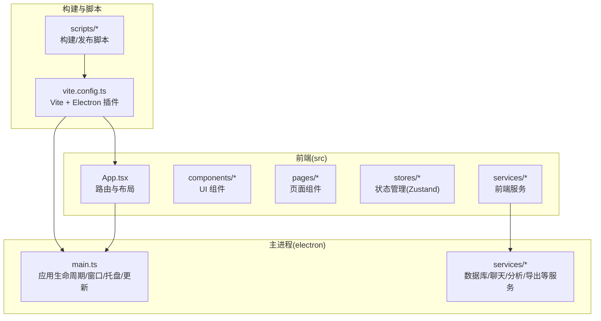
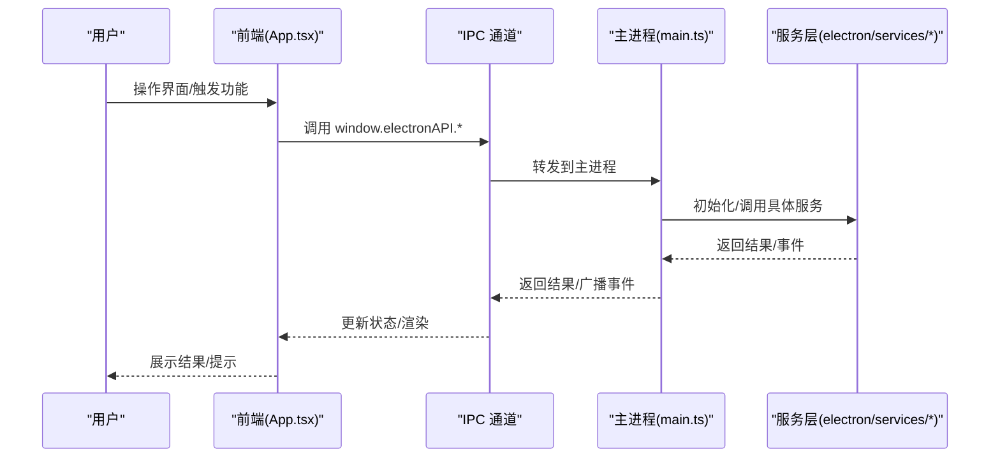
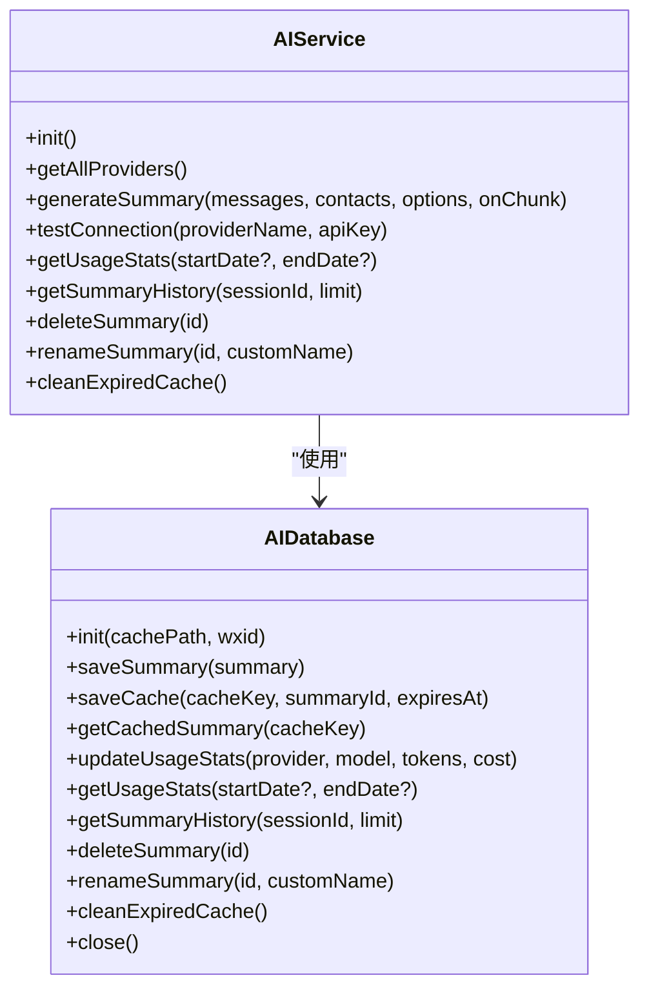
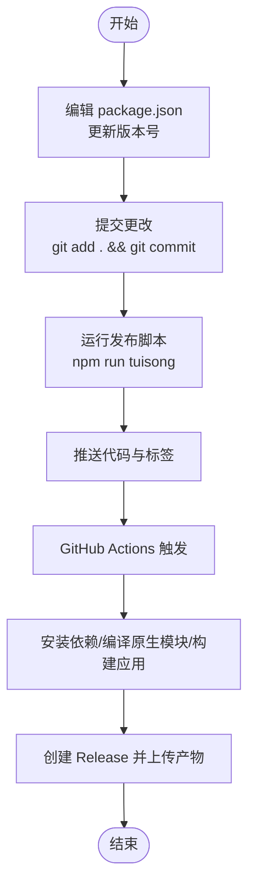
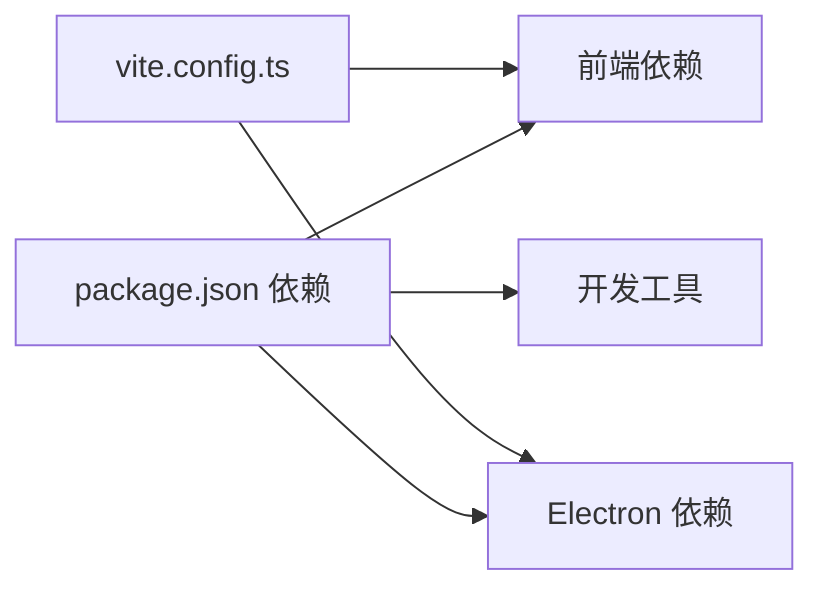

# 贡献指南

<cite>
**本文引用的文件**   
- [CONTRIBUTING.md](file://CONTRIBUTING.md)
- [README.md](file://README.md)
- [package.json](file://package.json)
- [tsconfig.json](file://tsconfig.json)
- [vite.config.ts](file://vite.config.ts)
- [scripts/README.md](file://scripts/README.md)
- [electron/main.ts](file://electron/main.ts)
- [src/App.tsx](file://src/App.tsx)
- [electron/services/ai/aiService.ts](file://electron/services/ai/aiService.ts)
- [electron/services/ai/aiDatabase.ts](file://electron/services/ai/aiDatabase.ts)
- [electron/services/ai/Ollama使用指南.md](file://electron/services/ai/Ollama使用指南.md)
- [TODO.md](file://TODO.md)
</cite>

## 目录
1. [简介](#简介)
2. [项目结构](#项目结构)
3. [核心组件](#核心组件)
4. [架构总览](#架构总览)
5. [详细组件分析](#详细组件分析)
6. [依赖分析](#依赖分析)
7. [性能考虑](#性能考虑)
8. [故障排查指南](#故障排查指南)
9. [结论](#结论)
10. [附录](#附录)

## 简介
本指南面向开源贡献者，提供从准备、开发、提交到审查与发布的全流程参与说明。CipherTalk 是一款基于 Electron + React + TypeScript 的桌面应用，支持微信聊天记录查看、分析与导出，并集成多厂商 AI 摘要能力。贡献范围包括前端界面优化、样式与主题、用户体验、文档完善、国际化、性能优化等。

## 项目结构
项目采用前后端分离的桌面应用架构：
- 前端（React + TypeScript + Zustand）位于 src/，负责 UI、路由、状态管理与页面组件。
- 主进程（Electron）位于 electron/，负责窗口管理、IPC 通信、系统托盘、自动更新、服务注册与数据库/文件系统交互。
- 构建与打包使用 Vite + electron-builder，脚本位于 scripts/，CI/CD 通过 GitHub Actions 自动化。

**图表来源**
- [src/App.tsx:1-538](file://src/App.tsx#L1-L538)
- [electron/main.ts:1-800](file://electron/main.ts#L1-L800)
- [vite.config.ts:1-78](file://vite.config.ts#L1-L78)
- [scripts/README.md:1-337](file://scripts/README.md#L1-L337)

**章节来源**
- [README.md:132-160](file://README.md#L132-L160)
- [package.json:1-169](file://package.json#L1-L169)
- [vite.config.ts:1-78](file://vite.config.ts#L1-L78)

## 核心组件
- 应用入口与路由：src/App.tsx 负责主题切换、协议与激活流程、路由守卫、独立窗口模式、更新提示与锁屏等。
- 主进程：electron/main.ts 负责窗口创建与生命周期、系统托盘、自动更新、协议注册、服务初始化与 IPC 通信。
- AI 服务：electron/services/ai/aiService.ts 提供多厂商 AI 摘要能力与流式生成，aiDatabase.ts 提供摘要与使用统计的 SQLite 存储。
- 构建配置：vite.config.ts 配置 Vite、Electron 插件与别名；package.json 定义脚本与构建配置。

**章节来源**
- [src/App.tsx:1-538](file://src/App.tsx#L1-L538)
- [electron/main.ts:1-800](file://electron/main.ts#L1-L800)
- [electron/services/ai/aiService.ts:1-631](file://electron/services/ai/aiService.ts#L1-L631)
- [electron/services/ai/aiDatabase.ts:1-347](file://electron/services/ai/aiDatabase.ts#L1-L347)
- [vite.config.ts:1-78](file://vite.config.ts#L1-L78)
- [package.json:1-169](file://package.json#L1-L169)

## 架构总览
应用采用“前端渲染 + Electron 主进程”的架构，前端通过 IPC 与主进程交互，主进程协调系统资源与服务。

**图表来源**
- [src/App.tsx:1-538](file://src/App.tsx#L1-L538)
- [electron/main.ts:1-800](file://electron/main.ts#L1-L800)

## 详细组件分析

### 贡献领域与优先级
- 高优先级：UI 相关 Bug 修复、无障碍改进、国际化与本地化、响应式设计优化。
- 中优先级：新增 UI 组件、主题与样式改进、文档完善、开发工具改进。
- 低优先级：代码重构（需充分理由）、依赖更新、性能优化（需基准测试）。

**章节来源**
- [CONTRIBUTING.md:215-235](file://CONTRIBUTING.md#L215-L235)

### 开发环境搭建
- 环境要求：Node.js 18.x+，Windows 10/11，建议 4GB+ 内存。
- 安装依赖：npm install
- 启动开发服务器：npm run dev
- 类型检查：npx tsc --noEmit
- 代码格式化：npx prettier --write src/

**章节来源**
- [README.md:94-128](file://README.md#L94-L128)
- [CONTRIBUTING.md:47-73](file://CONTRIBUTING.md#L47-L73)
- [tsconfig.json:1-26](file://tsconfig.json#L1-L26)

### 代码规范与最佳实践
- TypeScript 规范：严格模式、显式类型注解、接口定义、避免 any。
- React 组件规范：函数组件 + Hooks、PascalCase 命名、Props 接口以组件名 + Props 命名、必要时使用 memo。
- CSS/SCSS 规范：BEM 命名、CSS 变量、最多三层嵌套、语义化类名。
- 状态管理：Zustand 简洁高效，避免过度拆分 store。
- 主题系统：CSS 变量驱动，支持 light/dark/system 三种模式。

**章节来源**
- [CONTRIBUTING.md:96-178](file://CONTRIBUTING.md#L96-L178)
- [README.md:193-231](file://README.md#L193-L231)
- [src/App.tsx:69-88](file://src/App.tsx#L69-L88)

### 提交流程与分支管理
- Fork 项目到你的 GitHub 账号，克隆到本地，安装依赖，创建特性分支。
- 开发完成后，添加变更、提交（遵循 Conventional Commits 规范）、推送至远端。
- 在 GitHub 上发起 Pull Request，填写描述并等待维护者审核。

**章节来源**
- [CONTRIBUTING.md:47-95](file://CONTRIBUTING.md#L47-L95)

### Pull Request 流程
- 选择目标分支（通常为 main）。
- 描述变更内容、影响范围与测试情况。
- 通过 CI 检查与代码审查后合并。

**章节来源**
- [CONTRIBUTING.md:88-95](file://CONTRIBUTING.md#L88-L95)

### 代码审查流程
- 审查标准：功能正确性、代码风格一致性、性能与可维护性、安全性与隐私合规。
- 反馈处理：及时响应评论、补充说明或修改代码。
- 合并策略：通过审查后由维护者合并，避免直接推送 main。

**章节来源**
- [CONTRIBUTING.md:1-248](file://CONTRIBUTING.md#L1-L248)

### 社区准则
- 行为规范：尊重、包容、友善，遵守法律法规与平台规则。
- 沟通礼仪：清晰表达、积极倾听、建设性反馈。
- 冲突解决：优先私下沟通，无法解决时提请维护者介入。

**章节来源**
- [CONTRIBUTING.md:1-4](file://CONTRIBUTING.md#L1-L4)

### 新贡献者入门
- 从 issue 开始：查找或创建相关 issue，确认需求与优先级。
- 选择任务：认领合适的功能或修复，避免重复劳动。
- 开发与测试：本地运行、类型检查、格式化、功能自测。
- 提交 PR：遵循规范、充分说明、耐心等待反馈。
- 合并与发布：通过审查后合并，版本发布由维护者负责。

**章节来源**
- [CONTRIBUTING.md:45-95](file://CONTRIBUTING.md#L45-L95)
- [README.md:234-264](file://README.md#L234-L264)

### AI 摘要服务（贡献参考）
- 多厂商支持：OpenAI、Gemini、智谱、DeepSeek、通义、豆包、Kimi、硅基流动、小米、腾讯、xAI、Ollama、自定义。
- 流式生成：generateSummary 支持流式回调，逐步更新 UI。
- 数据存储：aiDatabase 提供摘要、使用统计与缓存的 SQLite 存储。
- 本地部署：Ollama 使用指南提供本地模型部署与配置说明。

**图表来源**
- [electron/services/ai/aiService.ts:1-631](file://electron/services/ai/aiService.ts#L1-L631)
- [electron/services/ai/aiDatabase.ts:1-347](file://electron/services/ai/aiDatabase.ts#L1-L347)

**章节来源**
- [electron/services/ai/aiService.ts:1-631](file://electron/services/ai/aiService.ts#L1-L631)
- [electron/services/ai/aiDatabase.ts:1-347](file://electron/services/ai/aiDatabase.ts#L1-L347)
- [electron/services/ai/Ollama使用指南.md:1-120](file://electron/services/ai/Ollama使用指南.md#L1-L120)

### 发布与自动化（维护者参考）
- 版本号规范：遵循语义化版本（patch/minor/major）。
- 发布脚本：scripts/README.md 提供一键推送与标签创建流程。
- CI/CD：GitHub Actions 自动安装依赖、重新编译原生模块、构建安装包、创建 Release 并上传。

**图表来源**
- [scripts/README.md:1-337](file://scripts/README.md#L1-L337)
- [package.json:1-169](file://package.json#L1-L169)

**章节来源**
- [scripts/README.md:1-337](file://scripts/README.md#L1-L337)
- [package.json:74-167](file://package.json#L74-L167)

## 依赖分析
- 前端依赖：React 19、Zustand、Material-UI、ECharts、lucide-react、marked 等。
- Electron 依赖：electron、electron-updater、electron-store、better-sqlite3 等。
- 构建工具：Vite、electron-builder、sass、sharp 等。
- 开发工具：TypeScript、@vitejs/plugin-react、vite-plugin-electron 等。

**图表来源**
- [package.json:20-73](file://package.json#L20-L73)
- [vite.config.ts:1-78](file://vite.config.ts#L1-L78)

**章节来源**
- [package.json:1-169](file://package.json#L1-L169)
- [vite.config.ts:1-78](file://vite.config.ts#L1-L78)

## 性能考虑
- 前端性能：合理使用 memo、避免不必要的重渲染；长列表使用虚拟化；按需加载资源。
- Electron 性能：减少主进程阻塞，将耗时任务放入 worker；合理使用缓存与数据库索引。
- 构建优化：利用 Vite 的热重载与按需打包；生产构建开启压缩与最小化。

[本节为通用建议，无需特定文件引用]

## 故障排查指南
- 未提交更改：发布脚本报错提示未提交更改，请先提交再运行脚本。
- 推送失败：检查网络与 Git 配置，确认已登录 GitHub。
- 标签已存在：若需重新创建，先删除远程标签并本地删除后重试。
- 类型检查失败：运行 npx tsc --noEmit，修正类型错误。
- 格式化问题：运行 npx prettier --write src/。

**章节来源**
- [scripts/README.md:270-321](file://scripts/README.md#L270-L321)
- [CONTRIBUTING.md:68-72](file://CONTRIBUTING.md#L68-L72)

## 结论
本指南提供了从环境搭建到代码贡献、从规范到审查与发布的完整路径。建议贡献者在提交前充分阅读相关文件，遵循规范与流程，共同提升 CipherTalk 的质量与体验。

[本节为总结，无需特定文件引用]

## 附录

### 术语表
- PR：Pull Request
- CI：持续集成
- IPC：进程间通信
- AI 摘要：基于多厂商大模型的聊天记录分析摘要

[本节为通用术语说明，无需特定文件引用]

### 参考链接
- [Contribution Guidelines:1-248](file://CONTRIBUTING.md#L1-L248)
- [Quick Start:94-128](file://README.md#L94-L128)
- [Scripts Usage:1-337](file://scripts/README.md#L1-L337)
- [AI Provider Guide:1-120](file://electron/services/ai/Ollama使用指南.md#L1-L120)

[本节为链接汇总，无需特定文件引用]