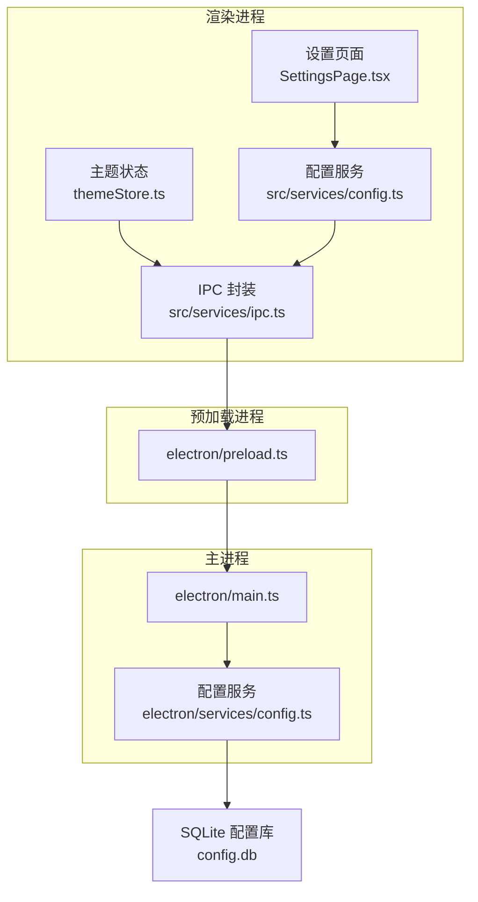
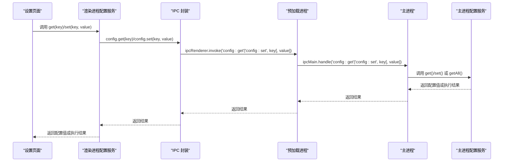
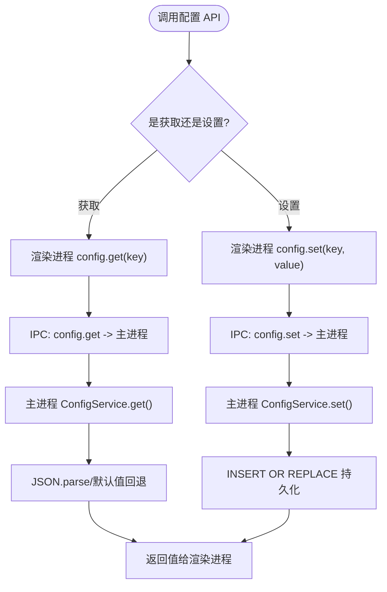
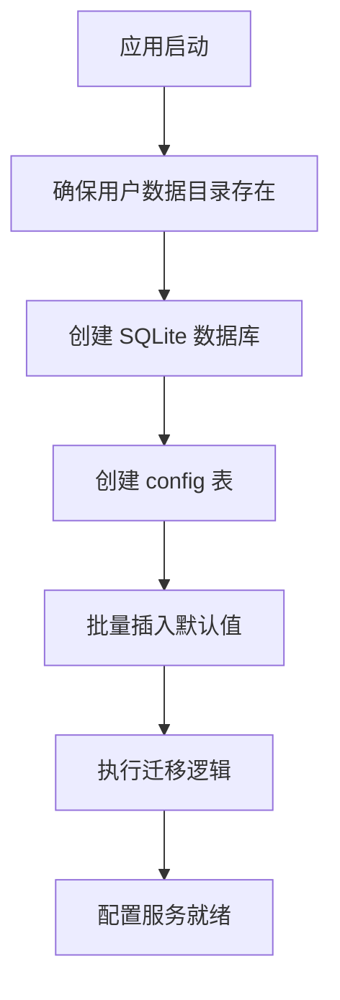
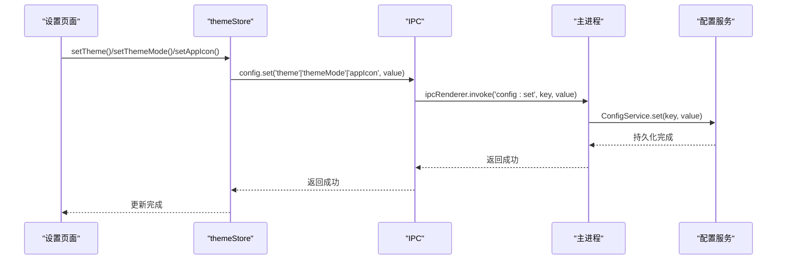
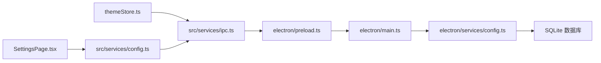

# 前端配置管理

<cite>
**本文档引用的文件**
- [electron/services/config.ts](file://electron/services/config.ts)
- [src/services/config.ts](file://src/services/config.ts)
- [src/services/ipc.ts](file://src/services/ipc.ts)
- [electron/preload.ts](file://electron/preload.ts)
- [electron/main.ts](file://electron/main.ts)
- [src/stores/themeStore.ts](file://src/stores/themeStore.ts)
- [src/pages/SettingsPage.tsx](file://src/pages/SettingsPage.tsx)
</cite>

## 目录
1. [简介](#简介)
2. [项目结构](#项目结构)
3. [核心组件](#核心组件)
4. [架构总览](#架构总览)
5. [详细组件分析](#详细组件分析)
6. [依赖关系分析](#依赖关系分析)
7. [性能考虑](#性能考虑)
8. [故障排除指南](#故障排除指南)
9. [结论](#结论)
10. [附录](#附录)

## 简介
本文件为 CipherTalk 的前端配置管理技术文档，围绕 Electron 环境下的配置架构展开，重点覆盖以下方面：
- 配置架构：Electron Store 封装、配置键值管理、类型安全设计
- 配置 API 接口：获取配置、设置配置、配置验证、默认值处理
- 配置分类管理：应用配置、用户偏好、功能开关、主题设置
- 配置存储机制：本地存储策略、配置持久化、跨会话同步
- 配置错误处理：异常捕获、回退机制、配置恢复
- 配置扩展方法：新增配置项、配置分组、配置迁移
- 最佳实践与使用示例：面向前端开发者的指导

## 项目结构
配置管理涉及三层协作：
- 主进程层：基于 SQLite 的配置存储与迁移逻辑
- 预加载层：通过 IPC 暴露配置读写接口
- 渲染进程层：封装统一的配置 API，提供类型安全与默认值处理



**图表来源**
- [src/services/config.ts:1-574](file://src/services/config.ts#L1-L574)
- [src/services/ipc.ts:1-38](file://src/services/ipc.ts#L1-L38)
- [electron/preload.ts:1-69](file://electron/preload.ts#L1-L69)
- [electron/main.ts:1-200](file://electron/main.ts#L1-L200)
- [electron/services/config.ts:126-395](file://electron/services/config.ts#L126-L395)

**章节来源**
- [src/services/config.ts:1-574](file://src/services/config.ts#L1-L574)
- [electron/services/config.ts:126-395](file://electron/services/config.ts#L126-L395)
- [electron/preload.ts:1-69](file://electron/preload.ts#L1-L69)
- [electron/main.ts:1-200](file://electron/main.ts#L1-L200)

## 核心组件
- 配置键值常量：集中定义配置键名，保证键名一致性与可维护性
- 配置服务（渲染进程）：封装 IPC 调用，提供类型安全的 getter/setter，内置默认值与简单校验
- IPC 封装：统一暴露 config.get/config.set 等接口
- 预加载层：桥接渲染进程与主进程，注册 IPC 处理函数
- 配置服务（主进程）：SQLite 存储、默认值初始化、迁移逻辑、TLD 缓存
- 主进程入口：注册 IPC 处理器，启动配置服务

**章节来源**
- [src/services/config.ts:4-36](file://src/services/config.ts#L4-L36)
- [src/services/config.ts:126-574](file://src/services/config.ts#L126-L574)
- [src/services/ipc.ts:1-7](file://src/services/ipc.ts#L1-L7)
- [electron/preload.ts:6-11](file://electron/preload.ts#L6-L11)
- [electron/services/config.ts:126-395](file://electron/services/config.ts#L126-L395)
- [electron/main.ts:86-91](file://electron/main.ts#L86-L91)

## 架构总览
配置从渲染进程发起，经 IPC 到达主进程，由主进程的配置服务完成读取/写入，最终持久化到 SQLite。



**图表来源**
- [src/services/config.ts:126-574](file://src/services/config.ts#L126-L574)
- [src/services/ipc.ts:1-7](file://src/services/ipc.ts#L1-L7)
- [electron/preload.ts:6-11](file://electron/preload.ts#L6-L11)
- [electron/main.ts:86-91](file://electron/main.ts#L86-L91)
- [electron/services/config.ts:248-394](file://electron/services/config.ts#L248-L394)

## 详细组件分析

### 配置键值管理与类型安全
- 键值集中定义于常量对象，避免魔法字符串，便于重构与 IDE 提示
- 渲染进程配置服务对返回值进行类型断言与默认值处理，确保调用方获得期望类型
- 主进程配置服务使用泛型键约束，保证键名与类型一致

```mermaid
classDiagram
class ConfigKeys {
<<enumeration>>
+DECRYPT_KEY
+DB_PATH
+THEME
+...
}
class RenderConfigService {
+get(key) : Promise<any>
+set(key, value) : Promise<void>
+getAutoUpdateDatabase() : Promise<boolean>
+setAutoUpdateDatabase(enable : boolean) : Promise<void>
+getTheme() : Promise<"light"|"dark">
+setTheme(theme : "light"|"dark") : Promise<void>
+...
}
class MainConfigService {
+get<K extends keyof ConfigSchema>(key : K) : ConfigSchema[K]
+set<K extends keyof ConfigSchema>(key : K, value : ConfigSchema[K]) : void
+getAll() : ConfigSchema
+clear() : void
+getTldCache() : {tlds, updatedAt} | null
+setTldCache(tlds : string[]) : void
+getAICurrentProvider() : string
+setAICurrentProvider(provider : string) : void
+getAIProviderConfig(providerId : string) : {apiKey, model, baseURL?} | null
+setAIProviderConfig(providerId : string, config : ...) : void
+getAllAIProviderConfigs() : Map
+getAIMessageLimit() : number
+setAIMessageLimit(limit : number) : void
+getCacheBasePath() : string
}
RenderConfigService --> ConfigKeys : "使用键名"
RenderConfigService --> MainConfigService : "通过 IPC 调用"
```

**图表来源**
- [src/services/config.ts:4-36](file://src/services/config.ts#L4-L36)
- [src/services/config.ts:126-574](file://src/services/config.ts#L126-L574)
- [electron/services/config.ts:6-80](file://electron/services/config.ts#L6-L80)
- [electron/services/config.ts:126-395](file://electron/services/config.ts#L126-L395)

**章节来源**
- [src/services/config.ts:4-36](file://src/services/config.ts#L4-L36)
- [src/services/config.ts:126-574](file://src/services/config.ts#L126-L574)
- [electron/services/config.ts:6-80](file://electron/services/config.ts#L6-L80)

### 配置 API 接口
- 获取配置：统一通过 config.get(key)，渲染进程侧提供具体业务方法（如 getTheme、getAutoUpdateDatabase）
- 设置配置：统一通过 config.set(key, value)，渲染进程侧提供具体业务方法（如 setTheme、setAutoUpdateDatabase）
- 配置验证与默认值：渲染进程侧对数值范围、枚举值进行简单校验；主进程侧提供默认值字典，缺失键自动回退
- AI 配置便捷方法：主进程提供 AI 提供商配置的读写与兼容处理



**图表来源**
- [src/services/config.ts:126-574](file://src/services/config.ts#L126-L574)
- [src/services/ipc.ts:1-7](file://src/services/ipc.ts#L1-L7)
- [electron/services/config.ts:248-394](file://electron/services/config.ts#L248-L394)

**章节来源**
- [src/services/config.ts:126-574](file://src/services/config.ts#L126-L574)
- [src/services/ipc.ts:1-7](file://src/services/ipc.ts#L1-L7)
- [electron/services/config.ts:248-394](file://electron/services/config.ts#L248-L394)

### 配置分类管理
- 应用配置：数据库路径、解密密钥、导出路径、缓存路径、最后会话等
- 用户偏好：主题、主题模式、应用图标、语言、引用样式等
- 功能开关：自动更新数据库、HTTP API 开关、Windows Hello 认证、关闭到托盘等
- AI 摘要：当前提供商、各提供商配置、摘要详细程度、系统提示词模板、消息条数限制等
- STT 相关：支持语言、模型类型、运行模式、Whisper 模型类型等
- 日志与完整性：日志级别、跳过完整性检查等

**章节来源**
- [electron/services/config.ts:6-80](file://electron/services/config.ts#L6-L80)
- [src/services/config.ts:4-36](file://src/services/config.ts#L4-L36)
- [src/services/config.ts:126-574](file://src/services/config.ts#L126-L574)

### 配置存储机制
- 存储介质：主进程使用 SQLite 数据库存储键值对，包含配置表与 TLD 缓存表
- 初始化与默认值：首次启动时创建表并批量插入默认值
- 迁移策略：针对旧版本配置进行字段修复与结构迁移（如 STT 语言列表、AI 配置结构、baseUrl -> baseURL）
- 跨会话同步：通过 IPC 在渲染进程与主进程之间同步配置变更



**图表来源**
- [electron/services/config.ts:136-246](file://electron/services/config.ts#L136-L246)

**章节来源**
- [electron/services/config.ts:136-246](file://electron/services/config.ts#L136-L246)

### 配置错误处理
- 获取失败回退：主进程 get() 捕获异常并回退到默认值；渲染进程 get() 未命中时使用业务默认值
- 设置失败处理：主进程 set() 捕获异常并记录错误日志
- 清空与重置：提供 clear() 重置为默认值的能力
- IPC 异常：预加载层与主进程间通过 invoke/handle 传递错误信息

**章节来源**
- [electron/services/config.ts:248-308](file://electron/services/config.ts#L248-L308)
- [src/services/config.ts:126-574](file://src/services/config.ts#L126-L574)

### 配置扩展方法
- 新增配置项：在主进程 ConfigSchema 中声明类型与默认值，在渲染进程 CONFIG_KEYS 中添加键名，补充对应的 getter/setter 方法
- 配置分组：通过嵌套对象（如 aiProviderConfigs）组织相关配置，主进程提供便捷访问方法
- 配置迁移：在 initDatabase() 中编写迁移逻辑，确保向后兼容

**章节来源**
- [electron/services/config.ts:6-80](file://electron/services/config.ts#L6-L80)
- [electron/services/config.ts:174-242](file://electron/services/config.ts#L174-L242)
- [src/services/config.ts:4-36](file://src/services/config.ts#L4-L36)

### 主题与界面配置集成
- 主题状态：Zustand store 维护当前主题、主题模式、应用图标，并在变更时通过 IPC 写入配置
- 设置页面：SettingsPage 聚合各类配置项，提供统一的保存与撤销机制
- 主进程联动：主进程根据配置动态设置应用图标与主题参数



**图表来源**
- [src/stores/themeStore.ts:79-140](file://src/stores/themeStore.ts#L79-L140)
- [src/services/ipc.ts:1-7](file://src/services/ipc.ts#L1-L7)
- [electron/services/config.ts:264-273](file://electron/services/config.ts#L264-L273)
- [electron/main.ts:118-141](file://electron/main.ts#L118-L141)

**章节来源**
- [src/stores/themeStore.ts:79-140](file://src/stores/themeStore.ts#L79-L140)
- [src/pages/SettingsPage.tsx:2790-2837](file://src/pages/SettingsPage.tsx#L2790-L2837)
- [electron/main.ts:118-141](file://electron/main.ts#L118-L141)

## 依赖关系分析
- 渲染进程配置服务依赖 IPC 封装，IPC 依赖预加载层桥接，预加载层依赖主进程处理器
- 主进程配置服务依赖 better-sqlite3 与 Electron app 路径 API
- 设置页面与主题 store 依赖配置服务进行读写



**图表来源**
- [src/pages/SettingsPage.tsx:2790-2837](file://src/pages/SettingsPage.tsx#L2790-L2837)
- [src/stores/themeStore.ts:79-140](file://src/stores/themeStore.ts#L79-L140)
- [src/services/config.ts:126-574](file://src/services/config.ts#L126-L574)
- [src/services/ipc.ts:1-7](file://src/services/ipc.ts#L1-L7)
- [electron/preload.ts:6-11](file://electron/preload.ts#L6-L11)
- [electron/main.ts:86-91](file://electron/main.ts#L86-L91)
- [electron/services/config.ts:126-395](file://electron/services/config.ts#L126-L395)

**章节来源**
- [src/pages/SettingsPage.tsx:2790-2837](file://src/pages/SettingsPage.tsx#L2790-L2837)
- [src/stores/themeStore.ts:79-140](file://src/stores/themeStore.ts#L79-L140)
- [src/services/config.ts:126-574](file://src/services/config.ts#L126-L574)
- [electron/preload.ts:6-11](file://electron/preload.ts#L6-L11)
- [electron/main.ts:86-91](file://electron/main.ts#L86-L91)
- [electron/services/config.ts:126-395](file://electron/services/config.ts#L126-L395)

## 性能考虑
- SQLite 存储：适合键值配置场景，读写开销低；注意避免在热路径频繁大事务
- IPC 调用：尽量合并多次设置为一次调用，减少往返开销
- 默认值与回退：主进程与渲染进程均提供默认值，降低空值判断成本
- 防抖与节流：自动更新相关配置（检查间隔、最小间隔、防抖时间）需合理设置，避免频繁触发

## 故障排除指南
- 配置读取为空：确认主进程是否正确初始化默认值，渲染进程是否使用了业务默认值
- 配置写入失败：检查主进程日志，确认 SQLite 可写与磁盘空间充足
- 迁移失败：查看主进程迁移日志，确认旧字段是否存在以及格式是否正确
- IPC 调用异常：检查预加载层与主进程处理器是否正确注册，键名是否一致

**章节来源**
- [electron/services/config.ts:174-242](file://electron/services/config.ts#L174-L242)
- [electron/services/config.ts:248-308](file://electron/services/config.ts#L248-L308)

## 结论
CipherTalk 的配置管理采用“渲染进程 API + IPC + 主进程 SQLite”的分层架构，实现了类型安全、默认值回退与迁移兼容。通过集中化的键值管理与统一的 API 设计，开发者可以快速扩展新的配置项并保持良好的可维护性。建议在新增配置时遵循本文档的最佳实践，确保配置的稳定性与一致性。

## 附录
- 配置键名清单：见 CONFIG_KEYS 常量
- 业务方法清单：见渲染进程配置服务中的具体 getter/setter
- 主进程配置结构：见 ConfigSchema 接口与默认值对象