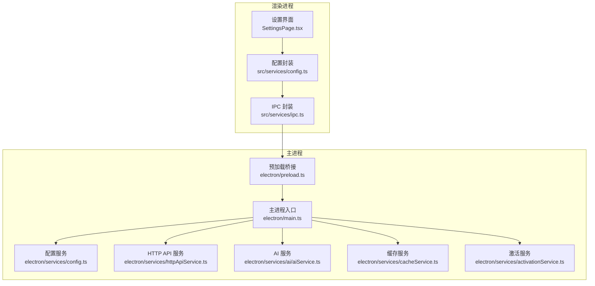
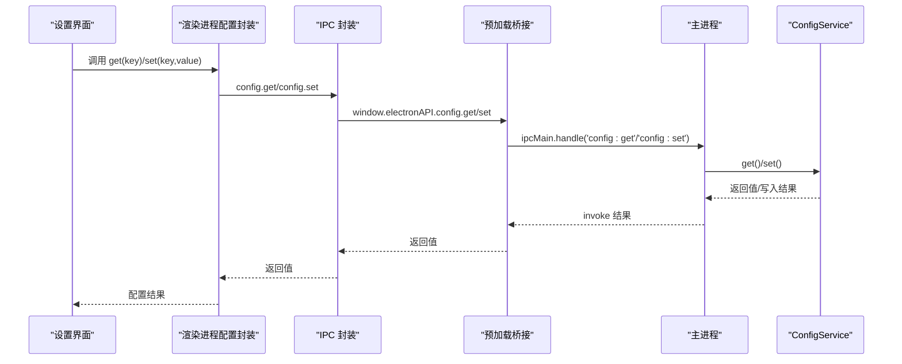
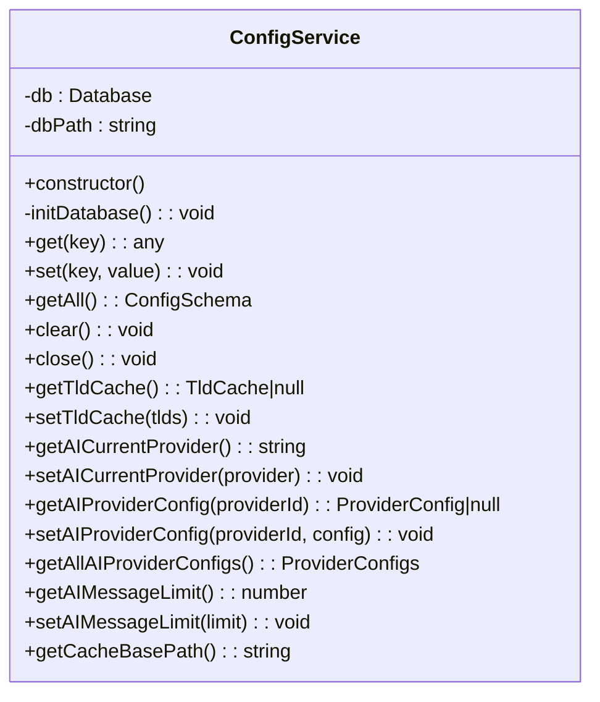
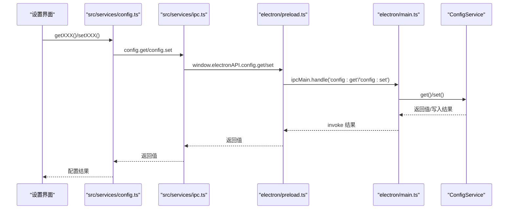
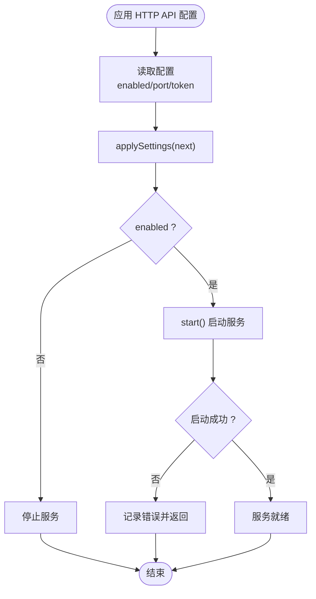
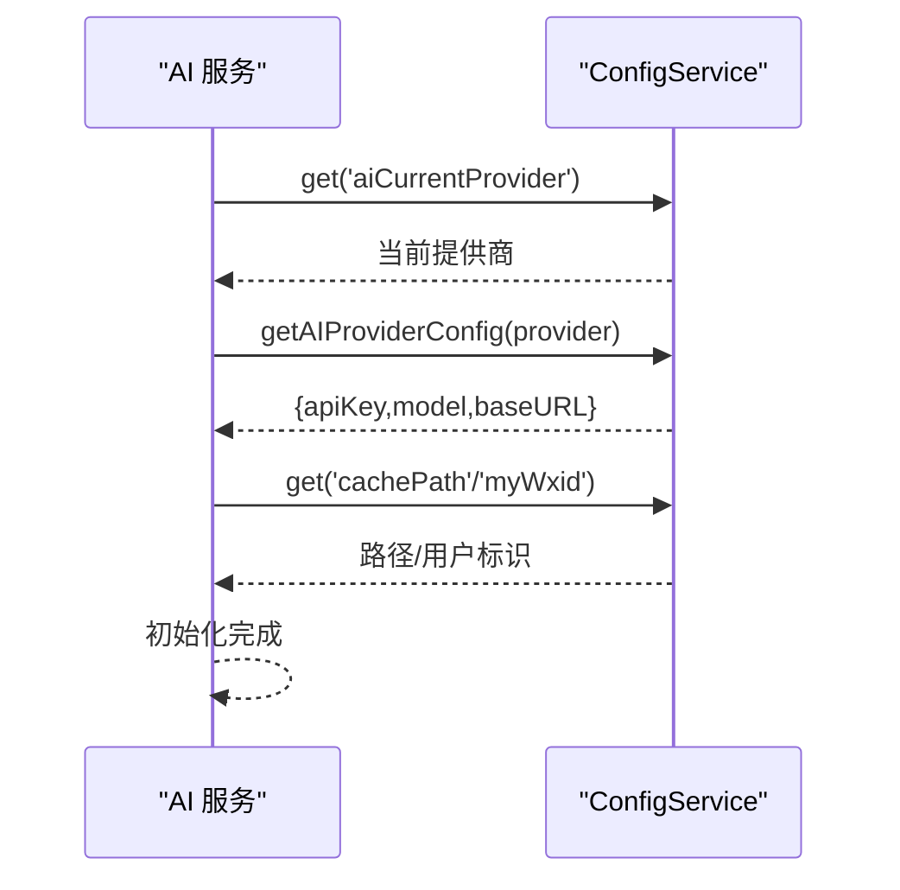
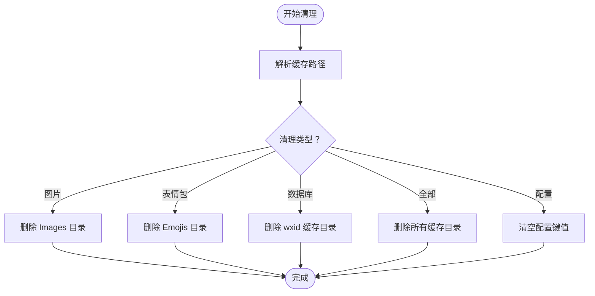
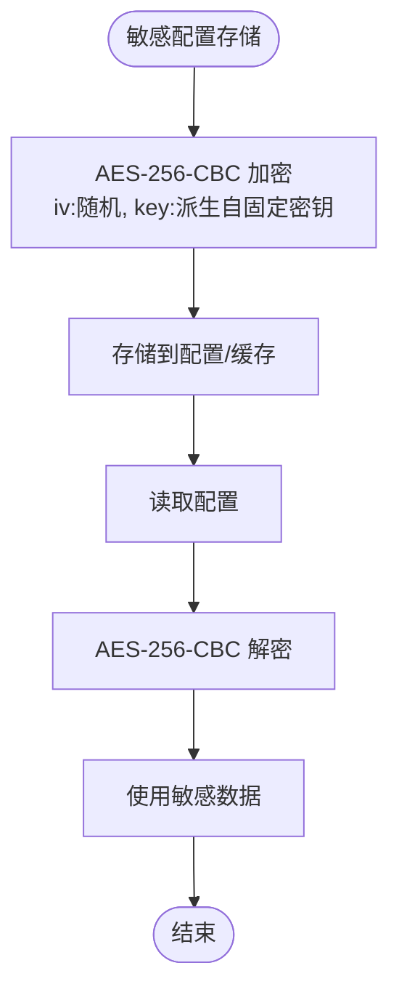
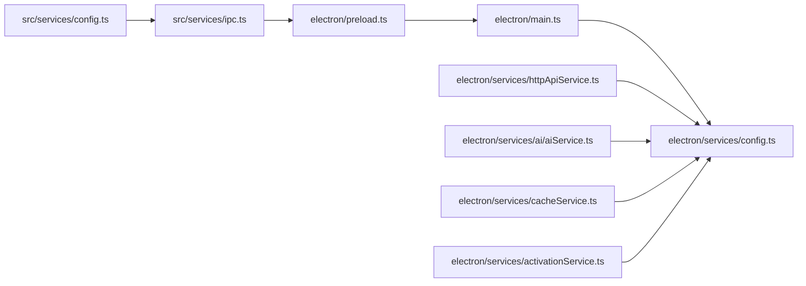

# 后端配置服务

<cite>
**本文档引用的文件**
- [electron/services/config.ts](file://electron/services/config.ts)
- [src/services/config.ts](file://src/services/config.ts)
- [electron/main.ts](file://electron/main.ts)
- [electron/preload.ts](file://electron/preload.ts)
- [src/services/ipc.ts](file://src/services/ipc.ts)
- [electron/services/httpApiService.ts](file://electron/services/httpApiService.ts)
- [electron/services/ai/aiService.ts](file://electron/services/ai/aiService.ts)
- [electron/services/cacheService.ts](file://electron/services/cacheService.ts)
- [electron/services/activationService.ts](file://electron/services/activationService.ts)
</cite>

## 目录
1. [简介](#简介)
2. [项目结构](#项目结构)
3. [核心组件](#核心组件)
4. [架构总览](#架构总览)
5. [详细组件分析](#详细组件分析)
6. [依赖关系分析](#依赖关系分析)
7. [性能考虑](#性能考虑)
8. [故障排除指南](#故障排除指南)
9. [结论](#结论)

## 简介
本文件为 CipherTalk 后端配置服务的全面技术文档，覆盖主进程配置管理、IPC 通信机制、配置同步策略；详细说明配置服务接口（读取、写入、监听、验证）、配置存储方案（SQLite 文件存储、JSON 序列化）、配置生命周期（初始化、更新、清理、备份）、配置安全机制（敏感配置保护、加密存储、访问权限控制），并提供性能优化建议（缓存策略、异步加载、批量操作）。文档面向后端开发者，既提供设计模式与实现细节，也兼顾非技术读者的理解需求。

## 项目结构
配置服务在 Electron 主进程中通过 SQLite 存储配置，在渲染进程中通过 IPC 与主进程交互。核心文件组织如下：
- 主进程配置服务：electron/services/config.ts
- 渲染进程配置封装：src/services/config.ts
- IPC 封装：src/services/ipc.ts、electron/preload.ts
- 主进程入口与服务注册：electron/main.ts
- HTTP API 集成：electron/services/httpApiService.ts
- AI 服务集成：electron/services/ai/aiService.ts
- 缓存与清理：electron/services/cacheService.ts
- 激活与安全：electron/services/activationService.ts

**图表来源**
- [electron/main.ts:217-221](file://electron/main.ts#L217-L221)
- [electron/preload.ts:4-11](file://electron/preload.ts#L4-L11)
- [src/services/ipc.ts:4-7](file://src/services/ipc.ts#L4-L7)

**章节来源**
- [electron/main.ts:217-221](file://electron/main.ts#L217-L221)
- [electron/preload.ts:4-11](file://electron/preload.ts#L4-L11)
- [src/services/ipc.ts:4-7](file://src/services/ipc.ts#L4-L7)

## 核心组件
- ConfigService（主进程）：基于 SQLite 的配置持久化，提供 get/set/getAll/clear/close 等接口，并内置默认值、迁移逻辑与 TLD 缓存表。
- 配置封装（渲染进程）：对 ConfigService 的键值进行类型化封装，提供 get/set 方法与协议版本控制。
- IPC 通道：通过 contextBridge 暴露 config.get/config.set 等方法，渲染进程通过 window.electronAPI.config.* 调用。
- HTTP API 集成：HTTP API 服务通过 ConfigService 读取/应用配置（如启用/端口/令牌）。
- AI 服务集成：AI 服务通过 ConfigService 读取当前提供商、API Key、模型等配置。
- 缓存与清理：CacheService 通过 ConfigService 获取缓存路径并执行清理操作。
- 激活与安全：ActivationService 使用 AES 对敏感数据进行加解密存储。

**章节来源**
- [electron/services/config.ts:126-315](file://electron/services/config.ts#L126-L315)
- [src/services/config.ts:4-36](file://src/services/config.ts#L4-L36)
- [electron/preload.ts:6-11](file://electron/preload.ts#L6-L11)
- [electron/services/httpApiService.ts:44-62](file://electron/services/httpApiService.ts#L44-L62)
- [electron/services/ai/aiService.ts:58-64](file://electron/services/ai/aiService.ts#L58-L64)
- [electron/services/cacheService.ts:6-8](file://electron/services/cacheService.ts#L6-L8)
- [electron/services/activationService.ts:103-129](file://electron/services/activationService.ts#L103-L129)

## 架构总览
配置服务采用“主进程持久化 + 渲染进程封装 + IPC 通信”的三层架构：
- 主进程层：ConfigService 负责 SQLite 初始化、默认值注入、迁移、TLD 缓存与配置 CRUD。
- 通信层：preload 暴露 electronAPI.config.*，渲染进程通过 src/services/ipc.ts 的 config 对象调用。
- 应用层：各业务服务（HTTP API、AI、缓存、激活）通过 ConfigService 读取配置，或通过封装函数进行读写。

**图表来源**
- [src/services/config.ts:4-36](file://src/services/config.ts#L4-L36)
- [src/services/ipc.ts:4-7](file://src/services/ipc.ts#L4-L7)
- [electron/preload.ts:6-11](file://electron/preload.ts#L6-L11)
- [electron/main.ts:217-221](file://electron/main.ts#L217-L221)
- [electron/services/config.ts:248-273](file://electron/services/config.ts#L248-L273)

## 详细组件分析

### ConfigService（主进程配置服务）
- 数据结构与存储
  - SQLite 表 config：key（主键）、value（JSON 文本）
  - SQLite 表 tld_cache：id=1 的单行缓存，存储 tlds 与 updated_at
  - 默认值 defaults：集中定义所有配置键的默认值与类型约束
- 生命周期
  - 初始化：创建目录、创建表、插入默认值、执行迁移
  - 读取：get(key) 优先从数据库读取，失败或无 db 返回默认值
  - 写入：set(key, value) 使用 INSERT OR REPLACE
  - 清理：clear() 删除所有配置并重置默认值
  - 关闭：close() 关闭数据库连接
- 迁移策略
  - 修复 STT 语言配置为空数组问题
  - 将旧的单提供商 AI 配置迁移到新的多提供商结构
  - 兼容 baseUrl -> baseURL 字段变更
- 辅助方法
  - getTldCache()/setTldCache()：TLD 缓存读写
  - AI 配置便捷方法：getAICurrentProvider()/setAICurrentProvider() 等
  - getCacheBasePath()：根据配置或默认规则计算缓存根路径

**图表来源**
- [electron/services/config.ts:126-394](file://electron/services/config.ts#L126-L394)

**章节来源**
- [electron/services/config.ts:136-246](file://electron/services/config.ts#L136-L246)
- [electron/services/config.ts:248-308](file://electron/services/config.ts#L248-L308)
- [electron/services/config.ts:317-394](file://electron/services/config.ts#L317-L394)

### 渲染进程配置封装与 IPC
- 键名常量：CONFIG_KEYS 定义所有配置键，统一管理键名
- 类型化 getter/setter：每个键提供 getXXX/setXXX 函数，内部调用 window.electronAPI.config.get/set
- 协议版本控制：CURRENT_AGREEMENT_VERSION 与 needShowAgreement/acceptCurrentAgreement
- 安全认证配置：Windows Hello 相关键的读写封装
- AI 配置预设：aiConfigPresets 的增删改查

**图表来源**
- [src/services/config.ts:4-36](file://src/services/config.ts#L4-L36)
- [src/services/ipc.ts:4-7](file://src/services/ipc.ts#L4-L7)
- [electron/preload.ts:6-11](file://electron/preload.ts#L6-L11)
- [electron/main.ts:217-221](file://electron/main.ts#L217-L221)

**章节来源**
- [src/services/config.ts:4-36](file://src/services/config.ts#L4-L36)
- [src/services/config.ts:43-574](file://src/services/config.ts#L43-L574)
- [src/services/ipc.ts:4-7](file://src/services/ipc.ts#L4-L7)
- [electron/preload.ts:6-11](file://electron/preload.ts#L6-L11)

### HTTP API 配置集成
- 配置应用：HttpApiService.applySettings() 读取配置并应用到 HTTP 服务
- 启停控制：start()/stop()/restart() 管理服务生命周期
- 认证策略：基于 token 的访问控制，部分端点免鉴权
- 状态查询：getUiStatus() 返回运行状态、端口、启用状态等

**图表来源**
- [electron/services/httpApiService.ts:56-97](file://electron/services/httpApiService.ts#L56-L97)
- [electron/services/httpApiService.ts:120-152](file://electron/services/httpApiService.ts#L120-L152)

**章节来源**
- [electron/services/httpApiService.ts:44-152](file://electron/services/httpApiService.ts#L44-L152)

### AI 服务配置集成
- 提供商选择：getAICurrentProvider()/setAICurrentProvider()
- 配置读取：getAIProviderConfig()/getAllAIProviderConfigs()
- 初始化校验：AI 服务初始化时检查 cachePath 与 myWxid 是否配置

**图表来源**
- [electron/services/ai/aiService.ts:58-83](file://electron/services/ai/aiService.ts#L58-L83)
- [electron/services/config.ts:348-385](file://electron/services/config.ts#L348-L385)

**章节来源**
- [electron/services/ai/aiService.ts:58-83](file://electron/services/ai/aiService.ts#L58-L83)
- [electron/services/config.ts:348-385](file://electron/services/config.ts#L348-L385)

### 缓存与清理流程
- 缓存路径解析：优先使用配置的 cachePath，否则根据安装位置与开发/生产环境选择默认路径
- 清理策略：支持清除图片缓存、表情包缓存、数据库缓存、全部缓存、配置信息
- 原子替换与备份：数据管理服务在更新数据库文件时采用备份与原子替换，保证一致性

**图表来源**
- [electron/services/cacheService.ts:17-40](file://electron/services/cacheService.ts#L17-L40)
- [electron/services/cacheService.ts:71-85](file://electron/services/cacheService.ts#L71-L85)
- [electron/services/cacheService.ts:90-107](file://electron/services/cacheService.ts#L90-L107)
- [electron/services/cacheService.ts:112-191](file://electron/services/cacheService.ts#L112-L191)
- [electron/services/cacheService.ts:196-200](file://electron/services/cacheService.ts#L196-L200)

**章节来源**
- [electron/services/cacheService.ts:6-191](file://electron/services/cacheService.ts#L6-L191)
- [electron/services/cacheService.ts:286-307](file://electron/services/cacheService.ts#L286-L307)

### 安全机制与敏感配置保护
- 敏感数据加/解密：ActivationService 使用 AES-256-CBC 对激活相关数据进行加解密存储
- 设备标识：通过 CPU、主板序列号/UUID 等组合生成稳定设备 ID
- 访问控制：HTTP API 服务基于 token 控制访问，部分端点免鉴权
- 配置清理：提供 clearConfig 接口，一键清空密钥、路径等敏感配置

**图表来源**
- [electron/services/activationService.ts:103-129](file://electron/services/activationService.ts#L103-L129)
- [electron/services/activationService.ts:176-200](file://electron/services/activationService.ts#L176-L200)
- [electron/services/cacheService.ts:286-307](file://electron/services/cacheService.ts#L286-L307)

**章节来源**
- [electron/services/activationService.ts:103-129](file://electron/services/activationService.ts#L103-L129)
- [electron/services/activationService.ts:176-200](file://electron/services/activationService.ts#L176-L200)
- [electron/services/cacheService.ts:286-307](file://electron/services/cacheService.ts#L286-L307)

## 依赖关系分析
- ConfigService 依赖：better-sqlite3、Electron app 路径、fs/path
- 渲染进程依赖：src/services/ipc.ts 依赖 window.electronAPI（由 preload 暴露）
- 主进程入口：electron/main.ts 在应用启动时初始化 ConfigService，并注册 IPC 处理器
- 业务服务依赖：HTTP API、AI、缓存、激活等服务均通过 ConfigService 读取配置

**图表来源**
- [electron/main.ts:217-221](file://electron/main.ts#L217-L221)
- [electron/preload.ts:4-11](file://electron/preload.ts#L4-L11)
- [src/services/ipc.ts:4-7](file://src/services/ipc.ts#L4-L7)
- [src/services/config.ts:4-36](file://src/services/config.ts#L4-L36)

**章节来源**
- [electron/main.ts:217-221](file://electron/main.ts#L217-L221)
- [electron/preload.ts:4-11](file://electron/preload.ts#L4-L11)
- [src/services/ipc.ts:4-7](file://src/services/ipc.ts#L4-L7)

## 性能考虑
- 配置缓存策略
  - 主进程 ConfigService 已通过 SQLite 缓存数据库连接，避免频繁打开/关闭
  - 渲染进程通过封装函数复用 IPC 调用，减少重复请求
- 异步加载
  - 渲染进程配置封装均为异步函数，避免阻塞 UI 线程
  - HTTP API 服务启动/停止采用 Promise 包装，避免阻塞主进程
- 批量操作
  - 清理缓存时对多个路径进行去重与批量删除，减少 IO 次数
  - 数据管理服务在批量更新数据库文件时采用原子替换与备份，降低失败风险

[本节为通用性能指导，无需特定文件引用]

## 故障排除指南
- 配置读取失败
  - 检查 ConfigService 初始化是否成功（数据库文件是否存在、目录权限）
  - 确认 IPC 通道是否正常（preload 是否正确暴露 electronAPI.config）
- 配置写入失败
  - 检查 SQLite 写入权限与磁盘空间
  - 确认键名是否在 defaults 中定义
- HTTP API 启动失败
  - 检查端口占用与权限（EADDRINUSE）
  - 确认 token 配置与鉴权策略
- 缓存清理失败
  - 检查目标路径是否存在与权限
  - 确认相关服务（如数据库）是否已关闭，避免文件占用

**章节来源**
- [electron/services/config.ts:248-273](file://electron/services/config.ts#L248-L273)
- [electron/services/httpApiService.ts:81-96](file://electron/services/httpApiService.ts#L81-L96)
- [electron/services/cacheService.ts:112-191](file://electron/services/cacheService.ts#L112-L191)

## 结论
CipherTalk 的后端配置服务通过主进程 SQLite 持久化与渲染进程 IPC 封装，实现了稳定、可扩展的配置管理能力。其设计具备以下特点：
- 明确的三层架构：主进程持久化、通信桥接、应用封装
- 完整的生命周期管理：初始化、迁移、读写、清理、关闭
- 安全与合规：敏感配置加密存储、访问控制、配置清理
- 可靠的同步与一致性：IPC 同步、原子替换、备份策略
- 良好的性能：缓存、异步、批量操作

该架构为后续扩展（如配置监听、热更新、分布式配置中心）提供了清晰的演进路径。