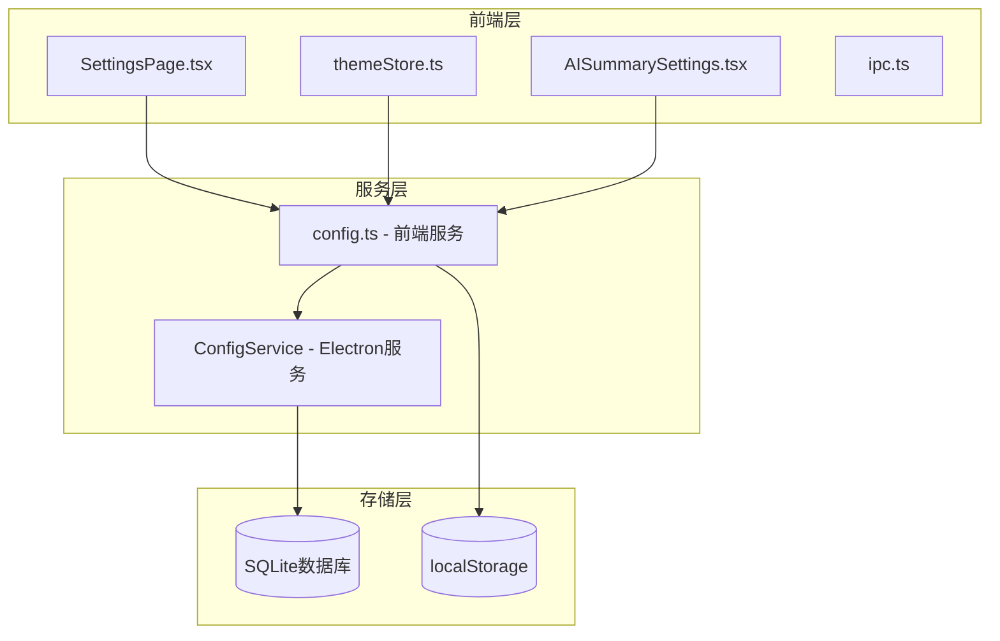
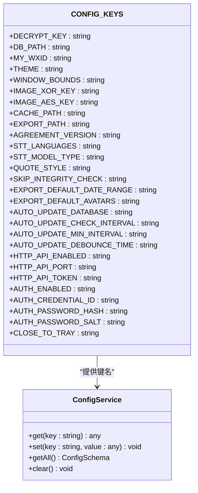
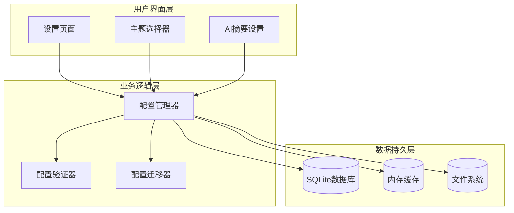
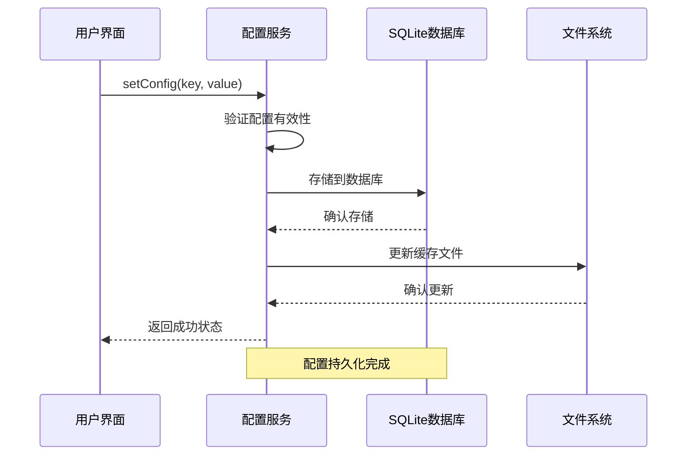
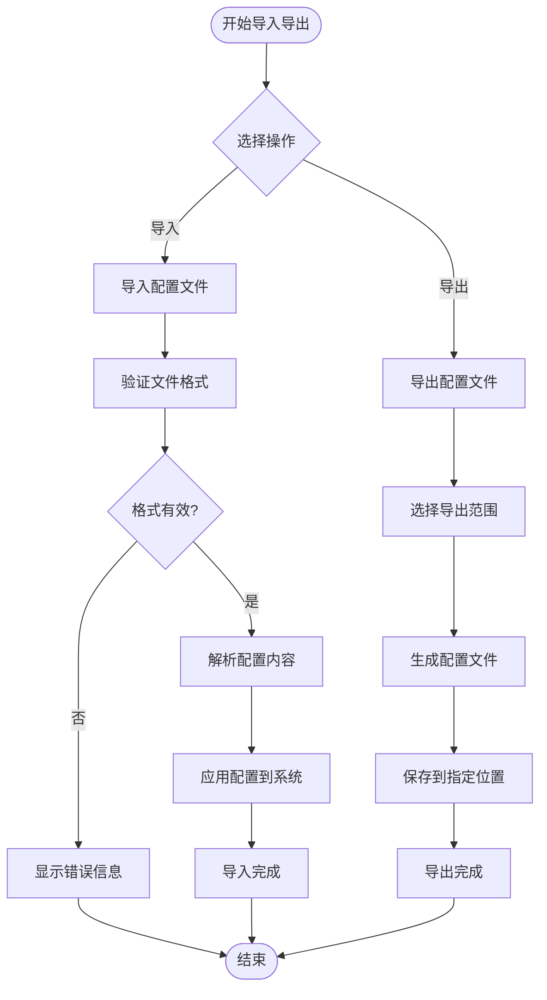
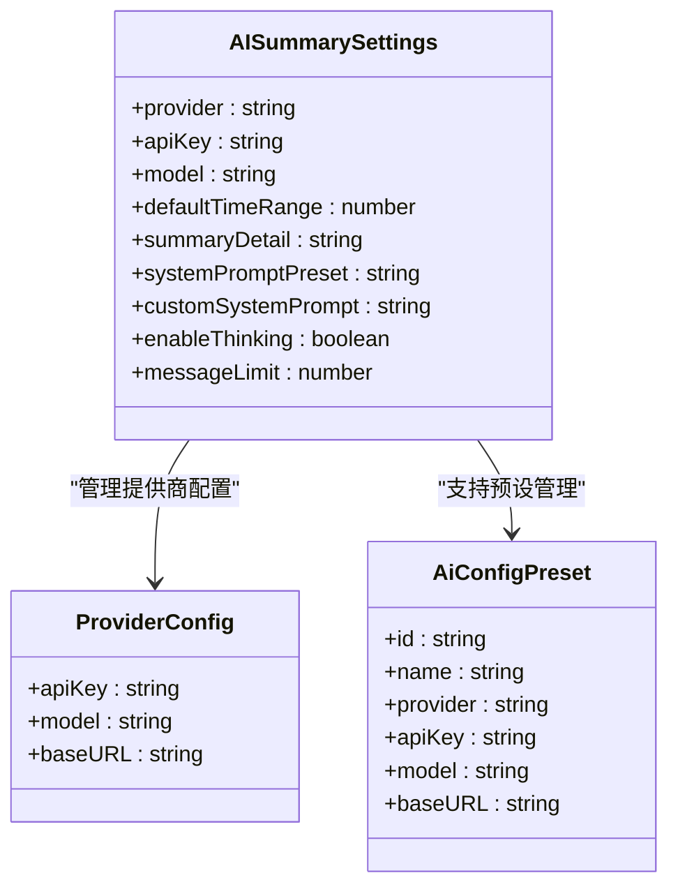
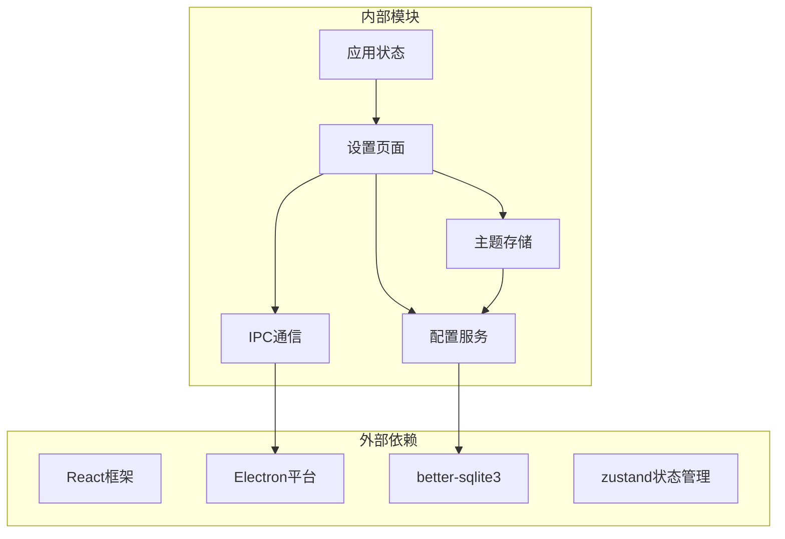

# 用户偏好设置

<cite>
**本文档引用的文件**
- [config.ts](file://src/services/config.ts)
- [config.ts](file://electron/services/config.ts)
- [themeStore.ts](file://src/stores/themeStore.ts)
- [SettingsPage.tsx](file://src/pages/SettingsPage.tsx)
- [AISummarySettings.tsx](file://src/components/ai/AISummarySettings.tsx)
- [ipc.ts](file://src/services/ipc.ts)
- [main.ts](file://electron/main.ts)
- [appStore.ts](file://src/stores/appStore.ts)
</cite>

## 目录
1. [简介](#简介)
2. [项目结构](#项目结构)
3. [核心组件](#核心组件)
4. [架构概览](#架构概览)
5. [详细组件分析](#详细组件分析)
6. [依赖关系分析](#依赖关系分析)
7. [性能考虑](#性能考虑)
8. [故障排除指南](#故障排除指南)
9. [结论](#结论)
10. [附录](#附录)

## 简介

CipherTalk 的用户偏好设置系统是一个完整的配置管理解决方案，为用户提供个性化的应用体验。该系统涵盖了从基础的主题切换到复杂的 AI 摘要配置，从界面设置到功能开关的全方位用户偏好管理。

系统采用分层架构设计，通过 Electron Store 实现配置持久化，结合前端状态管理和后端数据库服务，提供了稳定可靠的配置管理能力。用户可以通过直观的界面进行偏好设置，系统会自动处理配置的验证、存储和同步。

## 项目结构

用户偏好设置系统的文件组织遵循清晰的分层原则：

**图表来源**
- [SettingsPage.tsx:1-800](file://src/pages/SettingsPage.tsx#L1-L800)
- [config.ts:1-574](file://src/services/config.ts#L1-L574)
- [config.ts:126-315](file://electron/services/config.ts#L126-L315)

**章节来源**
- [SettingsPage.tsx:1-800](file://src/pages/SettingsPage.tsx#L1-L800)
- [config.ts:1-574](file://src/services/config.ts#L1-L574)
- [config.ts:126-315](file://electron/services/config.ts#L126-L315)

## 核心组件

### 配置键管理系统

系统定义了完整的配置键常量，涵盖各个功能模块的配置项：

**图表来源**
- [config.ts:4-36](file://src/services/config.ts#L4-L36)
- [config.ts:126-315](file://electron/services/config.ts#L126-L315)

### 主题管理系统

系统支持多种主题模式和主题变体，提供丰富的视觉体验：

| 主题模式 | 描述 | 默认值 |
|---------|------|--------|
| light | 浅色主题 | ✓ |
| dark | 深色主题 |  |
| system | 跟随系统设置 |  |

| 主题变体 | 颜色方案 | 适用场景 |
|---------|----------|----------|
| cloud-dancer | 米白色调 | 经典商务风格 |
| corundum-blue | 蓝色调 | 科技感强 |
| kiwi-green | 绿色调 | 清新自然 |
| spicy-red | 红色调 | 活力四射 |
| teal-water | 青色调 | 现代简约 |
| new-year | 红色新年主题 | 节日氛围 |
| sakura-mist | 粉色调 | 温柔治愈 |

**章节来源**
- [themeStore.ts:15-65](file://src/stores/themeStore.ts#L15-L65)
- [themeStore.ts:79-140](file://src/stores/themeStore.ts#L79-L140)

## 架构概览

用户偏好设置系统采用三层架构设计，确保配置管理的可靠性、可扩展性和易维护性：

**图表来源**
- [SettingsPage.tsx:165-271](file://src/pages/SettingsPage.tsx#L165-L271)
- [config.ts:248-262](file://electron/services/config.ts#L248-L262)

系统架构的关键特性：

1. **分层设计**：清晰分离用户界面、业务逻辑和数据持久化层
2. **配置验证**：内置配置有效性检查和默认值应用机制
3. **数据迁移**：支持配置结构的向后兼容和自动迁移
4. **异步处理**：采用异步操作确保用户体验流畅
5. **错误处理**：完善的错误捕获和恢复机制

## 详细组件分析

### 配置存储机制

系统采用混合存储策略，结合 SQLite 数据库和本地存储：

**图表来源**
- [config.ts:264-273](file://electron/services/config.ts#L264-L273)
- [config.ts:294-308](file://electron/services/config.ts#L294-L308)

### 配置验证规则

系统实现了多层次的配置验证机制：

| 验证类型 | 规则描述 | 默认值 | 应用场景 |
|---------|----------|--------|----------|
| 类型验证 | 检查数据类型一致性 | 自动推断 | 所有配置项 |
| 范围验证 | 数值范围限制检查 | 预定义范围 | 端口号、时间间隔 |
| 格式验证 | 字符串格式校验 | 正则表达式 | 密钥、路径 |
| 依赖验证 | 依赖关系检查 | 逻辑关联 | 多项配置联动 |

**章节来源**
- [config.ts:56-87](file://src/services/config.ts#L56-L87)
- [config.ts:102-123](file://src/services/config.ts#L102-L123)

### 配置导入导出

系统支持配置的导入导出功能，便于用户备份和迁移：

**图表来源**
- [SettingsPage.tsx:525-563](file://src/pages/SettingsPage.tsx#L525-L563)
- [config.ts:294-308](file://electron/services/config.ts#L294-L308)

### 偏好用户体验设计

系统注重用户体验的细节设计：

#### 实时预览功能
- 主题切换即时生效
- 配置修改实时反馈
- 实时验证配置有效性

#### 配置重置机制
- 单项配置重置
- 批量配置重置
- 完全重置到默认值

#### 配置分组管理
- 功能模块化分组
- 常用配置快捷访问
- 配置搜索和过滤

**章节来源**
- [SettingsPage.tsx:923-949](file://src/pages/SettingsPage.tsx#L923-L949)
- [SettingsPage.tsx:2823-2831](file://src/pages/SettingsPage.tsx#L2823-L2831)

### AI 配置管理

AI 摘要功能的配置管理具有特殊复杂性：

**图表来源**
- [config.ts:514-521](file://src/services/config.ts#L514-L521)
- [AISummarySettings.tsx:95-115](file://src/components/ai/AISummarySettings.tsx#L95-L115)

**章节来源**
- [AISummarySettings.tsx:209-227](file://src/components/ai/AISummarySettings.tsx#L209-L227)
- [config.ts:524-560](file://src/services/config.ts#L524-L560)

## 依赖关系分析

用户偏好设置系统的依赖关系体现了清晰的分层架构：

**图表来源**
- [SettingsPage.tsx:1-29](file://src/pages/SettingsPage.tsx#L1-L29)
- [themeStore.ts:1-13](file://src/stores/themeStore.ts#L1-L13)
- [config.ts:1-2](file://src/services/config.ts#L1-L2)

### 核心依赖关系

| 模块 | 依赖模块 | 用途 |
|------|----------|------|
| SettingsPage | themeStore, config, ipc | 用户界面交互 |
| themeStore | config, electronAPI | 主题状态管理 |
| configService | better-sqlite3, electron | 配置持久化 |
| IPCService | electron | 前后端通信 |
| AppStore | none | 应用全局状态 |

**章节来源**
- [main.ts:8-28](file://electron/main.ts#L8-L28)
- [ipc.ts:1-7](file://src/services/ipc.ts#L1-L7)

## 性能考虑

系统在性能优化方面采用了多项策略：

### 配置加载优化
- 异步加载配置减少启动延迟
- 懒加载非关键配置
- 配置缓存机制

### 内存管理
- 及时清理配置监听器
- 合理的垃圾回收策略
- 避免内存泄漏

### 网络优化
- 配置变更防抖处理
- 批量配置更新
- 网络请求缓存

## 故障排除指南

### 常见问题及解决方案

| 问题类型 | 症状 | 可能原因 | 解决方案 |
|----------|------|----------|----------|
| 配置丢失 | 应用重启后配置重置 | 数据库损坏 | 清除配置并重新设置 |
| 主题不生效 | 更换主题后无变化 | 缓存问题 | 刷新页面或重启应用 |
| 配置验证失败 | 保存配置时报错 | 格式不正确 | 检查配置格式和范围 |
| 同步问题 | 配置不同步 | 网络问题 | 检查网络连接和代理设置 |

### 调试工具

系统提供了多种调试和诊断工具：

- 配置状态监控
- 错误日志记录
- 性能指标跟踪
- 配置变更审计

**章节来源**
- [SettingsPage.tsx:398-414](file://src/pages/SettingsPage.tsx#L398-L414)
- [config.ts:294-308](file://electron/services/config.ts#L294-L308)

## 结论

CipherTalk 的用户偏好设置系统展现了现代应用配置管理的最佳实践。通过清晰的架构设计、完善的验证机制和优秀的用户体验，系统为用户提供了灵活而可靠的个性化配置能力。

系统的主要优势包括：

1. **架构清晰**：分层设计确保了代码的可维护性和可扩展性
2. **功能完善**：覆盖了从基础设置到高级功能的全方位配置需求
3. **用户体验优秀**：直观的界面设计和实时反馈机制
4. **技术先进**：采用最新的前端技术和后端服务架构

对于产品和前端开发者而言，该系统提供了良好的扩展基础，可以方便地添加新的配置项和功能模块。

## 附录

### 配置项参考表

| 配置类别 | 配置项 | 数据类型 | 默认值 | 说明 |
|----------|--------|----------|--------|------|
| 界面设置 | theme | string | 'cloud-dancer' | 主题变体 |
| 界面设置 | themeMode | 'light'\|'dark'\|'system' | 'light' | 主题模式 |
| 界面设置 | appIcon | 'default'\|'xinnian' | 'default' | 应用图标 |
| 数据解密 | decryptKey | string | '' | 解密密钥 |
| 数据解密 | dbPath | string | '' | 数据库路径 |
| 数据解密 | myWxid | string | '' | 用户微信ID |
| AI配置 | aiProvider | string | 'zhipu' | AI提供商 |
| AI配置 | aiDefaultTimeRange | number | 7 | 默认分析天数 |
| AI配置 | aiSummaryDetail | string | 'normal' | 摘要详细程度 |
| 系统设置 | closeToTray | boolean | true | 关闭行为 |

### 开发者指南

#### 新增配置项步骤
1. 在 CONFIG_KEYS 中添加新的配置键
2. 在默认配置中设置默认值
3. 添加相应的 getter/setter 方法
4. 在设置页面中添加配置界面
5. 添加必要的验证规则

#### 配置迁移指南
- 保持向后兼容性
- 提供自动迁移脚本
- 测试迁移过程的稳定性
- 记录迁移日志