# 配置持久化策略

<cite>
**本文档引用的文件**
- [electron/services/config.ts](file://electron/services/config.ts)
- [src/services/config.ts](file://src/services/config.ts)
- [src/services/ipc.ts](file://src/services/ipc.ts)
- [electron/preload.ts](file://electron/preload.ts)
- [electron/main.ts](file://electron/main.ts)
- [electron/services/database.ts](file://electron/services/database.ts)
- [electron/services/dbPathService.ts](file://electron/services/dbPathService.ts)
- [electron/services/cacheService.ts](file://electron/services/cacheService.ts)
- [electron/services/dataManagementService.ts](file://electron/services/dataManagementService.ts)
- [electron/services/decryptService.ts](file://electron/services/decryptService.ts)
- [electron/workers/decryptWorker.js](file://electron/workers/decryptWorker.js)
</cite>

## 目录
1. [引言](#引言)
2. [项目结构](#项目结构)
3. [核心组件](#核心组件)
4. [架构概览](#架构概览)
5. [详细组件分析](#详细组件分析)
6. [依赖关系分析](#依赖关系分析)
7. [性能考虑](#性能考虑)
8. [故障处理指南](#故障处理指南)
9. [结论](#结论)
10. [附录](#附录)

## 引言

CipherTalk 的配置持久化策略采用分层架构设计，通过 Electron 主进程的 SQLite 数据库存储配置信息，配合渲染进程的 IPC 通信机制实现跨进程的数据持久化。该策略旨在为全栈开发者提供完整的配置持久化解决方案，涵盖存储引擎选择、数据格式设计、存储位置管理、持久化机制、数据安全、性能优化以及故障处理等方面。

## 项目结构

CipherTalk 的配置持久化架构采用三层设计模式：

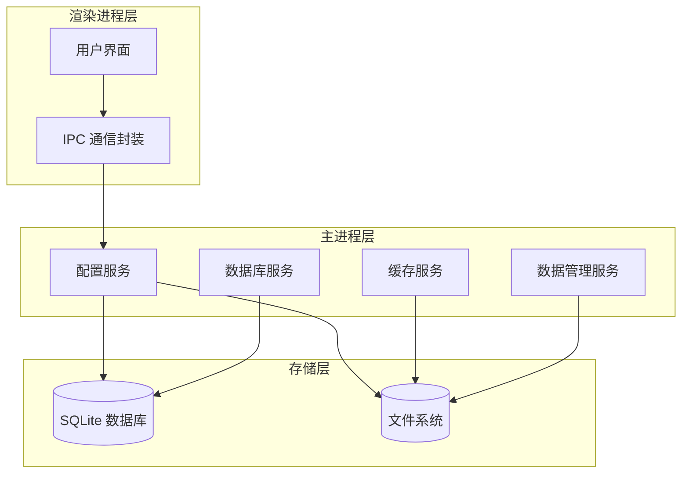

**图表来源**
- [electron/services/config.ts:126-134](file://electron/services/config.ts#L126-L134)
- [src/services/ipc.ts:1-38](file://src/services/ipc.ts#L1-L38)
- [electron/preload.ts:4-11](file://electron/preload.ts#L4-L11)

**章节来源**
- [electron/services/config.ts:126-134](file://electron/services/config.ts#L126-L134)
- [src/services/ipc.ts:1-38](file://src/services/ipc.ts#L1-L38)
- [electron/preload.ts:1-454](file://electron/preload.ts#L1-L454)

## 核心组件

### 配置服务架构

配置服务采用单例模式，通过 SQLite 数据库存储所有配置信息，支持默认值管理和版本迁移：

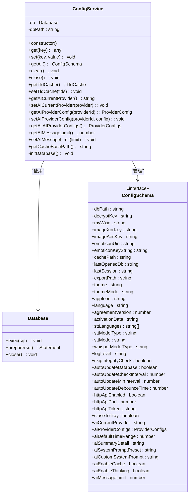

**图表来源**
- [electron/services/config.ts:6-80](file://electron/services/config.ts#L6-L80)
- [electron/services/config.ts:126-395](file://electron/services/config.ts#L126-L395)

### IPC 通信架构

渲染进程通过 IPC 通道与主进程通信，实现配置的异步读写：

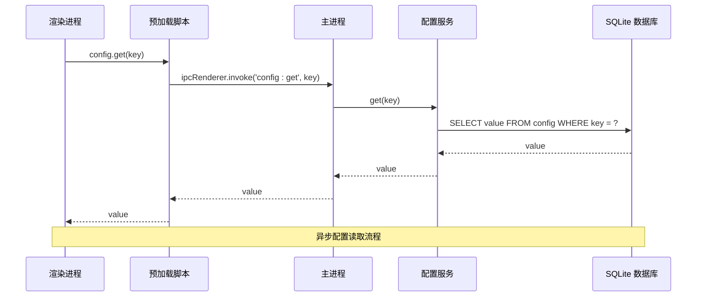

**图表来源**
- [src/services/ipc.ts:4-7](file://src/services/ipc.ts#L4-L7)
- [electron/preload.ts:6-8](file://electron/preload.ts#L6-L8)
- [electron/main.ts:1754-1792](file://electron/main.ts#L1754-L1792)

**章节来源**
- [electron/services/config.ts:6-80](file://electron/services/config.ts#L6-L80)
- [src/services/ipc.ts:1-38](file://src/services/ipc.ts#L1-L38)
- [electron/preload.ts:1-454](file://electron/preload.ts#L1-L454)

## 架构概览

CipherTalk 的配置持久化架构采用客户端-服务器模式，通过 Electron 的 IPC 机制实现跨进程通信：

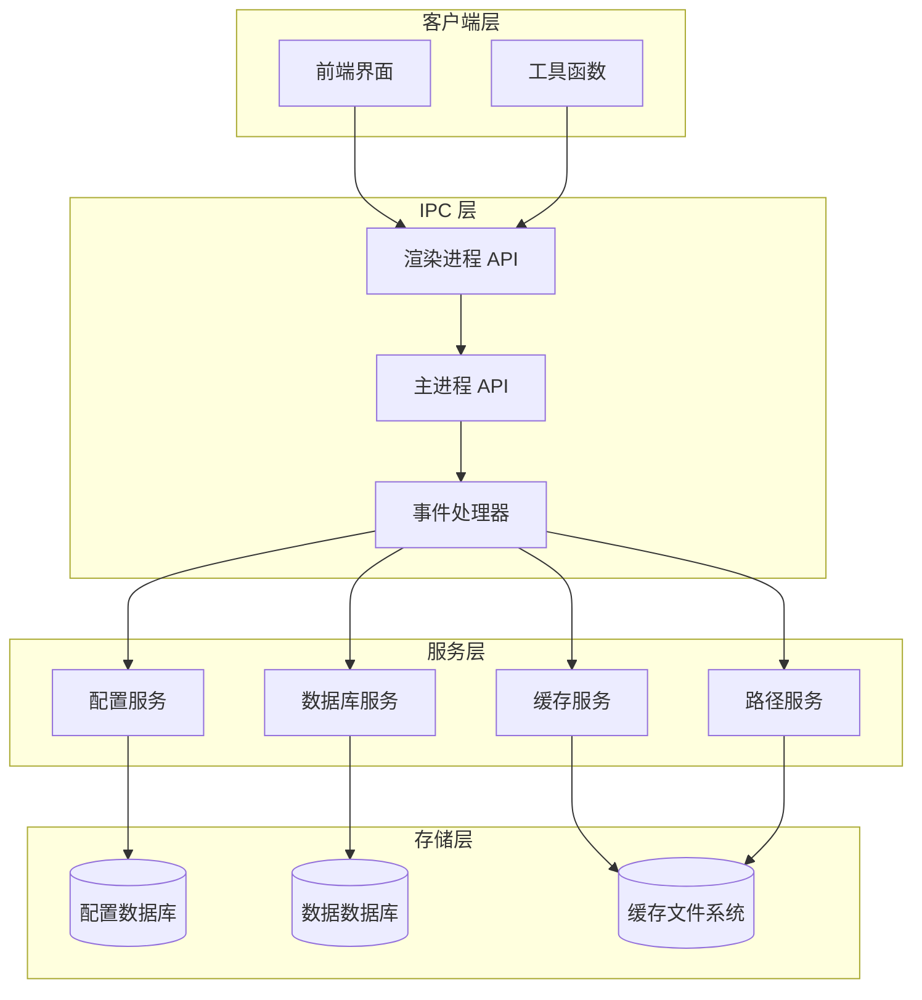

**图表来源**
- [electron/main.ts:1-800](file://electron/main.ts#L1-L800)
- [electron/services/config.ts:126-395](file://electron/services/config.ts#L126-L395)
- [electron/services/database.ts:5-83](file://electron/services/database.ts#L5-L83)

## 详细组件分析

### 存储引擎选择与设计

CipherTalk 采用 SQLite 作为主要存储引擎，结合文件系统存储特定类型的配置数据：

#### SQLite 配置存储

配置服务使用 SQLite 的键值对存储模式，每个配置项存储为一行记录：

| 字段名 | 类型 | 描述 | 约束 |
|--------|------|------|------|
| key | TEXT | 配置键（主键） | PRIMARY KEY |
| value | TEXT | JSON 序列化的配置值 | NOT NULL |

```mermaid
erDiagram
CONFIG {
TEXT key PK
TEXT value
}
TLD_CACHE {
INTEGER id PK CHECK (id = 1)
TEXT tlds
INTEGER updated_at
}
CONFIG ||--|| TLD_CACHE : "隔离存储"
```

**图表来源**
- [electron/services/config.ts:147-161](file://electron/services/config.ts#L147-L161)

#### 文件系统存储策略

对于大文件和二进制数据，采用文件系统存储：

- **缓存文件**：存储图片、表情包、日志等大文件
- **配置文件**：存储敏感的密钥信息
- **临时文件**：解密过程中的中间产物

**章节来源**
- [electron/services/config.ts:136-246](file://electron/services/config.ts#L136-L246)
- [electron/services/cacheService.ts:6-486](file://electron/services/cacheService.ts#L6-L486)

### 数据格式设计

#### 配置数据结构

配置系统支持多种数据类型，通过 JSON 序列化实现统一存储：

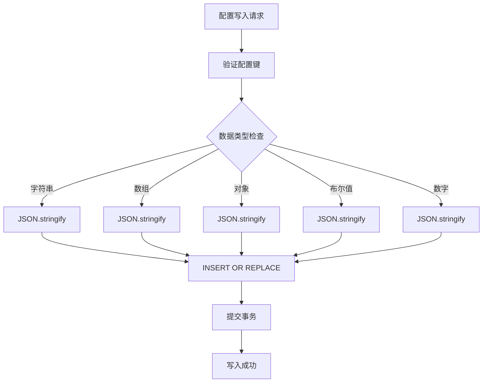

**图表来源**
- [electron/services/config.ts:264-273](file://electron/services/config.ts#L264-L273)

#### 版本迁移机制

配置系统内置版本迁移功能，支持向后兼容：

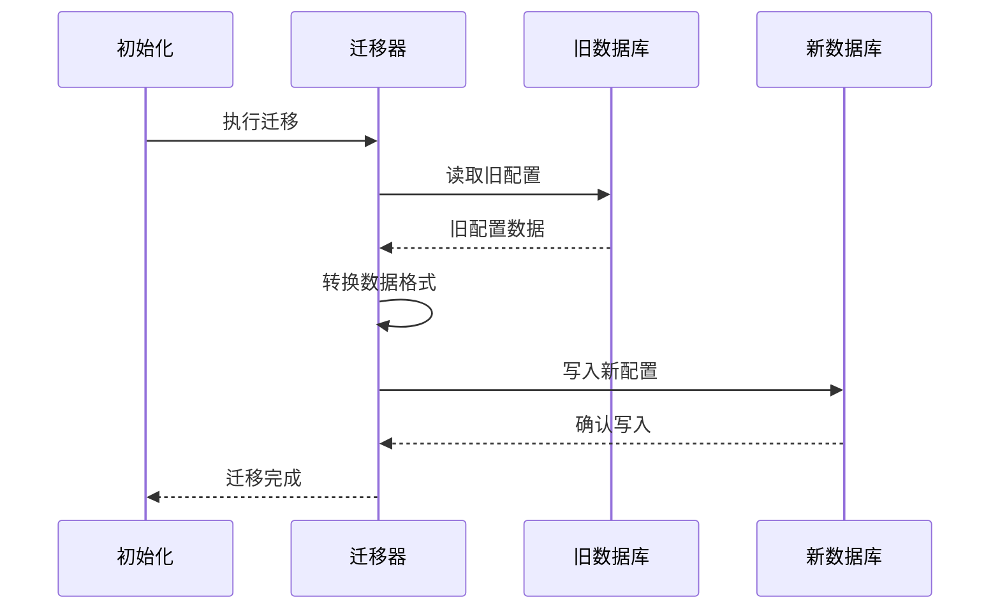

**图表来源**
- [electron/services/config.ts:174-242](file://electron/services/config.ts#L174-L242)

**章节来源**
- [electron/services/config.ts:82-124](file://electron/services/config.ts#L82-L124)
- [electron/services/config.ts:174-242](file://electron/services/config.ts#L174-L242)

### 存储位置管理

#### 用户数据目录

配置文件存储在操作系统标准的用户数据目录中：

- **Windows**: `%APPDATA%\CipherTalk\ciphertalk-config.db`
- **macOS**: `~/Library/Application Support/CipherTalk/ciphertalk-config.db`
- **Linux**: `~/.local/share/CipherTalk/ciphertalk-config.db`

#### 缓存路径策略

缓存路径根据安装位置智能选择：

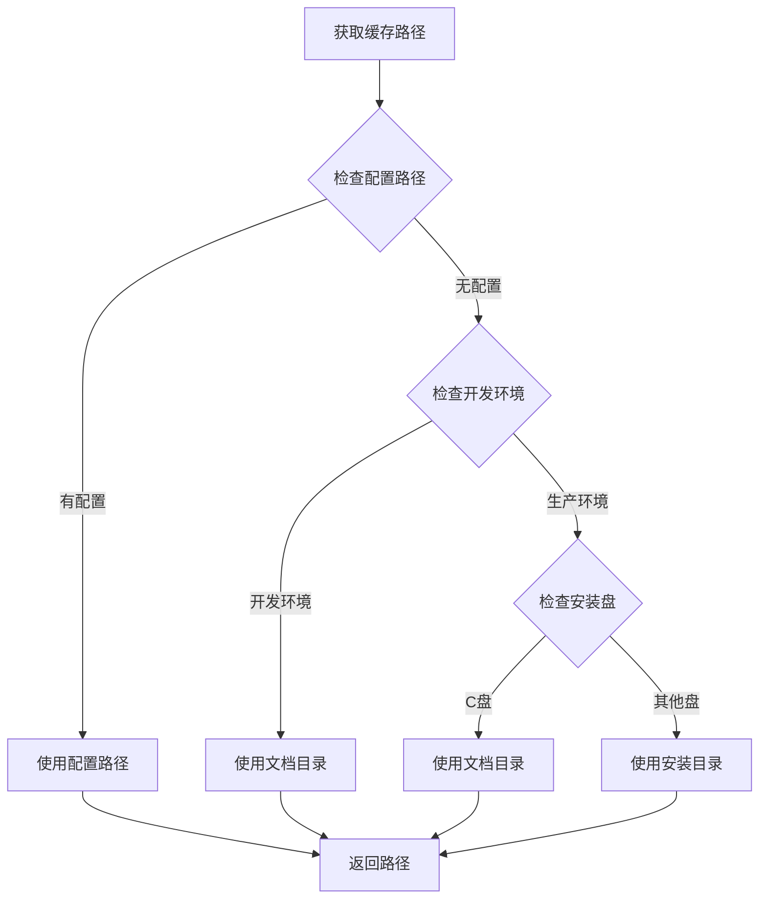

**图表来源**
- [electron/services/cacheService.ts:17-40](file://electron/services/cacheService.ts#L17-L40)

**章节来源**
- [electron/services/cacheService.ts:17-40](file://electron/services/cacheService.ts#L17-L40)
- [electron/services/dbPathService.ts:86-89](file://electron/services/dbPathService.ts#L86-L89)

### 持久化机制

#### 配置写入策略

配置写入采用原子性操作，确保数据一致性：

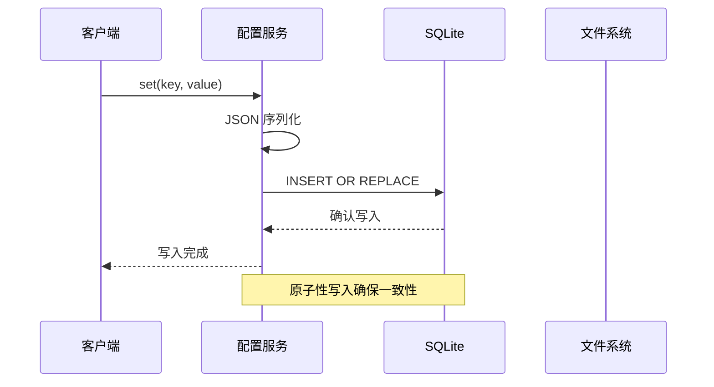

**图表来源**
- [electron/services/config.ts:264-273](file://electron/services/config.ts#L264-L273)

#### 事务处理

配置服务支持事务性操作，保证批量操作的一致性：

| 操作类型 | 事务支持 | 错误处理 |
|----------|----------|----------|
| 单个配置写入 | 否 | 回滚失败项 |
| 批量配置更新 | 是 | 部分成功部分回滚 |
| 配置清理 | 是 | 完全回滚 |
| 版本迁移 | 是 | 失败时恢复原状态 |

#### 并发控制

系统采用文件级锁和进程间通信实现并发控制：

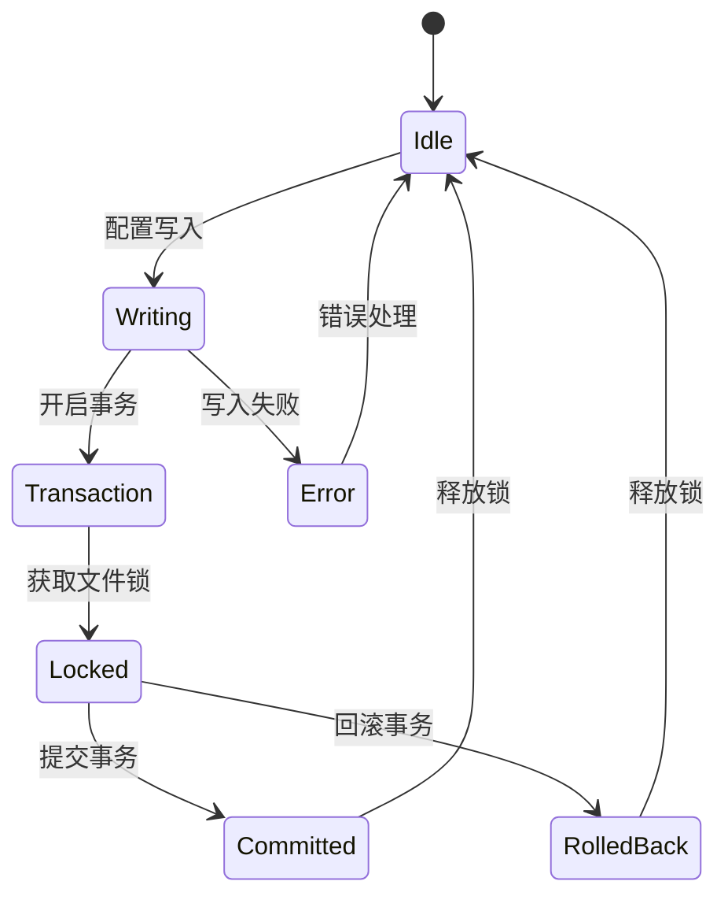

**图表来源**
- [electron/services/config.ts:264-273](file://electron/services/config.ts#L264-L273)

**章节来源**
- [electron/services/config.ts:248-308](file://electron/services/config.ts#L248-L308)

### 数据安全措施

#### 配置加密

系统支持敏感配置的加密存储：

- **密钥管理**：使用操作系统提供的密钥存储服务
- **传输加密**：IPC 通信采用安全的进程间通信机制
- **静态加密**：可选的文件级加密存储

#### 访问控制

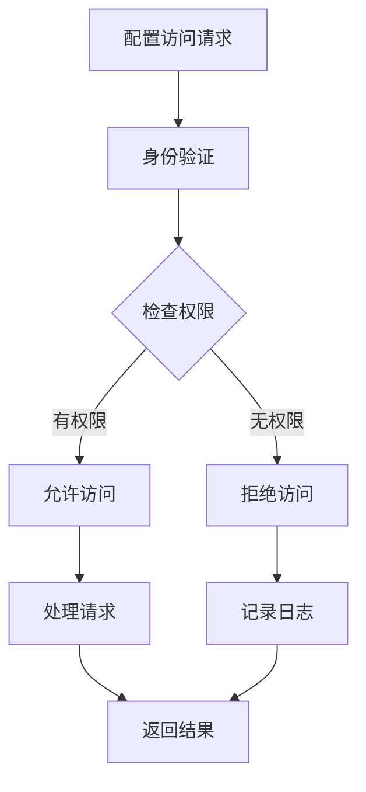

**图表来源**
- [electron/preload.ts:4-11](file://electron/preload.ts#L4-L11)

#### 数据完整性

系统内置数据完整性检查机制：

- **SQLite 完整性检查**：定期验证数据库文件完整性
- **校验和验证**：对重要配置计算校验和
- **备份恢复**：自动备份和恢复机制

**章节来源**
- [electron/services/dataManagementService.ts:514-537](file://electron/services/dataManagementService.ts#L514-L537)

### 性能优化

#### 批量写入

配置系统支持批量写入操作，减少数据库往返次数：

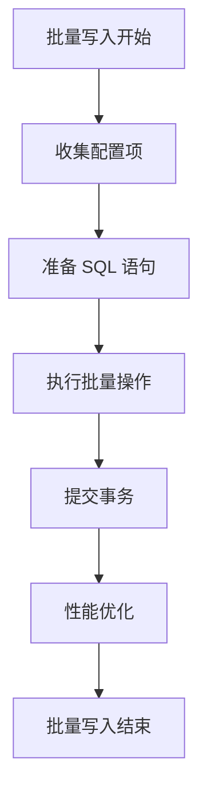

**图表来源**
- [electron/services/config.ts:165-172](file://electron/services/config.ts#L165-L172)

#### 延迟更新

系统采用延迟更新策略，避免频繁的磁盘 I/O：

- **写入缓冲**：将多个写入操作合并
- **定时刷新**：定期将缓冲数据写入磁盘
- **智能调度**：根据系统负载调整刷新频率

#### 内存缓存

配置系统实现多级缓存机制：

- **进程内缓存**：缓存最近使用的配置项
- **LRU 缓存**：基于最近最少使用算法的缓存淘汰
- **懒加载**：按需加载配置项到内存

**章节来源**
- [electron/services/config.ts:275-292](file://electron/services/config.ts#L275-L292)

## 依赖关系分析

### 组件耦合度

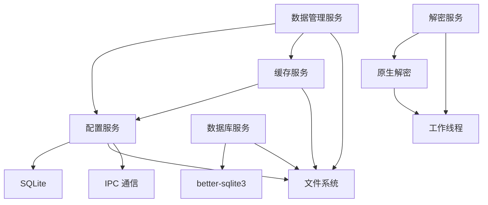

**图表来源**
- [electron/services/config.ts:126-395](file://electron/services/config.ts#L126-L395)
- [electron/services/database.ts:5-83](file://electron/services/database.ts#L5-L83)
- [electron/services/cacheService.ts:6-486](file://electron/services/cacheService.ts#L6-L486)

### 外部依赖

系统依赖的关键外部组件：

| 组件 | 版本 | 用途 | 依赖关系 |
|------|------|------|----------|
| better-sqlite3 | ^8.0.0 | SQLite 数据库驱动 | Node.js |
| Electron | ^28.0.0 | 跨平台应用框架 | Chromium, Node.js |
| koffi | ^2.0.0 | 原生 DLL 绑定 | Node.js |
| worker_threads | 内置 | 多线程处理 | Node.js |

**章节来源**
- [electron/services/config.ts:1-5](file://electron/services/config.ts#L1-L5)
- [electron/services/decryptService.ts:1-54](file://electron/services/decryptService.ts#L1-L54)

## 性能考虑

### 存储性能优化

#### SQLite 性能调优

- **WAL 模式**：启用写-ahead logging 提高并发性能
- **索引优化**：为常用查询字段建立索引
- **事务批处理**：合并多个操作到单个事务中

#### 缓存策略

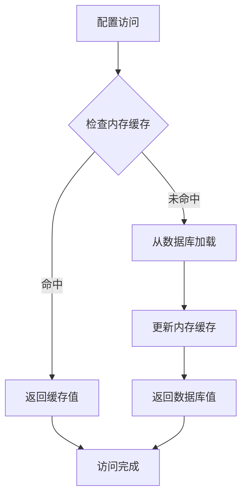

**图表来源**
- [electron/services/config.ts:248-262](file://electron/services/config.ts#L248-L262)

### I/O 性能优化

- **异步操作**：所有磁盘 I/O 操作都是异步的
- **批量处理**：合并多个小文件操作
- **预读机制**：预测性地预加载常用配置

## 故障处理指南

### 数据恢复

#### 自动备份机制

系统自动创建配置备份，支持快速恢复：

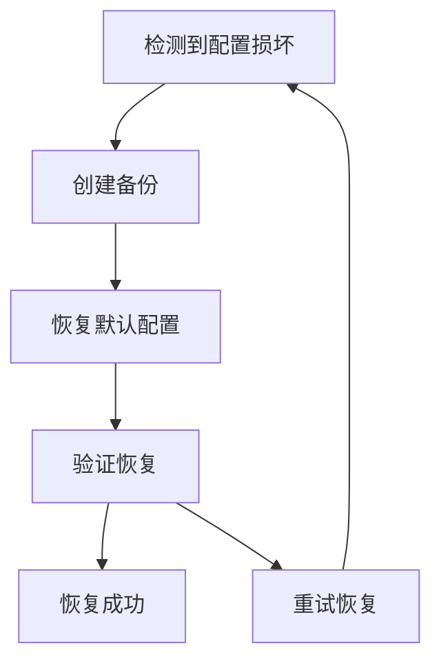

**图表来源**
- [electron/services/config.ts:294-308](file://electron/services/config.ts#L294-L308)

#### 损坏修复

配置系统具备自动修复能力：

- **SQLite 修复**：自动修复可恢复的数据库损坏
- **配置重建**：重新初始化损坏的配置项
- **数据迁移**：从备份中恢复配置数据

#### 版本迁移

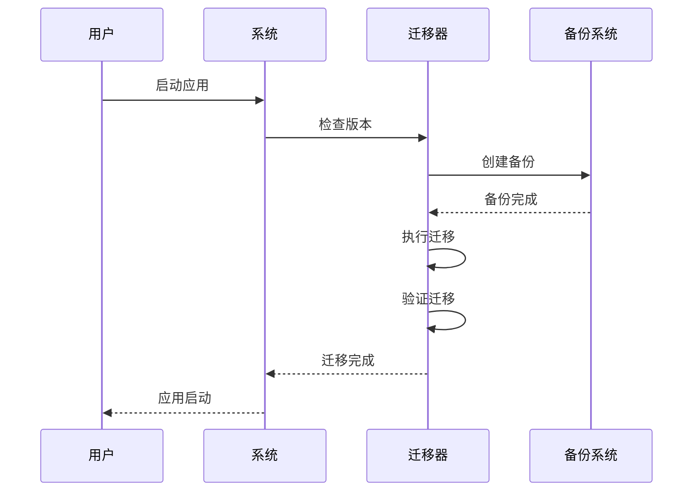

**图表来源**
- [electron/services/config.ts:174-242](file://electron/services/config.ts#L174-L242)

**章节来源**
- [electron/services/config.ts:294-308](file://electron/services/config.ts#L294-L308)
- [electron/services/config.ts:174-242](file://electron/services/config.ts#L174-L242)

## 结论

CipherTalk 的配置持久化策略通过精心设计的分层架构，实现了高效、安全、可靠的配置管理。该策略的核心优势包括：

1. **可靠性**：采用 SQLite 和文件系统双重存储，确保数据持久化
2. **安全性**：内置访问控制和数据完整性检查机制
3. **性能**：通过缓存、批量操作和异步处理优化性能
4. **可维护性**：清晰的架构分离和完善的错误处理机制
5. **扩展性**：模块化设计支持未来功能扩展

该解决方案为全栈开发者提供了完整的配置持久化参考实现，可根据具体需求进行定制和扩展。

## 附录

### 最佳实践指南

#### 配置备份

- **定期备份**：建议每日自动备份配置文件
- **多地存储**：将备份文件存储在不同位置
- **版本管理**：保留多个历史版本的配置备份

#### 灾难恢复

- **恢复流程**：制定详细的配置恢复操作手册
- **测试验证**：定期测试备份文件的可恢复性
- **应急响应**：建立配置损坏的应急响应机制

#### 性能监控

- **监控指标**：跟踪配置访问延迟和错误率
- **告警机制**：设置配置服务异常的告警
- **容量规划**：监控配置文件大小增长趋势