# 配置管理系统

<cite>
**本文档引用的文件**
- [src/services/config.ts](file://src/services/config.ts)
- [electron/services/config.ts](file://electron/services/config.ts)
- [src/stores/themeStore.ts](file://src/stores/themeStore.ts)
- [src/pages/SettingsPage.tsx](file://src/pages/SettingsPage.tsx)
- [electron/main.ts](file://electron/main.ts)
- [electron/preload.ts](file://electron/preload.ts)
- [src/services/ipc.ts](file://src/services/ipc.ts)
- [src/stores/appStore.ts](file://src/stores/appStore.ts)
- [README.md](file://README.md)
- [electron/services/README-STT.md](file://electron/services/README-STT.md)
- [electron/services/ai/Ollama使用指南.md](file://electron/services/ai/Ollama使用指南.md)
</cite>

## 目录
1. [简介](#简介)
2. [项目结构](#项目结构)
3. [核心组件](#核心组件)
4. [架构概览](#架构概览)
5. [详细组件分析](#详细组件分析)
6. [依赖关系分析](#依赖关系分析)
7. [性能考虑](#性能考虑)
8. [故障排除指南](#故障排除指南)
9. [结论](#结论)
10. [附录](#附录)

## 简介

CipherTalk 配置管理系统是一个全栈配置管理解决方案，专为现代化桌面应用设计。该系统采用前后端分离架构，结合 Electron 主进程配置服务和前端状态管理，提供了完整的配置生命周期管理能力。

系统支持多种配置类型，包括应用配置项（主题设置、语言选择、功能开关）、用户偏好设置（个性化配置、用户数据存储）、配置持久化策略（本地存储、配置文件、云端同步）以及配置验证和迁移机制。通过精心设计的配置架构，实现了配置的热重载、动态更新和无刷新生效。

## 项目结构

CipherTalk 配置管理系统采用模块化设计，主要分为三个层次：

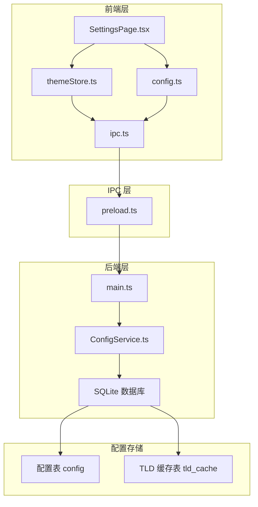

**图表来源**
- [src/pages/SettingsPage.tsx:1-800](file://src/pages/SettingsPage.tsx#L1-L800)
- [electron/preload.ts:1-454](file://electron/preload.ts#L1-L454)
- [electron/services/config.ts:126-395](file://electron/services/config.ts#L126-L395)

**章节来源**
- [README.md:132-159](file://README.md#L132-L159)
- [src/services/config.ts:1-574](file://src/services/config.ts#L1-L574)

## 核心组件

### 配置键值管理器

系统定义了统一的配置键值常量，确保配置项的一致性和可维护性：

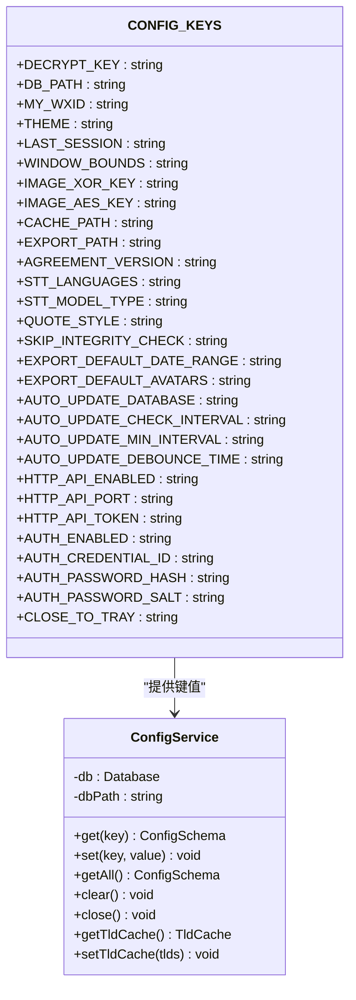

**图表来源**
- [src/services/config.ts:4-36](file://src/services/config.ts#L4-L36)
- [electron/services/config.ts:6-80](file://electron/services/config.ts#L6-L80)

### 配置服务架构

配置系统采用双层架构设计，前端提供便捷的配置访问接口，后端通过 ConfigService 管理实际的配置存储：

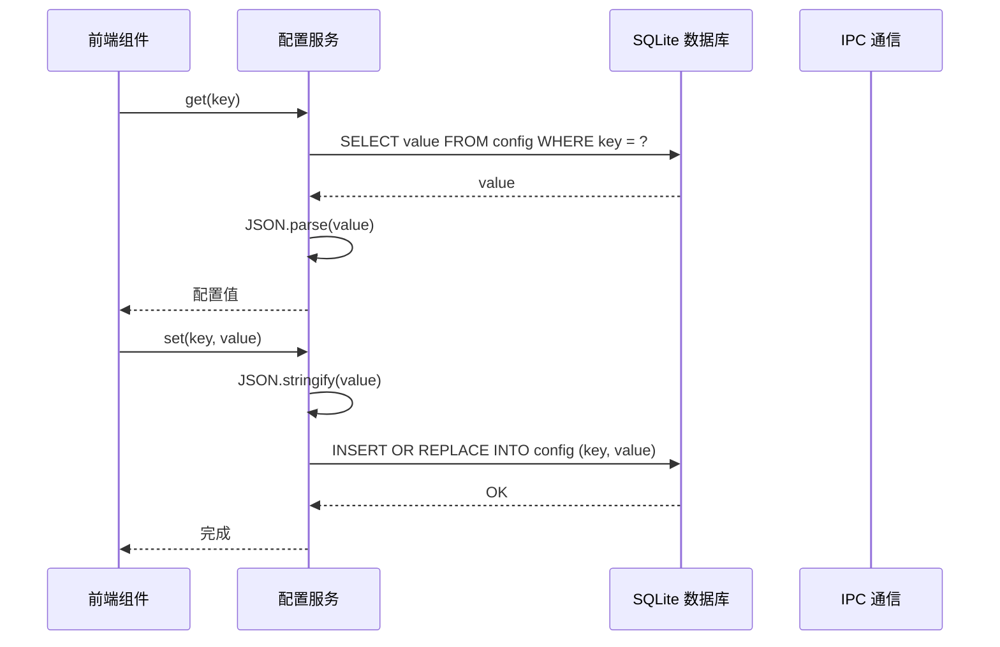

**图表来源**
- [src/services/config.ts:248-273](file://src/services/config.ts#L248-L273)
- [electron/services/config.ts:248-273](file://electron/services/config.ts#L248-L273)

**章节来源**
- [src/services/config.ts:1-574](file://src/services/config.ts#L1-L574)
- [electron/services/config.ts:126-395](file://electron/services/config.ts#L126-L395)

## 架构概览

CipherTalk 配置管理系统采用三层架构设计，实现了配置的完整生命周期管理：

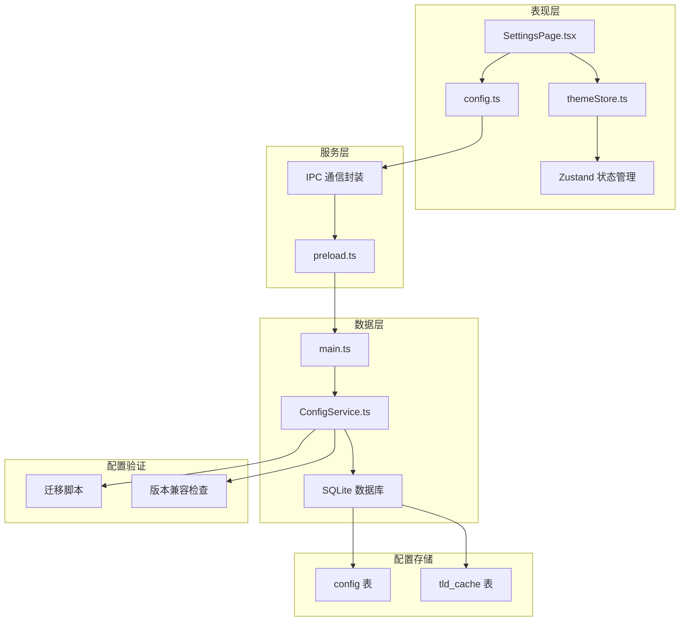

**图表来源**
- [electron/main.ts:86-91](file://electron/main.ts#L86-L91)
- [electron/preload.ts:4-11](file://electron/preload.ts#L4-L11)
- [electron/services/config.ts:147-162](file://electron/services/config.ts#L147-L162)

系统的核心优势在于其模块化设计和强类型的配置管理。每个配置项都有明确的数据类型定义和默认值处理，确保了系统的稳定性和可靠性。

## 详细组件分析

### 前端配置管理

前端配置管理通过 React Hooks 和 Zustand 状态管理实现，提供了响应式的配置更新机制：

#### 主题配置系统

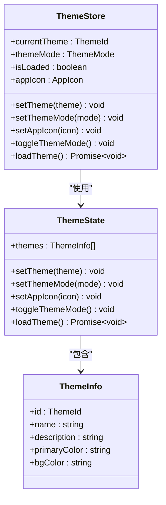

**图表来源**
- [src/stores/themeStore.ts:67-140](file://src/stores/themeStore.ts#L67-L140)

#### 设置页面配置管理

SettingsPage.tsx 提供了完整的配置管理界面，支持多种配置类型的编辑和验证：

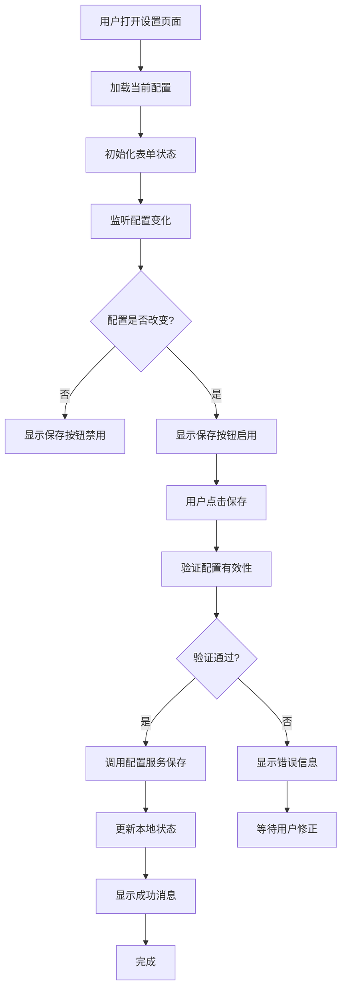

**图表来源**
- [src/pages/SettingsPage.tsx:283-327](file://src/pages/SettingsPage.tsx#L283-L327)

**章节来源**
- [src/stores/themeStore.ts:1-146](file://src/stores/themeStore.ts#L1-L146)
- [src/pages/SettingsPage.tsx:1-800](file://src/pages/SettingsPage.tsx#L1-L800)

### 后端配置服务

后端配置服务通过 ConfigService 提供可靠的配置存储和管理功能：

#### 配置存储架构

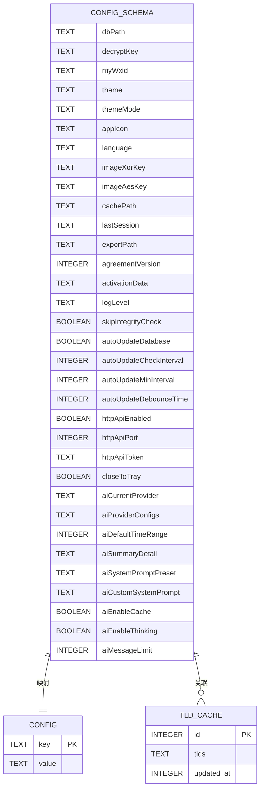

**图表来源**
- [electron/services/config.ts:6-80](file://electron/services/config.ts#L6-L80)
- [electron/services/config.ts:147-162](file://electron/services/config.ts#L147-L162)

#### 配置迁移机制

系统内置了完善的配置迁移机制，确保版本升级时的配置兼容性：

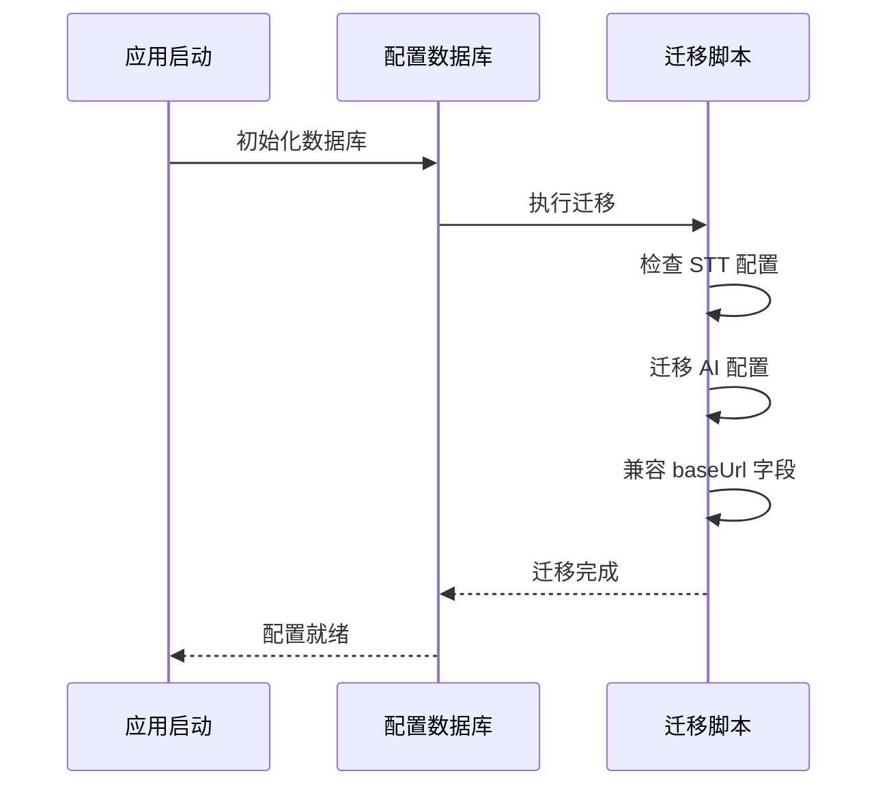

**图表来源**
- [electron/services/config.ts:174-242](file://electron/services/config.ts#L174-L242)

**章节来源**
- [electron/services/config.ts:126-395](file://electron/services/config.ts#L126-L395)

### IPC 通信层

IPC 通信层通过 contextBridge 暴露安全的 API 接口，实现了前端与后端的配置访问：

#### IPC 接口设计

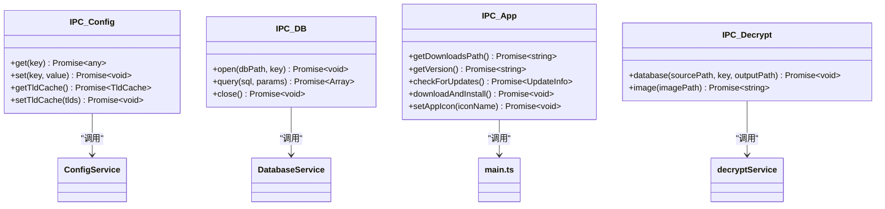

**图表来源**
- [electron/preload.ts:4-11](file://electron/preload.ts#L4-L11)
- [electron/preload.ts:47-62](file://electron/preload.ts#L47-L62)

**章节来源**
- [electron/preload.ts:1-454](file://electron/preload.ts#L1-L454)
- [src/services/ipc.ts:1-38](file://src/services/ipc.ts#L1-L38)

## 依赖关系分析

配置管理系统各组件之间的依赖关系体现了清晰的分层架构：

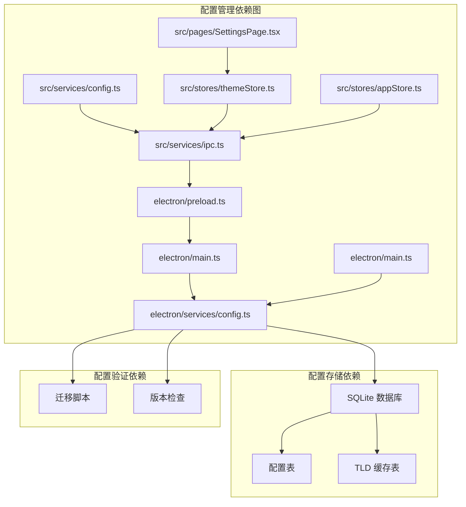

**图表来源**
- [src/services/config.ts:1-574](file://src/services/config.ts#L1-L574)
- [electron/services/config.ts:126-395](file://electron/services/config.ts#L126-L395)

系统采用松耦合的设计原则，各组件通过明确定义的接口进行交互，降低了组件间的依赖复杂度。

**章节来源**
- [src/services/config.ts:1-574](file://src/services/config.ts#L1-L574)
- [electron/services/config.ts:126-395](file://electron/services/config.ts#L126-L395)

## 性能考虑

配置管理系统在设计时充分考虑了性能优化，采用了多种策略来提升系统响应速度和资源利用率：

### 配置缓存策略

系统实现了多层次的配置缓存机制：

1. **前端状态缓存**：使用 Zustand 状态管理，避免重复的配置查询
2. **IPC 缓存**：通过 preload 脚本缓存常用配置值
3. **数据库缓存**：SQLite 数据库存储配置，支持快速查询

### 异步配置处理

所有配置操作都采用异步处理模式，避免阻塞主线程：

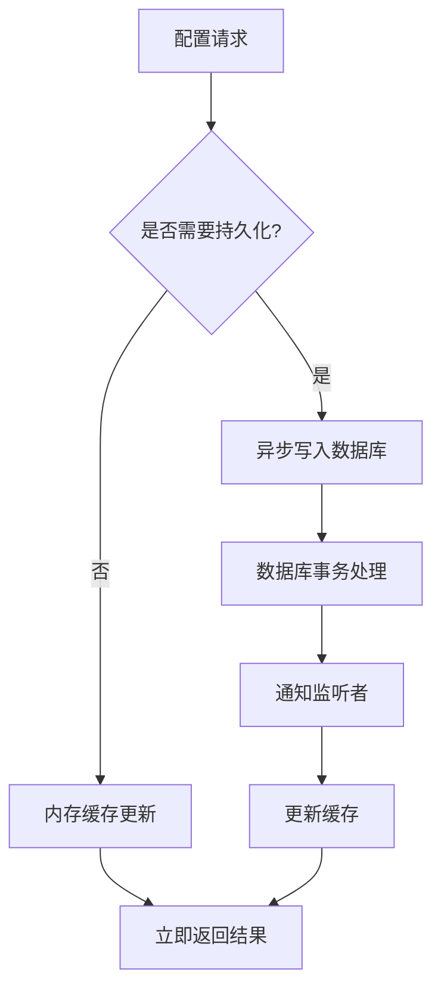

### 配置验证优化

系统在配置验证方面采用了多项优化措施：

- **类型检查**：编译时类型检查，减少运行时错误
- **默认值处理**：自动处理缺失配置的默认值
- **边界检查**：对数值配置进行范围验证

## 故障排除指南

### 常见配置问题及解决方案

#### 配置加载失败

**问题症状**：应用启动时配置加载异常，使用默认配置

**可能原因**：
1. SQLite 数据库文件损坏
2. 配置表结构不匹配
3. 权限不足导致文件访问失败

**解决步骤**：
1. 检查配置数据库文件是否存在
2. 验证配置表结构是否正确
3. 确认应用程序具有文件访问权限

#### 配置同步问题

**问题症状**：前端显示的配置与实际配置不一致

**可能原因**：
1. IPC 通信中断
2. 状态管理不同步
3. 缓存数据过期

**解决步骤**：
1. 重启应用以重置 IPC 连接
2. 清除应用缓存数据
3. 检查网络连接状态

#### 配置迁移失败

**问题症状**：升级后配置丢失或异常

**可能原因**：
1. 迁移脚本执行失败
2. 数据库版本不兼容
3. 迁移过程中断电

**解决步骤**：
1. 检查迁移日志文件
2. 手动执行迁移脚本
3. 备份并重建配置数据库

**章节来源**
- [electron/services/config.ts:248-308](file://electron/services/config.ts#L248-L308)

## 结论

CipherTalk 配置管理系统通过精心设计的架构和实现，为现代桌面应用提供了完整的配置管理解决方案。系统的主要特点包括：

1. **模块化设计**：清晰的分层架构，便于维护和扩展
2. **强类型支持**：完整的 TypeScript 类型定义，提升开发体验
3. **持久化存储**：基于 SQLite 的可靠配置存储
4. **配置迁移**：自动化的配置迁移机制，确保版本兼容性
5. **性能优化**：多层次缓存和异步处理，提升系统响应速度

该系统为全栈开发者提供了配置管理的最佳实践指导，包括配置架构设计、数据流管理、错误处理策略等方面的经验总结。通过遵循这些设计原则和实现模式，开发者可以构建出更加健壮和可维护的配置管理系统。

## 附录

### 配置项分类说明

系统配置项按照功能和作用域可分为以下几类：

#### 应用配置项
- 主题设置：主题颜色、模式、图标
- 语言选择：界面语言、STT 语言支持
- 功能开关：自动更新、HTTP API、完整性检查
- 默认参数：导出设置、时间范围、消息限制

#### 用户偏好设置
- 个性化配置：用户界面偏好、显示选项
- 用户数据存储：用户标识、会话信息
- 配置导入导出：配置文件的导入导出功能

#### 配置持久化策略
- 本地存储：用户数据的本地缓存
- 配置文件：配置文件的序列化和反序列化
- 云端同步：配置的云端备份和同步

### 配置扩展指南

#### 新增配置项
1. 在 CONFIG_KEYS 中添加新的配置键
2. 在 ConfigSchema 中定义配置类型
3. 实现配置的 getter 和 setter 方法
4. 在 SettingsPage 中添加配置界面

#### 配置分组
系统支持配置的逻辑分组，便于管理和维护：
- 数据库相关配置
- 用户界面配置
- AI 服务配置
- 系统功能配置

#### 配置分层
系统采用分层配置管理：
- 应用层：全局应用配置
- 用户层：用户个性化配置
- 会话层：临时会话配置
- 临时层：运行时临时配置

通过这些设计模式，CipherTalk 配置管理系统为开发者提供了一个强大而灵活的配置管理框架，适用于各种复杂的桌面应用需求。