# 配置验证与迁移

<cite>
**本文档引用的文件**
- [electron/services/config.ts](file://electron/services/config.ts)
- [src/services/config.ts](file://src/services/config.ts)
- [electron/main.ts](file://electron/main.ts)
- [electron/services/httpApiService.ts](file://electron/services/httpApiService.ts)
- [electron/services/dataManagementService.ts](file://electron/services/dataManagementService.ts)
- [electron/services/ai/providers/custom.ts](file://electron/services/ai/providers/custom.ts)
- [src/App.tsx](file://src/App.tsx)
- [src/stores/authStore.ts](file://src/stores/authStore.ts)
- [package.json](file://package.json)
</cite>

## 目录
1. [简介](#简介)
2. [项目结构](#项目结构)
3. [核心组件](#核心组件)
4. [架构概览](#架构概览)
5. [详细组件分析](#详细组件分析)
6. [依赖关系分析](#依赖关系分析)
7. [性能考虑](#性能考虑)
8. [故障排除指南](#故障排除指南)
9. [结论](#结论)

## 简介

CipherTalk 是一个微信聊天记录查看工具，其配置验证与迁移机制是确保系统稳定运行的关键基础设施。本文档深入分析了该系统的配置验证体系、迁移机制、错误处理策略以及兼容性管理方案。

系统采用双层配置架构：前端通过 Electron Store 进行配置管理，后端使用 SQLite 数据库存储配置数据。这种设计提供了强大的配置验证能力、灵活的迁移机制和完善的错误处理策略。

## 项目结构

CipherTalk 的配置系统主要分布在以下模块中：

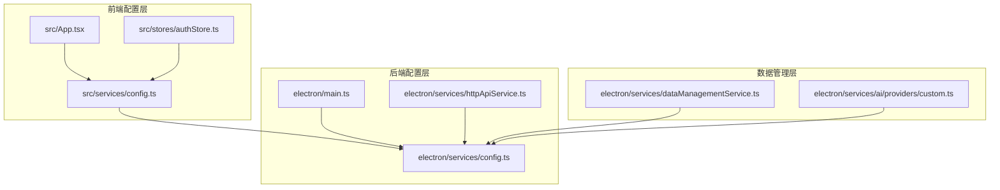

**图表来源**
- [electron/services/config.ts:126-246](file://electron/services/config.ts#L126-L246)
- [src/services/config.ts:1-574](file://src/services/config.ts#L1-L574)

**章节来源**
- [electron/services/config.ts:126-246](file://electron/services/config.ts#L126-L246)
- [src/services/config.ts:1-574](file://src/services/config.ts#L1-L574)

## 核心组件

### 配置服务架构

系统的核心是 ConfigService 类，它提供了完整的配置管理功能：

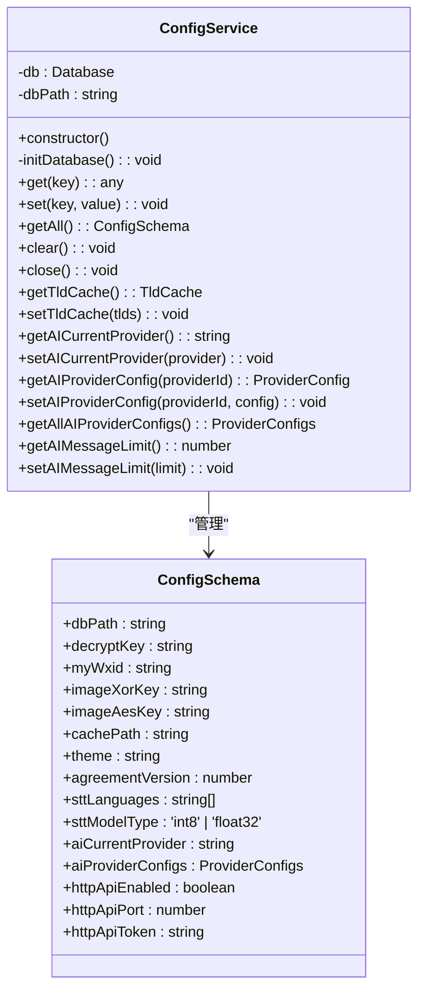

**图表来源**
- [electron/services/config.ts:6-80](file://electron/services/config.ts#L6-L80)
- [electron/services/config.ts:126-246](file://electron/services/config.ts#L126-L246)

### 配置验证体系

系统实现了多层次的配置验证机制：

1. **数据类型验证**：通过 TypeScript 接口定义严格的类型约束
2. **业务规则检查**：参数范围验证和业务逻辑约束
3. **配置一致性校验**：跨配置项的一致性检查

**章节来源**
- [electron/services/config.ts:82-124](file://electron/services/config.ts#L82-L124)
- [src/services/config.ts:44-87](file://src/services/config.ts#L44-L87)

## 架构概览

CipherTalk 的配置系统采用分层架构设计，确保了配置的可靠性、可维护性和可扩展性：

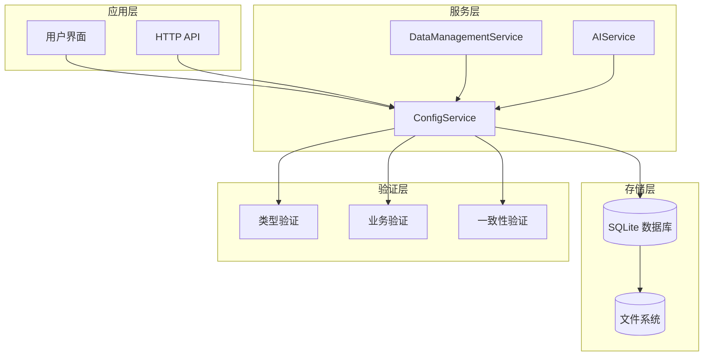

**图表来源**
- [electron/main.ts:86-91](file://electron/main.ts#L86-L91)
- [electron/services/config.ts:126-246](file://electron/services/config.ts#L126-L246)

## 详细组件分析

### 配置验证机制

#### 数据类型验证

系统通过严格的 TypeScript 接口实现数据类型验证：

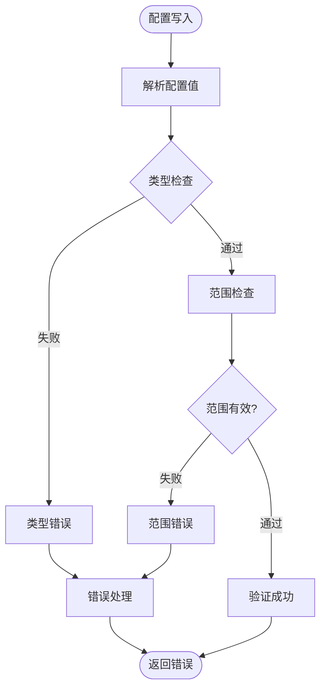

**图表来源**
- [src/services/config.ts:63-87](file://src/services/config.ts#L63-L87)
- [electron/services/httpApiService.ts:241-246](file://electron/services/httpApiService.ts#L241-L246)

#### 业务规则检查

系统实现了多种业务规则验证：

1. **端口范围验证**：1-65535
2. **时间参数验证**：最小更新间隔、防抖时间等
3. **协议版本检查**：用户协议版本一致性

**章节来源**
- [src/services/config.ts:109-112](file://src/services/config.ts#L109-L112)
- [src/services/config.ts:265-274](file://src/services/config.ts#L265-L274)

### 配置迁移机制

#### 版本检测与迁移

系统通过协议版本控制实现配置迁移：

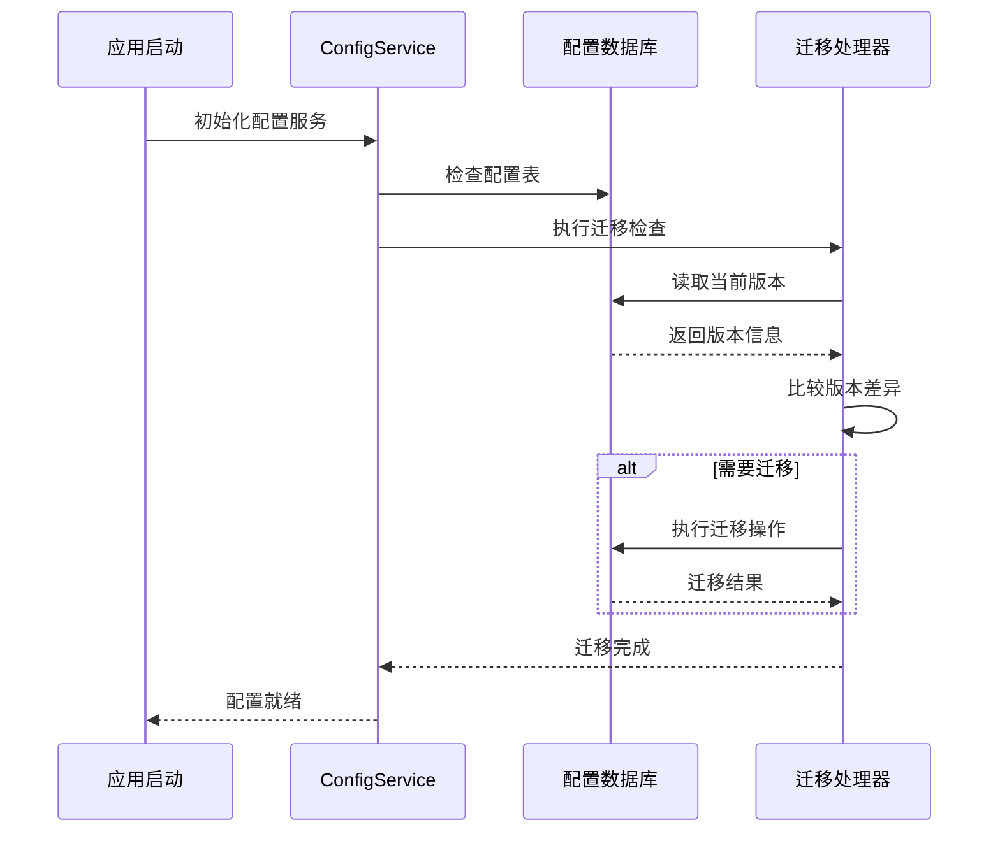

**图表来源**
- [electron/services/config.ts:136-246](file://electron/services/config.ts#L136-L246)
- [src/services/config.ts:254-274](file://src/services/config.ts#L254-L274)

#### 自动升级策略

系统实现了智能的自动升级机制：

1. **AI 配置迁移**：从单提供商配置迁移到多提供商配置
2. **字段兼容性**：baseUrl 到 baseURL 的字段迁移
3. **默认值修复**：修复历史版本产生的配置问题

**章节来源**
- [electron/services/config.ts:187-242](file://electron/services/config.ts#L187-L242)

### 迁移策略

#### 渐进式迁移

系统采用渐进式迁移策略，确保迁移过程的稳定性：

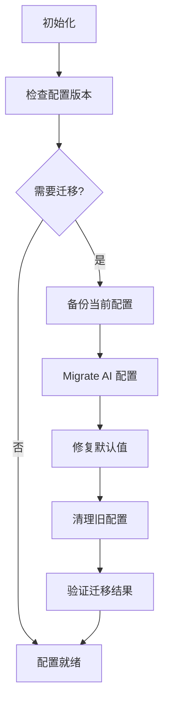

**图表来源**
- [electron/services/config.ts:174-242](file://electron/services/config.ts#L174-L242)

#### 批量处理与回滚机制

系统提供了完善的批量处理和回滚机制：

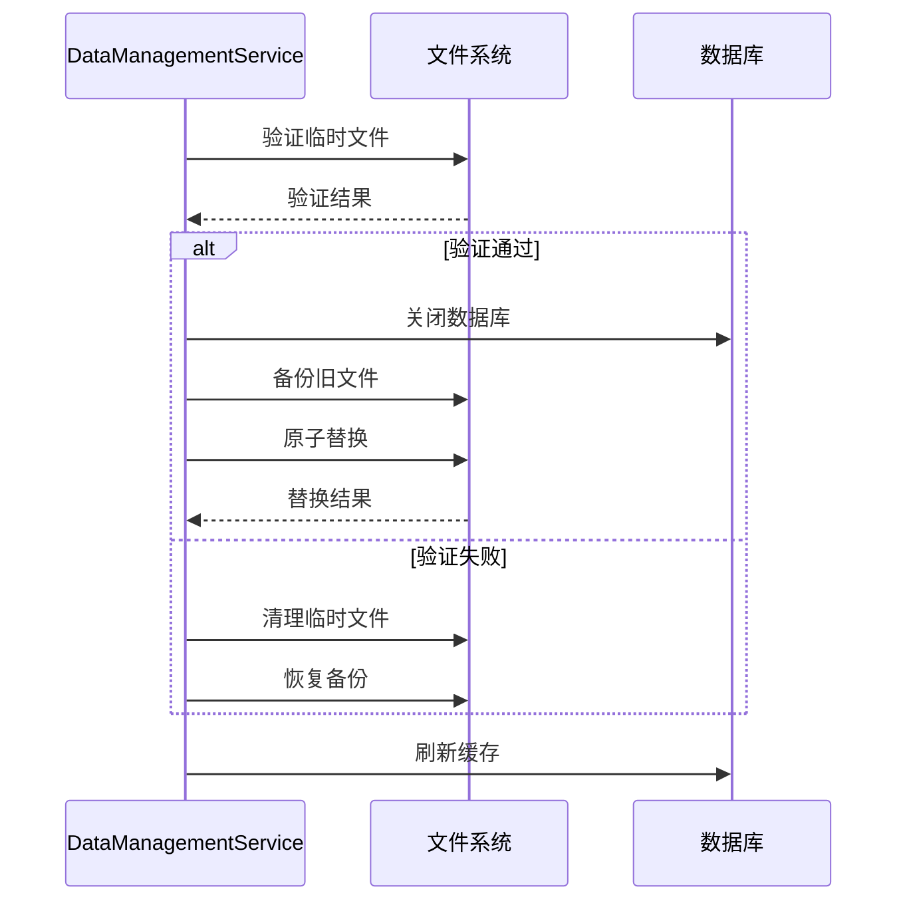

**图表来源**
- [electron/services/dataManagementService.ts:514-612](file://electron/services/dataManagementService.ts#L514-L612)

**章节来源**
- [electron/services/dataManagementService.ts:514-612](file://electron/services/dataManagementService.ts#L514-L612)

### 错误处理与用户提示

#### 错误分类与处理

系统实现了多层次的错误处理机制：

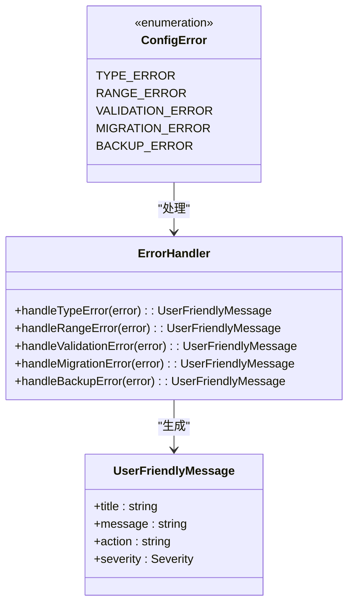

**图表来源**
- [src/stores/authStore.ts:29-50](file://src/stores/authStore.ts#L29-L50)
- [electron/services/ai/providers/custom.ts:84-116](file://electron/services/ai/providers/custom.ts#L84-L116)

#### 自动修复机制

系统提供了自动修复功能：

1. **STT 配置修复**：自动修复空语言列表问题
2. **AI 配置迁移**：自动迁移旧的配置格式
3. **字段兼容性**：自动处理字段名称变更

**章节来源**
- [electron/services/config.ts:174-185](file://electron/services/config.ts#L174-L185)
- [electron/services/config.ts:219-242](file://electron/services/config.ts#L219-L242)

### 配置兼容性管理

#### API 变更处理

系统通过版本控制和向后兼容策略处理 API 变更：

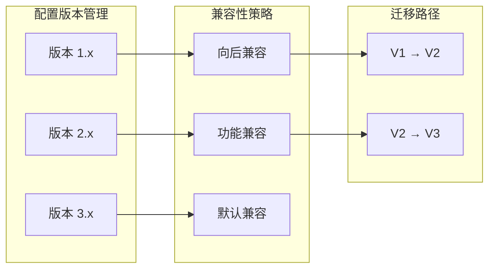

**图表来源**
- [src/services/config.ts:38-39](file://src/services/config.ts#L38-L39)
- [src/App.tsx:434](file://src/App.tsx#L434)

#### 配置结构调整

系统提供了灵活的配置结构调整能力：

1. **动态配置更新**：支持运行时配置修改
2. **配置热重载**：部分配置支持热重载
3. **配置验证链**：多级配置验证确保数据一致性

**章节来源**
- [electron/main.ts:1146-1176](file://electron/main.ts#L1146-L1176)
- [electron/services/httpApiService.ts:56-62](file://electron/services/httpApiService.ts#L56-L62)

## 依赖关系分析

### 核心依赖关系

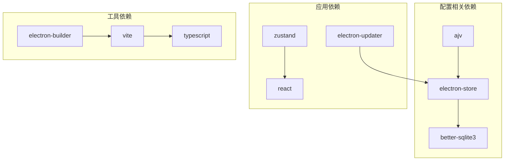

**图表来源**
- [package.json:20-57](file://package.json#L20-L57)
- [package.json:58-73](file://package.json#L58-L73)

### 配置服务依赖

系统配置服务的依赖关系清晰明确：

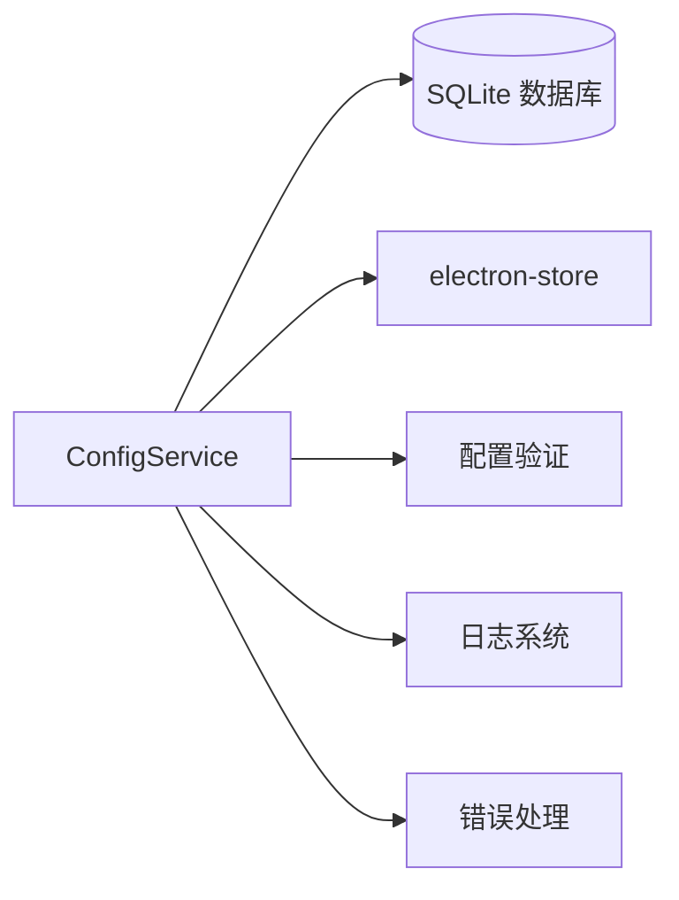

**图表来源**
- [electron/services/config.ts:1-5](file://electron/services/config.ts#L1-L5)

**章节来源**
- [package.json:20-57](file://package.json#L20-L57)

## 性能考虑

### 配置访问优化

系统采用了多种性能优化策略：

1. **延迟初始化**：配置数据库仅在需要时初始化
2. **缓存机制**：常用配置值缓存避免重复查询
3. **批量操作**：支持批量配置读写操作

### 迁移性能优化

迁移过程的性能优化包括：

1. **异步处理**：迁移操作异步执行避免阻塞主线程
2. **增量迁移**：支持增量迁移减少迁移时间
3. **资源管理**：合理管理数据库连接和文件句柄

## 故障排除指南

### 常见配置问题

#### 配置验证失败

当配置验证失败时，系统会返回详细的错误信息：

1. **类型不匹配**：检查配置值的数据类型
2. **范围超出**：确认数值在允许范围内
3. **格式错误**：验证字符串格式是否正确

#### 迁移失败

迁移失败的常见原因：

1. **数据库权限不足**：检查配置数据库文件权限
2. **磁盘空间不足**：确保有足够的磁盘空间
3. **文件锁定**：关闭可能锁定配置文件的应用程序

#### HTTP API 配置问题

HTTP API 配置相关的故障排除：

1. **端口占用**：检查端口是否被其他应用程序占用
2. **认证失败**：验证访问令牌配置
3. **跨域问题**：检查 CORS 配置

**章节来源**
- [electron/services/httpApiService.ts:81-88](file://electron/services/httpApiService.ts#L81-L88)
- [electron/services/ai/providers/custom.ts:84-116](file://electron/services/ai/providers/custom.ts#L84-L116)

### 调试工具

系统提供了多种调试工具：

1. **配置状态检查**：查看当前配置状态
2. **迁移日志**：跟踪迁移过程
3. **错误统计**：统计配置相关错误

## 结论

CipherTalk 的配置验证与迁移系统展现了现代应用程序配置管理的最佳实践。通过双层架构设计、多层次验证机制、智能迁移策略和完善的错误处理，系统确保了配置的可靠性、一致性和可维护性。

该系统的主要优势包括：

1. **强类型安全**：通过 TypeScript 和接口定义确保配置类型安全
2. **智能迁移**：自动处理配置格式变更和版本升级
3. **完善验证**：多层次的配置验证确保数据一致性
4. **灵活扩展**：支持新的配置项和验证规则
5. **用户友好**：提供清晰的错误提示和自动修复功能

这套配置管理系统为 CipherTalk 的稳定运行提供了坚实的基础，也为类似复杂应用的配置管理提供了宝贵的参考经验。