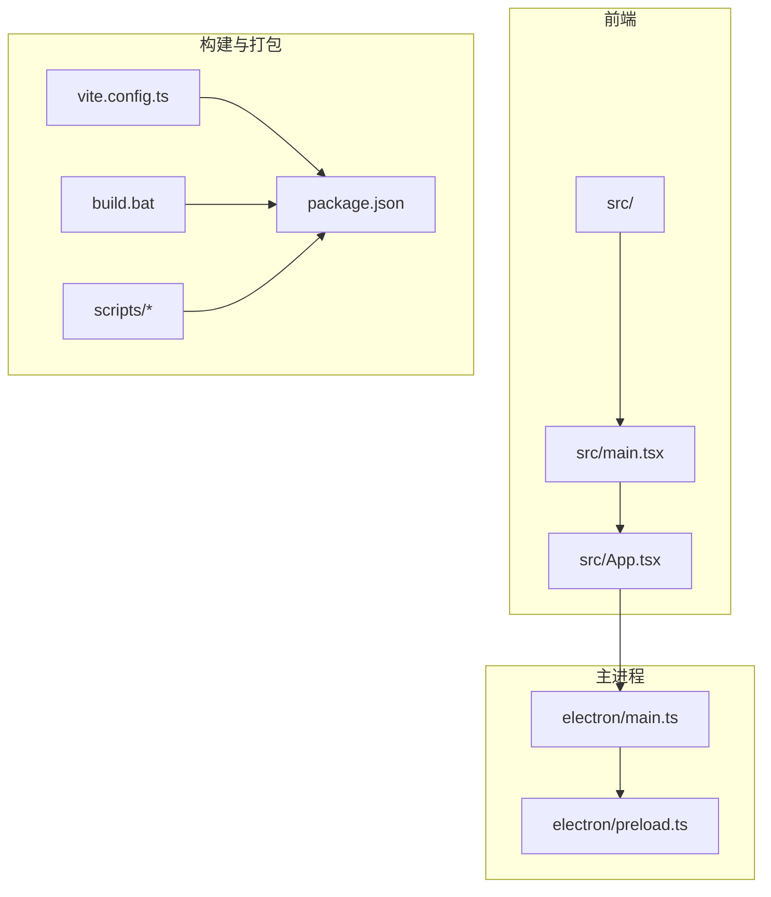
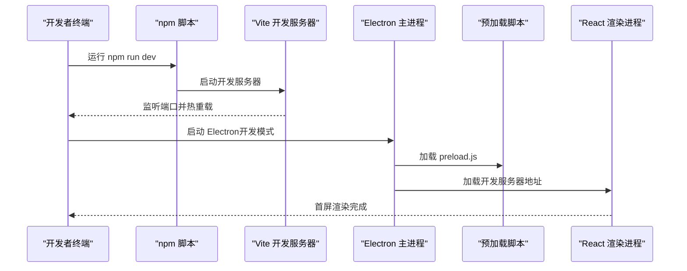
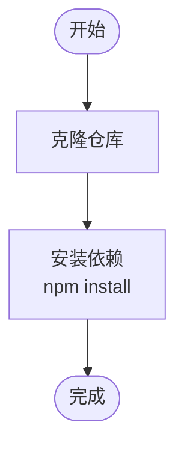
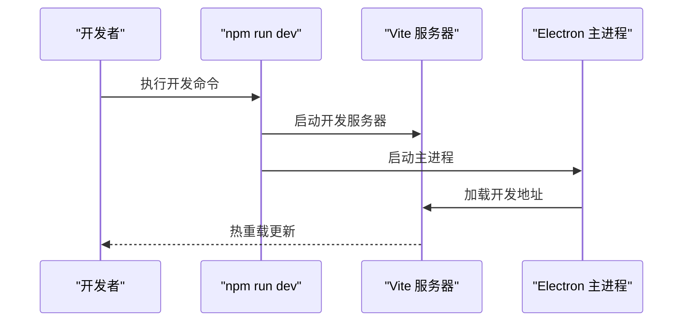
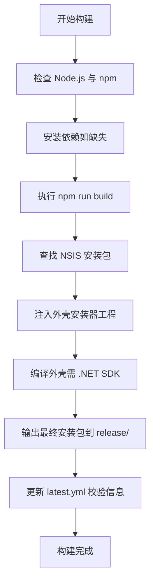
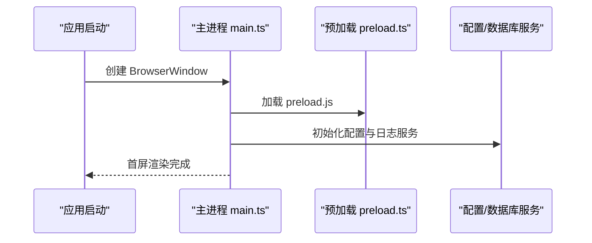
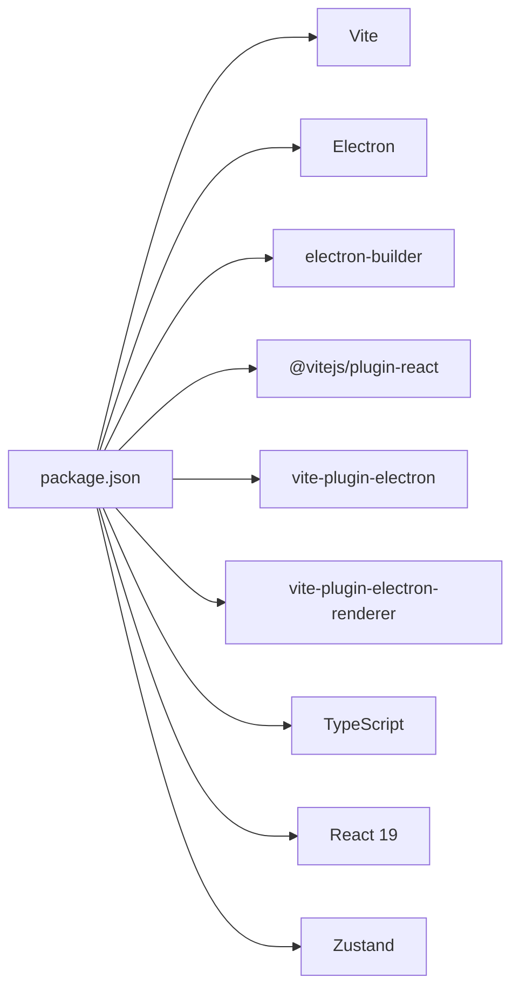

# 快速开始

<cite>
**本文引用的文件**
- [README.md](file://README.md)
- [package.json](file://package.json)
- [vite.config.ts](file://vite.config.ts)
- [build.bat](file://build.bat)
- [scripts/build-full.js](file://scripts/build-full.js)
- [scripts/build-shell-only.js](file://scripts/build-shell-only.js)
- [scripts/optimize-deps.js](file://scripts/optimize-deps.js)
- [electron/main.ts](file://electron/main.ts)
- [electron/preload.ts](file://electron/preload.ts)
- [electron/services/config.ts](file://electron/services/config.ts)
- [electron/services/database.ts](file://electron/services/database.ts)
- [src/main.tsx](file://src/main.tsx)
- [tsconfig.json](file://tsconfig.json)
</cite>

## 目录
1. [简介](#简介)
2. [项目结构](#项目结构)
3. [核心组件](#核心组件)
4. [架构总览](#架构总览)
5. [详细组件分析](#详细组件分析)
6. [依赖分析](#依赖分析)
7. [性能考虑](#性能考虑)
8. [故障排查指南](#故障排查指南)
9. [结论](#结论)
10. [附录](#附录)

## 简介
本指南面向首次接触 CipherTalk 的开发者与使用者，帮助你在 Windows 10/11 环境下，基于 Node.js 18.x+，在最短时间内完成环境准备、项目克隆、依赖安装、开发服务器启动，并掌握开发模式与生产构建流程。你还将了解构建产物位置、使用方法以及常见问题的排查思路，确保顺利运行并开始使用。

## 项目结构
CipherTalk 是一个基于 Electron + React + Vite 的桌面应用，前端使用 React + TypeScript，主进程使用 Electron，构建工具链采用 Vite + electron-builder。项目还包含丰富的 AI 服务集成与多媒体处理能力。

**图示来源**
- [src/main.tsx:1-14](file://src/main.tsx#L1-L14)
- [electron/main.ts:1-800](file://electron/main.ts#L1-L800)
- [electron/preload.ts:1-454](file://electron/preload.ts#L1-L454)
- [vite.config.ts:1-78](file://vite.config.ts#L1-L78)
- [package.json:1-169](file://package.json#L1-L169)
- [build.bat:1-79](file://build.bat#L1-L79)
- [scripts/build-full.js:1-157](file://scripts/build-full.js#L1-L157)

**章节来源**
- [README.md:132-159](file://README.md#L132-L159)
- [package.json:1-169](file://package.json#L1-L169)
- [vite.config.ts:1-78](file://vite.config.ts#L1-L78)

## 核心组件
- 前端入口与路由：React 应用通过 HashRouter 包裹，挂载于 index.html 的 #app 容器。
- 主进程入口：Electron 主进程负责创建 BrowserWindow、注册协议、托盘、自动更新等。
- 预加载脚本：通过 contextBridge 暴露受控 API 给渲染进程，实现安全 IPC。
- 构建配置：Vite 插件组合 electron 与 renderer，支持主进程、预加载与 worker 的分别打包。
- 构建脚本：提供一键构建批处理与多阶段构建脚本，支持完整安装包与外壳安装包。

**章节来源**
- [src/main.tsx:1-14](file://src/main.tsx#L1-L14)
- [electron/main.ts:193-281](file://electron/main.ts#L193-L281)
- [electron/preload.ts:1-454](file://electron/preload.ts#L1-L454)
- [vite.config.ts:15-77](file://vite.config.ts#L15-L77)
- [build.bat:1-79](file://build.bat#L1-L79)
- [scripts/build-full.js:1-157](file://scripts/build-full.js#L1-L157)

## 架构总览
下面的序列图展示了从启动到首屏渲染的关键流程，涵盖开发模式与生产模式差异。

**图示来源**
- [README.md:94-130](file://README.md#L94-L130)
- [vite.config.ts:15-77](file://vite.config.ts#L15-L77)
- [electron/main.ts:260-277](file://electron/main.ts#L260-L277)
- [electron/preload.ts:1-454](file://electron/preload.ts#L1-L454)

## 详细组件分析

### 环境准备与系统要求
- Node.js：18.x 或更高版本
- 操作系统：Windows 10/11
- 内存：建议 4GB 以上
- 可选：.NET SDK（用于外壳安装包构建）

上述要求来自项目文档与构建脚本的环境检查逻辑。

**章节来源**
- [README.md:96-101](file://README.md#L96-L101)
- [build.bat:12-34](file://build.bat#L12-L34)

### 项目克隆与依赖安装
- 克隆仓库后，在项目根目录执行依赖安装命令。
- 若网络受限，可结合 npm 配置与代理使用。

**图示来源**
- [README.md:102-106](file://README.md#L102-L106)
- [build.bat:40-53](file://build.bat#L40-L53)

**章节来源**
- [README.md:102-106](file://README.md#L102-L106)
- [build.bat:40-53](file://build.bat#L40-L53)

### 开发服务器启动
- 开发模式：启动 Vite 开发服务器并配合 Electron 主进程加载开发地址。
- 端口：默认 3000，若被占用将自动尝试下一个可用端口。
- 热重载：Vite 插件启用，前端变更即时生效。

**图示来源**
- [README.md:108-114](file://README.md#L108-L114)
- [vite.config.ts:17-20](file://vite.config.ts#L17-L20)
- [electron/main.ts:260-277](file://electron/main.ts#L260-L277)

**章节来源**
- [README.md:108-114](file://README.md#L108-L114)
- [vite.config.ts:17-20](file://vite.config.ts#L17-L20)
- [electron/main.ts:260-277](file://electron/main.ts#L260-L277)

### 生产构建与产物位置
- 完整安装包构建：执行构建脚本，生成 NSIS 安装包并进入外壳构建流程。
- 产物位置：release 目录，包含安装包与更新元数据文件。
- 构建脚本：包含环境检查、依赖安装、构建与外壳打包、元数据更新等步骤。

**图示来源**
- [build.bat:12-79](file://build.bat#L12-L79)
- [scripts/build-full.js:20-157](file://scripts/build-full.js#L20-L157)
- [scripts/build-shell-only.js:14-85](file://scripts/build-shell-only.js#L14-L85)

**章节来源**
- [README.md:116-128](file://README.md#L116-L128)
- [build.bat:55-79](file://build.bat#L55-L79)
- [scripts/build-full.js:20-157](file://scripts/build-full.js#L20-L157)
- [scripts/build-shell-only.js:14-85](file://scripts/build-shell-only.js#L14-L85)

### 构建命令与参数说明
- 开发模式：npm run dev
- 生产构建：npm run build（包含 TypeScript 编译、Vite 构建、electron-builder 打包、附加元数据处理）
- 完整安装包：npm run build:full（内部调用完整构建脚本）
- 预构建版本更新：npm run prebuild（更新 README 版本信息）
- 预览构建：npm run preview（本地预览生产构建产物）
- Electron 开发模式：npm run electron:dev（以 Electron 模式运行 Vite）
- Electron 构建：npm run electron:build（委托 npm run build）

**章节来源**
- [package.json:8-18](file://package.json#L8-L18)

### 首次运行与初始化配置
- 首次启动：Electron 主进程创建主窗口并加载前端页面；开发模式下加载 Vite 地址，生产模式下加载 dist/index.html。
- 预加载脚本：通过 contextBridge 暴露受控 API，供渲染进程调用。
- 配置存储：使用 SQLite 数据库存储配置与缓存，路径位于应用用户数据目录。
- 数据库服务：提供只读数据库连接与查询封装。

**图示来源**
- [electron/main.ts:193-281](file://electron/main.ts#L193-L281)
- [electron/preload.ts:1-454](file://electron/preload.ts#L1-L454)
- [electron/services/config.ts:126-134](file://electron/services/config.ts#L126-L134)
- [electron/services/database.ts:5-24](file://electron/services/database.ts#L5-L24)

**章节来源**
- [electron/main.ts:193-281](file://electron/main.ts#L193-L281)
- [electron/preload.ts:1-454](file://electron/preload.ts#L1-L454)
- [electron/services/config.ts:126-134](file://electron/services/config.ts#L126-L134)
- [electron/services/database.ts:5-24](file://electron/services/database.ts#L5-L24)

## 依赖分析
- 构建工具链：Vite、electron、electron-builder、@vitejs/plugin-react、vite-plugin-electron、vite-plugin-electron-renderer。
- 前端框架：React 19、TypeScript、Zustand 状态管理。
- 桌面框架：Electron 39。
- 其他：better-sqlite3、echarts、marked、lucide-react、openai 等。

**图示来源**
- [package.json:58-73](file://package.json#L58-L73)
- [vite.config.ts:1-78](file://vite.config.ts#L1-L78)

**章节来源**
- [package.json:58-73](file://package.json#L58-L73)
- [vite.config.ts:1-78](file://vite.config.ts#L1-L78)

## 性能考虑
- 构建体积优化：electron-builder 配置排除冗余平台与调试文件，减少安装包体积。
- 依赖压缩：提供 UPX 压缩脚本（当前注释掉原生模块压缩，避免破坏性影响）。
- 产物瘦身：通过过滤规则与 asarUnpack 策略平衡体积与运行效率。
- 本地开发：Vite 热重载提升迭代速度；生产构建启用最大压缩与增量更新策略。

**章节来源**
- [package.json:74-166](file://package.json#L74-L166)
- [scripts/optimize-deps.js:1-38](file://scripts/optimize-deps.js#L1-L38)

## 故障排查指南
- Node.js 未安装或版本过低
  - 现象：构建脚本报错提示未检测到 Node.js 或版本不满足要求。
  - 处理：安装 Node.js 18.x+，重启终端后重试。
  - 参考：构建脚本对 Node.js 与 npm 的检查逻辑。

- npm 未安装
  - 现象：检测到 Node.js 但未检测到 npm。
  - 处理：确认 Node.js 安装完整（包含 npm），或重新安装 Node.js。

- 依赖安装失败
  - 现象：首次构建或手动安装依赖时报错。
  - 处理：检查网络与代理设置；清理缓存后重试；必要时更换镜像源。

- 构建失败
  - 现象：执行 npm run build 或一键构建失败。
  - 处理：查看控制台输出的错误信息；确认 .NET SDK（外壳安装包构建）已安装；检查 release 目录权限；确保未占用目标文件。

- 端口占用导致开发服务器无法启动
  - 现象：Vite 无法绑定到默认端口。
  - 处理：等待自动切换到下一个可用端口，或手动调整端口配置。

- 安装包未生成或版本不匹配
  - 现象：release 目录缺少目标版本安装包。
  - 处理：确认 package.json 版本号与生成产物一致；重新执行构建；检查 latest.yml 校验信息是否更新。

**章节来源**
- [build.bat:12-79](file://build.bat#L12-L79)
- [scripts/build-full.js:25-38](file://scripts/build-full.js#L25-L38)
- [vite.config.ts:17-20](file://vite.config.ts#L17-L20)

## 结论
按照本指南完成环境准备、依赖安装与开发服务器启动后，你可以在 Windows 10/11 上顺畅运行 CipherTalk。生产构建可生成完整安装包，release 目录即为产物所在位置。遇到问题时，优先检查 Node.js 版本、网络与代理、.NET SDK（外壳安装包构建）、端口占用与权限等问题。祝你开发顺利、使用愉快！

## 附录
- 快速命令清单
  - 安装依赖：npm install
  - 开发模式：npm run dev
  - 生产构建：npm run build
  - 完整安装包：npm run build:full
  - 预览构建：npm run preview
  - Electron 开发：npm run electron:dev
  - Electron 构建：npm run electron:build

- 产物位置
  - 安装包：release/ 目录
  - 预览：dist/ 与 dist-electron/（生产构建产物）

**章节来源**
- [README.md:102-128](file://README.md#L102-L128)
- [package.json:8-18](file://package.json#L8-L18)