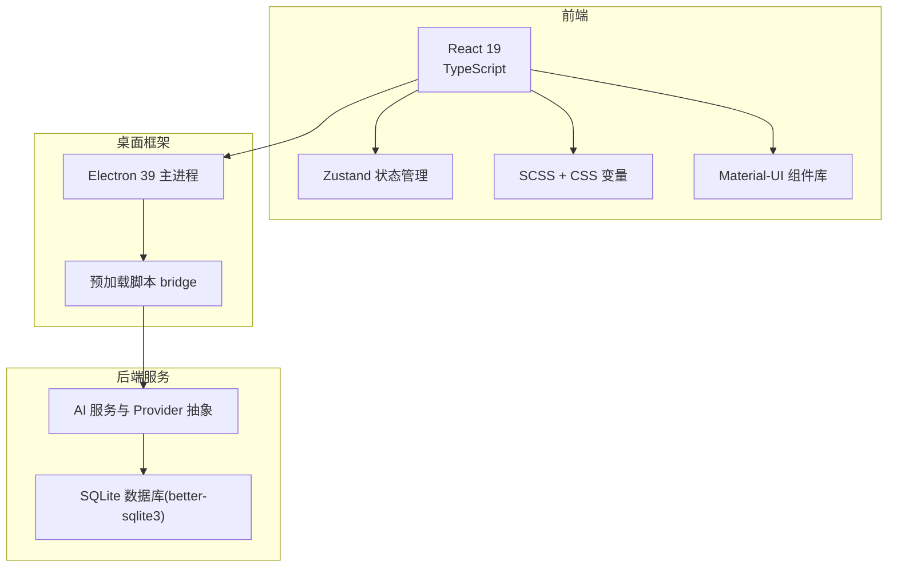
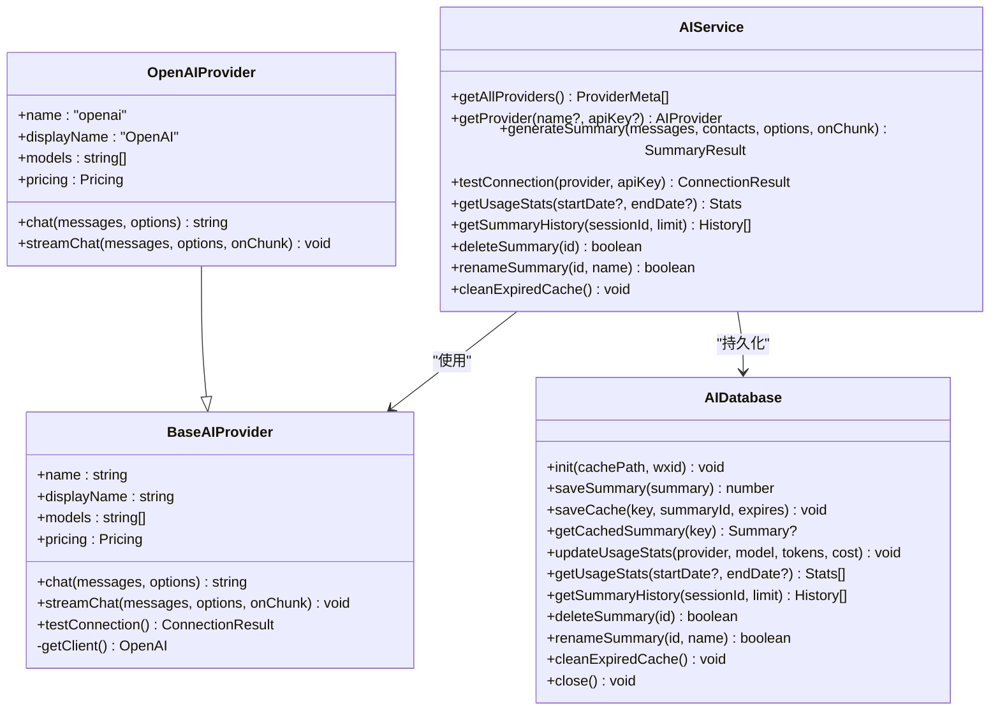
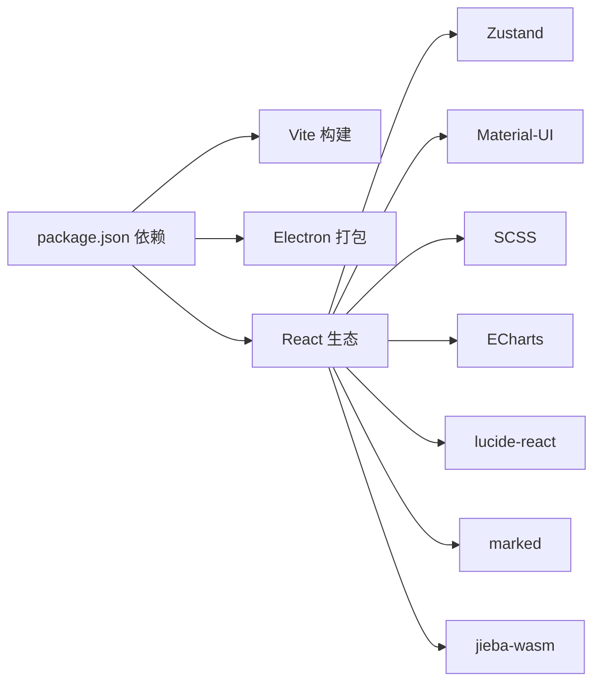

# 技术栈

<cite>
**本文档引用的文件**
- [package.json](file://package.json)
- [vite.config.ts](file://vite.config.ts)
- [tsconfig.json](file://tsconfig.json)
- [src/main.tsx](file://src/main.tsx)
- [src/App.tsx](file://src/App.tsx)
- [src/styles/main.scss](file://src/styles/main.scss)
- [src/stores/appStore.ts](file://src/stores/appStore.ts)
- [src/stores/chatStore.ts](file://src/stores/chatStore.ts)
- [electron/main.ts](file://electron/main.ts)
- [electron/preload.ts](file://electron/preload.ts)
- [electron/services/ai/aiService.ts](file://electron/services/ai/aiService.ts)
- [electron/services/ai/providers/base.ts](file://electron/services/ai/providers/base.ts)
- [electron/services/ai/providers/openai.ts](file://electron/services/ai/providers/openai.ts)
- [electron/services/ai/aiDatabase.ts](file://electron/services/ai/aiDatabase.ts)
- [README.md](file://README.md)
</cite>

## 目录
1. [简介](#简介)
2. [项目结构](#项目结构)
3. [核心组件](#核心组件)
4. [架构总览](#架构总览)
5. [详细组件分析](#详细组件分析)
6. [依赖分析](#依赖分析)
7. [性能考虑](#性能考虑)
8. [故障排查指南](#故障排查指南)
9. [结论](#结论)
10. [附录](#附录)

## 简介
本技术栈文档围绕 CipherTalk 项目的整体技术架构展开，系统梳理前端框架（React 19 + TypeScript + Zustand）、桌面应用框架（Electron 39）、构建工具（Vite + electron-builder）、样式方案（SCSS + CSS Variables）、图表库（ECharts）、AI 集成（OpenAI SDK 支持多家 AI 服务商）及其他辅助技术（jieba-wasm、lucide-react、marked）的选型理由、技术优势、具体应用与版本兼容性，并提供架构图与组件关系图，帮助不同技术背景的开发者快速理解与高效开发。

## 项目结构
项目采用“前后端分离 + Electron 主进程”的典型桌面应用结构：
- 前端：React 19 + TypeScript + Zustand，使用 Vite 构建与开发
- 桌面框架：Electron 39，主进程负责窗口、系统集成与后端服务协调
- 样式：SCSS + CSS 变量，配合 Material-UI 组件库
- 数据与状态：Zustand 管理前端状态，better-sqlite3 管理 AI 摘要数据库
- AI 集成：统一基于 OpenAI SDK 的 Provider 抽象，支持多家 AI 服务商



**章节来源**
- [package.json:1-169](file://package.json#L1-L169)
- [vite.config.ts:1-78](file://vite.config.ts#L1-L78)
- [src/main.tsx:1-14](file://src/main.tsx#L1-L14)
- [electron/main.ts:1-800](file://electron/main.ts#L1-L800)
- [electron/preload.ts:1-454](file://electron/preload.ts#L1-L454)

## 核心组件
- 前端入口与路由：React 19 + React Router，HashRouter 模式，全局样式引入
- 状态管理：Zustand（appStore、chatStore），轻量、易用、类型安全
- 样式系统：SCSS + CSS 变量，支持多主题与深浅模式
- 桌面集成：Electron 主进程负责窗口、协议注册、自动更新、IPC 暴露
- AI 摘要：统一 Provider 抽象，支持多家 AI 服务商，内置代理检测与流式输出
- 数据持久化：better-sqlite3 管理 AI 摘要、使用统计与缓存

**章节来源**
- [src/main.tsx:1-14](file://src/main.tsx#L1-L14)
- [src/App.tsx:1-538](file://src/App.tsx#L1-L538)
- [src/stores/appStore.ts:1-97](file://src/stores/appStore.ts#L1-L97)
- [src/stores/chatStore.ts:1-146](file://src/stores/chatStore.ts#L1-L146)
- [src/styles/main.scss:1-427](file://src/styles/main.scss#L1-L427)
- [electron/main.ts:1-800](file://electron/main.ts#L1-L800)
- [electron/preload.ts:1-454](file://electron/preload.ts#L1-L454)
- [electron/services/ai/aiService.ts:1-631](file://electron/services/ai/aiService.ts#L1-L631)
- [electron/services/ai/aiDatabase.ts:1-347](file://electron/services/ai/aiDatabase.ts#L1-L347)

## 架构总览
下图展示了前端、Electron 主进程与后端服务之间的交互关系，以及 IPC 暴露的 API 与 AI 服务链路。

```mermaid
graph TB
subgraph "渲染进程"
R1["React 应用(App.tsx)"]
R2["Zustand Store(appStore/chatStore)"]
R3["样式(main.scss)"]
end
subgraph "Electron"
M1["主进程(main.ts)"]
P1["预加载脚本(preload.ts)<br/>contextBridge 暴露 API"]
end
subgraph "后端服务"
S1["AI 服务(aiService.ts)"]
S2["Provider 抽象(base.ts)"]
S3["OpenAI Provider(openai.ts)"]
S4["AI 数据库(aiDatabase.ts)"]
end
R1 --> R2
R1 --> R3
R1 <- --> M1
M1 <- --> P1
P1 <- --> S1
S1 --> S2
S2 --> S3
S1 --> S4
```

**图表来源**
- [src/App.tsx:1-538](file://src/App.tsx#L1-L538)
- [src/stores/appStore.ts:1-97](file://src/stores/appStore.ts#L1-L97)
- [src/stores/chatStore.ts:1-146](file://src/stores/chatStore.ts#L1-L146)
- [src/styles/main.scss:1-427](file://src/styles/main.scss#L1-L427)
- [electron/main.ts:1-800](file://electron/main.ts#L1-L800)
- [electron/preload.ts:1-454](file://electron/preload.ts#L1-L454)
- [electron/services/ai/aiService.ts:1-631](file://electron/services/ai/aiService.ts#L1-L631)
- [electron/services/ai/providers/base.ts:1-241](file://electron/services/ai/providers/base.ts#L1-L241)
- [electron/services/ai/providers/openai.ts:1-77](file://electron/services/ai/providers/openai.ts#L1-L77)
- [electron/services/ai/aiDatabase.ts:1-347](file://electron/services/ai/aiDatabase.ts#L1-L347)

**章节来源**
- [README.md:76-90](file://README.md#L76-L90)
- [package.json:20-56](file://package.json#L20-L56)
- [vite.config.ts:15-77](file://vite.config.ts#L15-L77)

## 详细组件分析

### 前端框架与构建工具
- React 19：函数组件 + Hooks，结合 StrictMode 与 HashRouter，提供现代前端开发体验
- TypeScript：严格的类型系统，提升代码质量与可维护性
- Vite：快速开发与构建，支持热重载与多入口打包
- electron-builder：跨平台打包与安装包生成
- Material-UI：提供一致的 UI 组件与主题能力

技术优势与选择理由
- React 19 与 Vite 组合具备优秀的开发体验与构建性能
- TypeScript 保障大型项目长期演进的稳定性
- electron-builder 简化打包流程，支持 NSIS 安装器与多语言

版本兼容性与升级路径
- Node.js 建议使用 18.x 或更高版本
- Electron 39 与 Vite 6 保持良好兼容
- 升级策略：先升级 Vite 与 Electron，再调整构建配置与依赖版本

**章节来源**
- [src/main.tsx:1-14](file://src/main.tsx#L1-L14)
- [tsconfig.json:1-26](file://tsconfig.json#L1-L26)
- [vite.config.ts:15-77](file://vite.config.ts#L15-L77)
- [package.json:74-167](file://package.json#L74-L167)
- [README.md:96-126](file://README.md#L96-L126)

### 样式方案与主题系统
- SCSS：模块化样式组织，便于维护与扩展
- CSS 变量：通过 data-theme 与 data-mode 实现主题与深浅模式切换
- Material-UI：提供一致的组件样式与交互规范

技术优势与选择理由
- SCSS 提供嵌套、变量与混入，降低重复样式
- CSS 变量与 data-* 属性组合，实现运行时主题切换
- Material-UI 与 Emotion 结合，提供高性能样式渲染

**章节来源**
- [src/styles/main.scss:1-427](file://src/styles/main.scss#L1-L427)
- [package.json:21-24](file://package.json#L21-L24)

### 状态管理（Zustand）
- appStore：数据库连接、用户信息、解密进度等全局状态
- chatStore：会话列表、消息、联系人、搜索与增量同步版本号

技术优势与选择理由
- 轻量、零样板代码，易于上手与扩展
- 类型安全，与 TypeScript 无缝集成
- 适合中小型项目的全局状态管理

**章节来源**
- [src/stores/appStore.ts:1-97](file://src/stores/appStore.ts#L1-L97)
- [src/stores/chatStore.ts:1-146](file://src/stores/chatStore.ts#L1-L146)

### 桌面应用框架（Electron 39）
- 主进程：窗口管理、协议注册、自动更新、IPC 通信
- 预加载脚本：通过 contextBridge 暴露受控 API 至渲染进程

技术优势与选择理由
- Electron 39 提供稳定的功能与性能
- 预加载脚本 + contextBridge 保障安全的 IPC 通道
- 支持多窗口与独立子窗口（聊天、分析、朋友圈、年度报告等）

**章节来源**
- [electron/main.ts:1-800](file://electron/main.ts#L1-L800)
- [electron/preload.ts:1-454](file://electron/preload.ts#L1-L454)

### AI 集成与 Provider 抽象
- 统一抽象：BaseAIProvider 定义 chat/streamChat/testConnection 等接口
- 多家服务商：OpenAI、Gemini、DeepSeek、Qwen、Doubao、Kimi、SiliconFlow、Xiaomi、Tencent、XAI、Zhipu、Ollama、Custom
- 代理支持：动态代理检测与注入，增强网络稳定性
- 流式输出：支持思考模式（reasoning/thinking）与增量回调
- 数据库：better-sqlite3 存储摘要、使用统计与缓存

技术优势与选择理由
- Provider 抽象屏蔽底层差异，便于扩展与替换
- 代理与超时机制提升网络鲁棒性
- 流式输出与缓存机制改善用户体验



**图表来源**
- [electron/services/ai/providers/base.ts:1-241](file://electron/services/ai/providers/base.ts#L1-L241)
- [electron/services/ai/providers/openai.ts:1-77](file://electron/services/ai/providers/openai.ts#L1-L77)
- [electron/services/ai/aiService.ts:1-631](file://electron/services/ai/aiService.ts#L1-L631)
- [electron/services/ai/aiDatabase.ts:1-347](file://electron/services/ai/aiDatabase.ts#L1-L347)

**章节来源**
- [electron/services/ai/aiService.ts:1-631](file://electron/services/ai/aiService.ts#L1-L631)
- [electron/services/ai/providers/base.ts:1-241](file://electron/services/ai/providers/base.ts#L1-L241)
- [electron/services/ai/providers/openai.ts:1-77](file://electron/services/ai/providers/openai.ts#L1-L77)
- [electron/services/ai/aiDatabase.ts:1-347](file://electron/services/ai/aiDatabase.ts#L1-L347)

### 图表库（ECharts）
- 用于数据分析与可视化（消息统计、活跃时段、词云等）
- 与 React 结合使用，通过 ref 或容器尺寸变化驱动渲染

技术优势与选择理由
- 功能丰富、生态完善，适合复杂图表需求
- 与 SCSS 主题系统结合，可实现深浅主题下的图表适配

**章节来源**
- [README.md:184-189](file://README.md#L184-L189)
- [package.json:32-33](file://package.json#L32-L33)

### 辅助技术
- jieba-wasm：中文分词，支持在浏览器端进行文本处理
- lucide-react：简洁图标库，与 Material-UI 协同
- marked：Markdown 渲染，用于 AI 摘要等富文本展示

技术优势与选择理由
- jieba-wasm 降低对后端分词服务的依赖
- lucide-react 与 Material-UI 图标体系互补
- marked 提供稳定的 Markdown 渲染能力

**章节来源**
- [package.json:40](file://package.json#L40)
- [package.json:43](file://package.json#L43)
- [package.json:44](file://package.json#L44)

## 依赖分析
- 前端依赖：React 19、TypeScript、Zustand、Material-UI、SCSS、ECharts、lucide-react、marked、jieba-wasm
- 构建依赖：Vite、electron-builder、electron
- 后端依赖：better-sqlite3、OpenAI SDK、electron-store、electron-updater、ffmpeg-static、sherpa-onnx-node、silk-wasm 等



**图表来源**
- [package.json:20-72](file://package.json#L20-L72)

**章节来源**
- [package.json:20-72](file://package.json#L20-L72)

## 性能考虑
- 构建与打包：Vite 提供快速冷启动与热重载；electron-builder 配置压缩与 asarUnpack，减少体积与提升加载速度
- 状态管理：Zustand 无中间件开销，适合高频状态更新场景
- 样式：SCSS 编译与 CSS 变量切换，避免不必要的重排
- AI 流式输出：增量回调与缓存机制，降低等待时间
- SQLite：索引与事务优化，提升摘要与统计查询性能

[本节为通用性能指导，不直接分析具体文件]

## 故障排查指南
常见问题与定位思路
- 网络连接失败（AI 服务）：检查代理配置与网络状态，查看连接测试返回的错误类型
- API Key 无效或权限不足：核对服务商配置与权限范围
- 数据库连接异常：确认数据库路径、解密密钥与 wxid 配置
- 主题切换异常：检查 data-theme 与 data-mode 属性是否正确设置

定位依据
- AI 连接测试返回的错误类型与 needsProxy 标记
- 预加载脚本暴露的 IPC API 与主进程日志
- better-sqlite3 数据库初始化与索引状态

**章节来源**
- [electron/services/ai/providers/base.ts:177-240](file://electron/services/ai/providers/base.ts#L177-L240)
- [electron/preload.ts:1-454](file://electron/preload.ts#L1-L454)
- [electron/services/ai/aiDatabase.ts:15-102](file://electron/services/ai/aiDatabase.ts#L15-L102)

## 结论
CipherTalk 的技术栈围绕“现代前端 + Electron 桌面 + 统一 AI 抽象”展开，既保证了开发效率与用户体验，又为多服务商 AI 集成与本地数据处理提供了清晰的扩展路径。通过 SCSS + CSS 变量的主题系统、Zustand 的轻量状态管理、以及 better-sqlite3 的本地持久化，项目在功能复杂度与可维护性之间取得了良好平衡。建议在后续迭代中持续关注 Electron 与 Vite 的版本升级，同时完善 AI 服务的可观测性与缓存策略。

[本节为总结性内容，不直接分析具体文件]

## 附录
- 技术栈总览（来自 README）
  - 前端框架：React 19 + TypeScript + Zustand
  - 桌面应用：Electron 39
  - 构建工具：Vite + electron-builder
  - 样式方案：SCSS + CSS Variables
  - 图表库：ECharts
  - AI 集成：OpenAI SDK（支持多家 AI 服务商）
  - 其他：jieba-wasm、lucide-react、marked

**章节来源**
- [README.md:76-90](file://README.md#L76-L90)