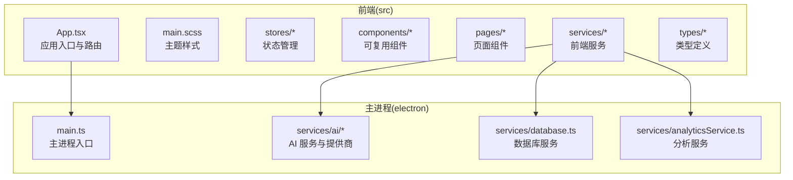
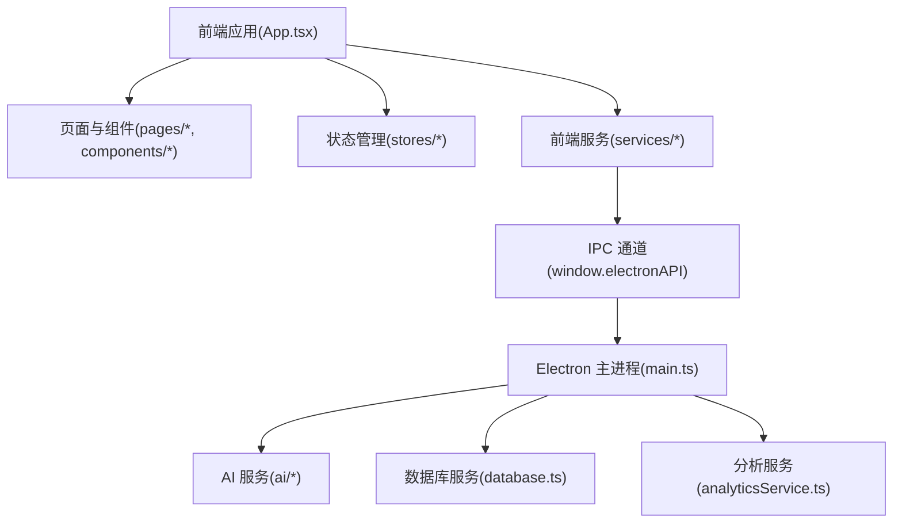
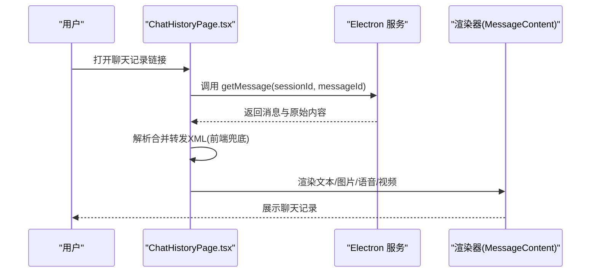
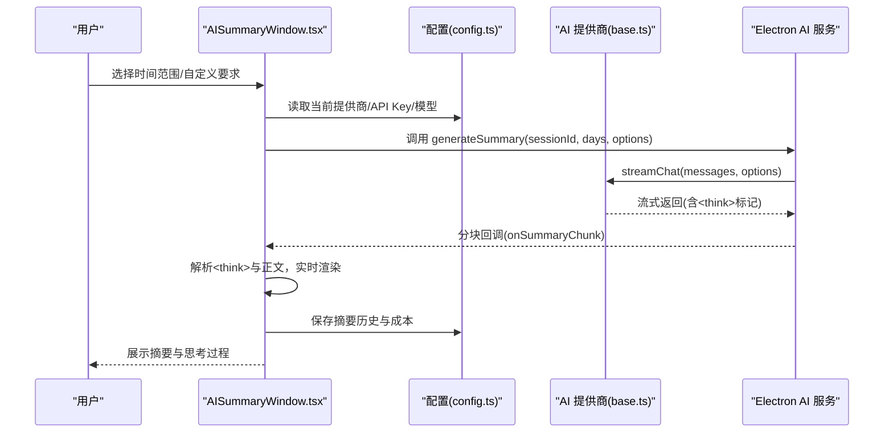
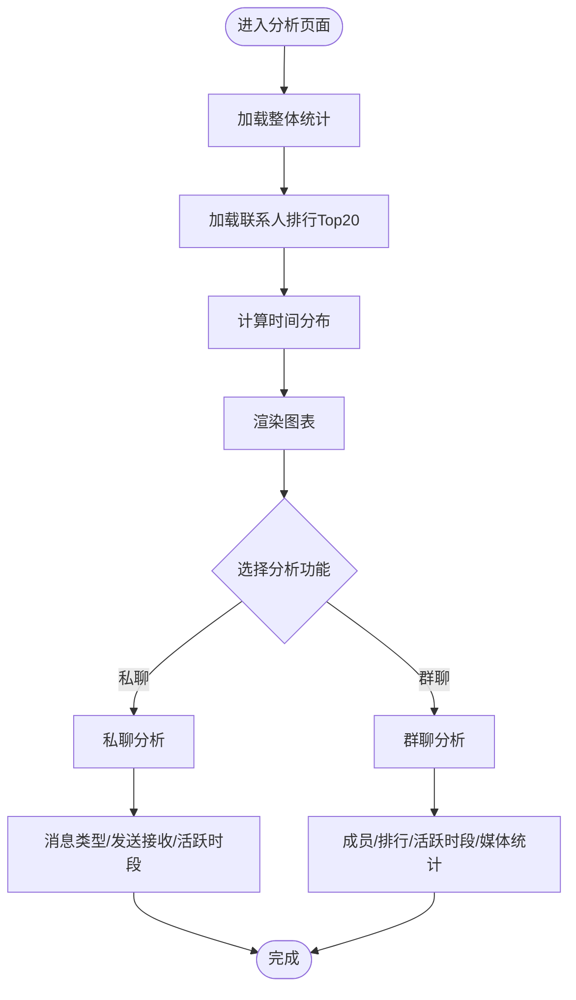
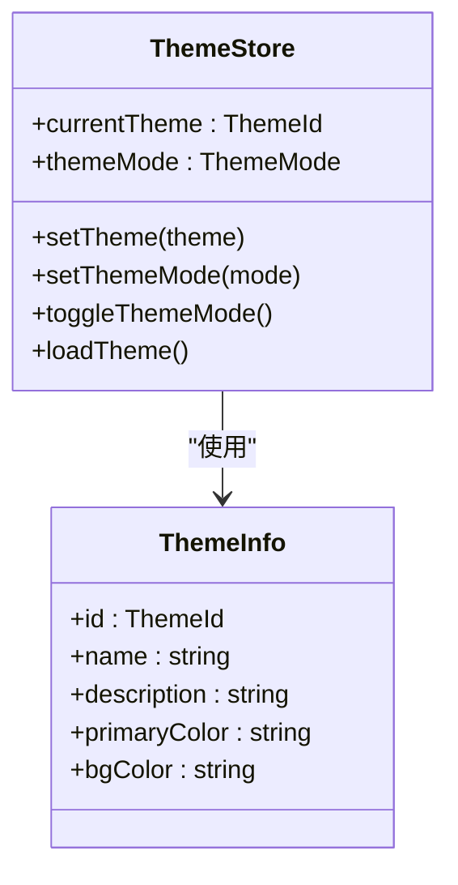
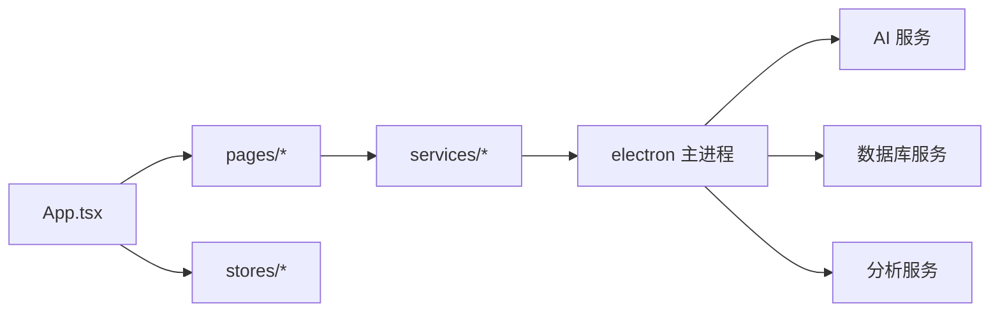

# 核心功能特性

<cite>
**本文档引用的文件**
- [README.md](file://README.md)
- [App.tsx](file://src/App.tsx)
- [main.scss](file://src/styles/main.scss)
- [themeStore.ts](file://src/stores/themeStore.ts)
- [MessageContent.tsx](file://src/components/MessageContent.tsx)
- [ChatHistoryPage.tsx](file://src/pages/ChatHistoryPage.tsx)
- [AISummaryWindow.tsx](file://src/pages/AISummaryWindow.tsx)
- [ai.ts](file://src/types/ai.ts)
- [config.ts](file://src/services/config.ts)
- [base.ts](file://electron/services/ai/providers/base.ts)
- [zhipu.ts](file://electron/services/ai/providers/zhipu.ts)
- [AnalyticsPage.tsx](file://src/pages/AnalyticsPage.tsx)
- [GroupAnalyticsPage.tsx](file://src/pages/GroupAnalyticsPage.tsx)
- [analyticsStore.ts](file://src/stores/analyticsStore.ts)
</cite>

## 目录
1. [简介](#简介)
2. [项目结构](#项目结构)
3. [核心组件](#核心组件)
4. [架构总览](#架构总览)
5. [详细组件分析](#详细组件分析)
6. [依赖分析](#依赖分析)
7. [性能考虑](#性能考虑)
8. [故障排除指南](#故障排除指南)
9. [结论](#结论)
10. [附录](#附录)

## 简介
CipherTalk 是一款现代化的微信聊天记录查看与分析工具，提供四大核心功能：
- 聊天记录查看：支持多种消息类型（文本、图片、语音、视频、表情等），还原原生聊天体验
- AI 智能摘要：集成多家 AI 服务商，支持思考模式与成本统计
- 数据分析可视化：消息统计、时间分析、词云分析、群聊分析
- 多主题支持：浅色/深色模式与多种主题色切换

## 项目结构
项目采用前端 React + Electron 主进程的桌面应用架构，核心目录组织如下：
- src：前端源码（组件、页面、状态管理、服务、类型定义、样式）
- electron：主进程与后端服务（AI 服务、数据库、分析服务等）
- public：静态资源（AI 标志、微信表情包等）

**图表来源**
- [App.tsx:1-538](file://src/App.tsx#L1-L538)
- [main.scss:1-427](file://src/styles/main.scss#L1-L427)

**章节来源**
- [README.md:132-159](file://README.md#L132-L159)

## 核心组件
- 聊天记录查看：负责解析与渲染多种消息类型，支持合并转发、图片/视频/语音预览等
- AI 智能摘要：提供摘要生成、思考模式、历史记录管理与成本统计
- 数据分析可视化：提供消息统计、时间分布、联系人排行、群聊分析
- 多主题支持：通过 CSS 变量与 Zustand 状态管理实现主题与模式切换

**章节来源**
- [ChatHistoryPage.tsx:1-239](file://src/pages/ChatHistoryPage.tsx#L1-L239)
- [AISummaryWindow.tsx:1-743](file://src/pages/AISummaryWindow.tsx#L1-L743)
- [AnalyticsPage.tsx:1-189](file://src/pages/AnalyticsPage.tsx#L1-L189)
- [GroupAnalyticsPage.tsx:1-537](file://src/pages/GroupAnalyticsPage.tsx#L1-L537)
- [themeStore.ts:1-146](file://src/stores/themeStore.ts#L1-L146)

## 架构总览
应用采用“前端 React + Electron 主进程”的双层架构。前端通过 IPC 与主进程通信，主进程封装数据库、AI 服务与系统能力。

**图表来源**
- [App.tsx:1-538](file://src/App.tsx#L1-L538)
- [base.ts:1-241](file://electron/services/ai/providers/base.ts#L1-L241)

## 详细组件分析

### 聊天记录查看功能
- 支持消息类型：文本、图片、语音、视频、表情、合并转发等
- 渲染逻辑：文本换行、链接识别、微信表情解析
- 独立窗口：支持独立聊天记录查看窗口，便于分享与导出
- 容错机制：前端兜底解析合并转发记录，提升兼容性

**图表来源**
- [ChatHistoryPage.tsx:114-152](file://src/pages/ChatHistoryPage.tsx#L114-L152)
- [MessageContent.tsx:10-103](file://src/components/MessageContent.tsx#L10-L103)

**章节来源**
- [ChatHistoryPage.tsx:1-239](file://src/pages/ChatHistoryPage.tsx#L1-L239)
- [MessageContent.tsx:1-103](file://src/components/MessageContent.tsx#L1-L103)

### AI 智能摘要功能
- 多提供商支持：智谱、DeepSeek、通义千问、Gemini、豆包、Kimi、硅基流动等
- 思考模式：流式输出中自动识别与展示推理过程
- 成本统计：虚拟成本估算，便于控制使用成本
- 历史管理：支持重命名、删除与历史记录查看

**图表来源**
- [AISummaryWindow.tsx:134-270](file://src/pages/AISummaryWindow.tsx#L134-L270)
- [base.ts:106-175](file://electron/services/ai/providers/base.ts#L106-L175)
- [config.ts:370-500](file://src/services/config.ts#L370-L500)

**章节来源**
- [AISummaryWindow.tsx:1-743](file://src/pages/AISummaryWindow.tsx#L1-L743)
- [ai.ts:1-93](file://src/types/ai.ts#L1-L93)
- [config.ts:370-500](file://src/services/config.ts#L370-L500)
- [base.ts:1-241](file://electron/services/ai/providers/base.ts#L1-L241)
- [zhipu.ts:1-75](file://electron/services/ai/providers/zhipu.ts#L1-L75)

### 数据分析可视化功能
- 私聊分析：消息总数、发送/接收比例、消息类型分布、活跃时段
- 群聊分析：成员列表、发言排行、活跃时段、媒体内容统计
- 交互设计：时间范围选择、刷新、图表联动

**图表来源**
- [AnalyticsPage.tsx:15-47](file://src/pages/AnalyticsPage.tsx#L15-L47)
- [GroupAnalyticsPage.tsx:138-174](file://src/pages/GroupAnalyticsPage.tsx#L138-L174)

**章节来源**
- [AnalyticsPage.tsx:1-189](file://src/pages/AnalyticsPage.tsx#L1-L189)
- [GroupAnalyticsPage.tsx:1-537](file://src/pages/GroupAnalyticsPage.tsx#L1-L537)
- [analyticsStore.ts:1-71](file://src/stores/analyticsStore.ts#L1-L71)

### 多主题支持功能
- 主题系统：CSS 变量 + data 属性切换，支持 7 种主题色与浅/深/系统三种模式
- 状态管理：Zustand 存储当前主题、模式与应用图标
- 动态切换：运行时即时切换主题与模式，自动保存配置

**图表来源**
- [themeStore.ts:1-146](file://src/stores/themeStore.ts#L1-L146)
- [main.scss:4-320](file://src/styles/main.scss#L4-L320)

**章节来源**
- [themeStore.ts:1-146](file://src/stores/themeStore.ts#L1-L146)
- [main.scss:1-427](file://src/styles/main.scss#L1-L427)
- [App.tsx:69-88](file://src/App.tsx#L69-L88)

## 依赖分析
- 前端依赖：React 19、Zustand、ECharts、lucide-react、marked、DOMPurify
- 主进程依赖：OpenAI SDK、代理服务、WCDB 数据库、Electron API
- 组件耦合：页面组件依赖服务层，服务层通过 IPC 与主进程交互

**图表来源**
- [App.tsx:1-538](file://src/App.tsx#L1-L538)

**章节来源**
- [App.tsx:1-538](file://src/App.tsx#L1-L538)

## 性能考虑
- 流式渲染：AI 摘要在流式输出中逐步渲染，降低首帧等待时间
- 图表优化：ECharts 按需渲染，避免不必要的重绘
- 状态缓存：分析数据使用 Zustand 缓存，减少重复计算
- 主题切换：CSS 变量切换零重排，保证流畅度

## 故障排除指南
- AI 连接失败：检查 API Key、网络与代理设置，查看错误提示
- 图表不显示：确认数据加载完成，检查 Electron IPC 通信
- 主题不生效：确认 data-theme 与 data-mode 属性正确设置

**章节来源**
- [base.ts:177-240](file://electron/services/ai/providers/base.ts#L177-L240)
- [App.tsx:69-88](file://src/App.tsx#L69-L88)

## 结论
CipherTalk 通过现代化的界面与强大的分析能力，为用户提供从聊天记录查看到 AI 智能摘要、从私聊分析到群聊洞察的完整体验。多主题支持与跨平台部署进一步提升了可用性与个性化程度。

## 附录

### 功能对比表（CipherTalk vs 典型竞品）
- 聊天记录查看：支持多种消息类型与合并转发解析，界面还原度高
- AI 摘要：多家提供商、思考模式、成本统计与历史管理
- 数据分析：私聊与群聊双维度分析，图表丰富、交互友好
- 主题系统：多主题色与深浅模式，支持系统跟随

### 使用场景与价值
- 个人：回顾聊天历史、生成摘要、统计使用习惯
- 团队：群聊分析、成员互动洞察、会议纪要整理
- 研究：数据可视化、趋势分析、隐私合规审计

### 功能演示与截图
- 聊天记录查看：展示文本、图片、语音、视频与合并转发的渲染效果
- AI 摘要：展示思考模式与摘要生成流程
- 数据分析：展示消息统计、时间分布与群聊分析图表
- 多主题：展示不同主题色与深浅模式切换