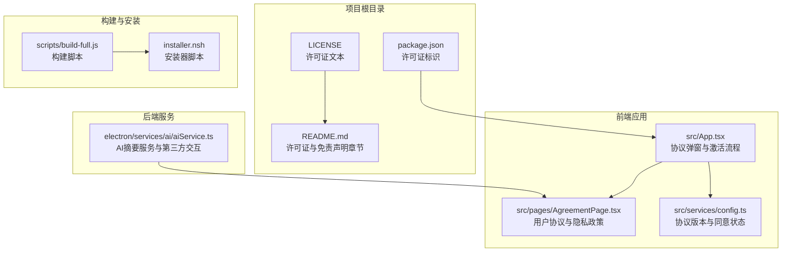
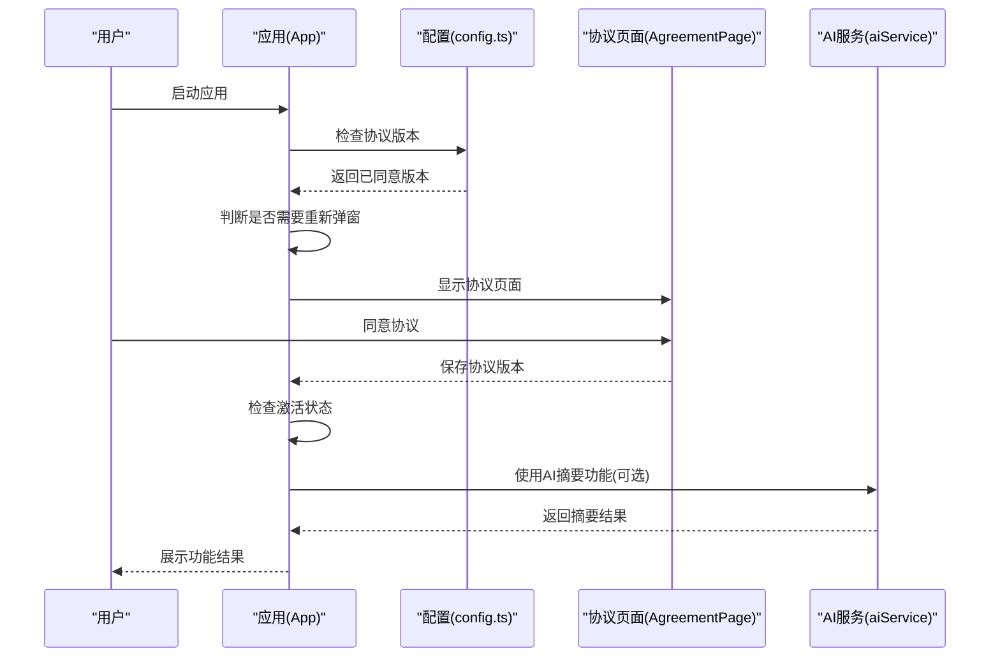
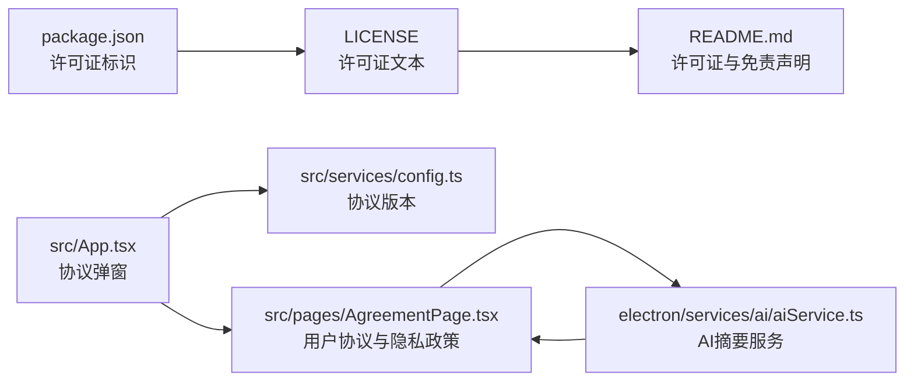

# 许可证与免责声明

<cite>
**本文档引用的文件**
- [LICENSE](file://LICENSE)
- [README.md](file://README.md)
- [package.json](file://package.json)
- [src/App.tsx](file://src/App.tsx)
- [src/pages/AgreementPage.tsx](file://src/pages/AgreementPage.tsx)
- [src/services/config.ts](file://src/services/config.ts)
- [electron/services/ai/aiService.ts](file://electron/services/ai/aiService.ts)
- [scripts/build-full.js](file://scripts/build-full.js)
- [installer.nsh](file://installer.nsh)
</cite>

## 目录
1. [简介](#简介)
2. [项目结构](#项目结构)
3. [核心组件](#核心组件)
4. [架构总览](#架构总览)
5. [详细组件分析](#详细组件分析)
6. [依赖关系分析](#依赖关系分析)
7. [性能考量](#性能考量)
8. [故障排查指南](#故障排查指南)
9. [结论](#结论)
10. [附录](#附录)

## 简介
本文件面向 CipherTalk 项目使用者与贡献者，系统化解读项目采用的 CC BY-NC-SA 4.0 许可证条款与免责声明，明确允许的使用范围与必须遵守的义务，列举严格禁止的行为，提供合规使用指导与最佳实践，并解释许可证选择的原因及其对项目发展的影响。同时，结合项目实际代码实现，说明用户协议与隐私政策在应用中的落地机制，帮助用户充分理解使用权利与义务，降低法律风险。

## 项目结构
- 许可证与免责声明相关文件分布于项目根目录与前端页面组件中：
  - 根目录 LICENSE：完整许可证文本与中文/英文对照
  - README.md：许可证与免责声明章节
  - package.json：许可证标识
  - src/pages/AgreementPage.tsx：用户协议与隐私政策页面
  - src/App.tsx：协议弹窗与激活流程控制
  - src/services/config.ts：协议版本与同意状态持久化
  - electron/services/ai/aiService.ts：AI摘要功能的第三方服务交互
  - scripts/build-full.js：构建脚本与发布流程
  - installer.nsh：安装器脚本（与许可证合规无直接关系）

**图表来源**
- [LICENSE](file://LICENSE)
- [README.md](file://README.md)
- [package.json](file://package.json)
- [src/App.tsx](file://src/App.tsx)
- [src/pages/AgreementPage.tsx](file://src/pages/AgreementPage.tsx)
- [src/services/config.ts](file://src/services/config.ts)
- [electron/services/ai/aiService.ts](file://electron/services/ai/aiService.ts)
- [scripts/build-full.js](file://scripts/build-full.js)
- [installer.nsh](file://installer.nsh)

**章节来源**
- [LICENSE](file://LICENSE)
- [README.md](file://README.md)
- [package.json](file://package.json)
- [src/App.tsx](file://src/App.tsx)
- [src/pages/AgreementPage.tsx](file://src/pages/AgreementPage.tsx)
- [src/services/config.ts](file://src/services/config.ts)
- [electron/services/ai/aiService.ts](file://electron/services/ai/aiService.ts)
- [scripts/build-full.js](file://scripts/build-full.js)
- [installer.nsh](file://installer.nsh)

## 核心组件
- 许可证与免责声明文本：提供 CC BY-NC-SA 4.0 的中文与英文版本，明确权利、义务与禁止行为。
- 用户协议与隐私政策页面：在应用启动时强制展示，要求用户同意后方可继续使用。
- 协议版本管理：通过配置服务记录用户同意的协议版本，支持协议更新后重新弹窗。
- AI 摘要服务：与多家第三方 AI 服务商交互，需注意数据传输与隐私保护。
- 构建与发布：构建脚本与安装器脚本确保发布产物的一致性与可维护性。

**章节来源**
- [LICENSE](file://LICENSE)
- [README.md](file://README.md)
- [src/App.tsx](file://src/App.tsx)
- [src/pages/AgreementPage.tsx](file://src/pages/AgreementPage.tsx)
- [src/services/config.ts](file://src/services/config.ts)
- [electron/services/ai/aiService.ts](file://electron/services/ai/aiService.ts)
- [scripts/build-full.js](file://scripts/build-full.js)

## 架构总览
下图展示了许可证与免责声明在应用中的整体交互流程：应用启动时检查协议版本，必要时弹出协议页面；用户同意后进入激活流程；AI 功能使用时遵循用户协议与隐私政策；构建与发布流程确保许可证合规的发布产物。

**图表来源**
- [src/App.tsx](file://src/App.tsx)
- [src/services/config.ts](file://src/services/config.ts)
- [src/pages/AgreementPage.tsx](file://src/pages/AgreementPage.tsx)
- [electron/services/ai/aiService.ts](file://electron/services/ai/aiService.ts)

## 详细组件分析

### 许可证条款解读（CC BY-NC-SA 4.0）
- 允许的权利
  - 共享：复制、发行本软件
  - 演绎：修改、转换或以本软件为基础进行创作
  - 个人使用：用于学习和个人项目
- 必须遵守的要求
  - 署名：必须给出适当署名，提供指向许可协议的链接，标明是否对原始作品作了修改
  - 非商业性使用：不得用于商业目的（包括但不限于销售、商业服务、商业环境部署、通过软件获取商业利益）
  - 相同方式共享：如果修改本软件，必须使用相同的许可协议
  - 无附加限制：不得以法律术语或技术措施限制他人做许可协议允许的事情
- 严格禁止的行为
  - 销售本软件或其修改版本
  - 用于任何商业服务或产品
  - 通过本软件获取商业利益
  - 在商业环境中部署或使用本软件

合规使用指导与最佳实践
- 分发与修改：分发或修改时必须保留原作者署名与许可协议链接，并使用相同许可协议
- 商业用途：严禁将本软件用于任何商业目的，包括但不限于销售、SaaS、托管服务、商业服务等
- 个人学习：允许个人学习、研究、分享，但需遵守署名与相同方式共享要求
- 衍生作品：衍生作品需标注来源与修改情况，并同样采用 CC BY-NC-SA 4.0

**章节来源**
- [LICENSE](file://LICENSE)
- [README.md](file://README.md)

### 免责声明与法律合规
- 法律合规要求
  - 本软件仅供学习和研究使用
  - 使用本软件需遵守相关法律法规与用户协议
  - 用户自行承担使用本软件产生的任何后果
  - 严禁将本软件用于任何非法用途
- 用户责任承担
  - 用户应自行确保其使用行为符合微信及腾讯相关产品的服务条款与适用法律法规
  - 因用户使用本软件而产生的任何法律责任、纠纷、索赔、处罚或损失，均由用户自行承担
- 风险提示
  - 本软件按“现状”提供，不提供任何形式的明示或暗示担保
  - 开发者不对使用本软件造成的任何损失承担责任
  - 使用本软件可能涉及对本地数据文件的读取操作，用户应自行评估使用风险并做好数据备份

**章节来源**
- [README.md](file://README.md)
- [src/pages/AgreementPage.tsx](file://src/pages/AgreementPage.tsx)

### 用户协议与隐私政策在应用中的落地
- 协议弹窗与版本管理
  - 应用启动时检查协议版本，若低于当前版本则弹出协议页面
  - 用户同意后保存协议版本，防止重复弹窗
- 使用限制
  - 明确禁止将软件用于任何违反法律法规、侵犯他人权益的用途
  - 明确禁止任何形式的商业使用、商业分发、商业服务、盈利活动或变相商业用途
- 数据归属与用户责任
  - 明确微信聊天数据的知识产权归属腾讯公司及相关权利方
  - 用户自行评估使用风险并做好数据备份，开发者不承担数据丢失、损坏或不可恢复的责任
- 免责声明
  - 本软件按“现状”提供，开发者不对适用性、准确性、完整性、稳定性、可靠性作出任何明示或暗示的保证
  - 在法律允许的最大范围内，因使用或无法使用本软件导致的任何损失由用户自行承担
- 知识产权声明
  - 本软件及其相关内容的知识产权归开发者所有
  - 未经许可，任何单位或个人不得复制、修改、传播、出租、出售或用于其他侵权行为
- 协议变更与终止
  - 开发者有权不定期修订协议，修订后协议一经公布即生效
  - 用户如不同意变更内容，应立即停止使用本软件
- 适用法律与争议解决
  - 协议适用中华人民共和国大陆地区法律
  - 争议由开发者所在地法院管辖

**章节来源**
- [src/App.tsx](file://src/App.tsx)
- [src/services/config.ts](file://src/services/config.ts)
- [src/pages/AgreementPage.tsx](file://src/pages/AgreementPage.tsx)

### AI 摘要功能与第三方服务交互
- 功能概述
  - 支持多家 AI 服务商（如智谱、DeepSeek、通义千问、Gemini 等）
  - 用户可选择提供商、模型与提示词模板，生成聊天摘要
- 数据交互与隐私保护
  - 使用 AI 功能时，仅发送用户选定的聊天文本内容、联系人昵称及自定义提示词
  - 严禁用户使用 AI 功能处理涉及国家秘密、商业机密、违法违规或高度敏感的个人隐私数据
  - 开发者不收集、不保存任何用户数据，AI 生成内容仅供参考，不代表开发者立场
- 免责声明
  - 开发者不对 AI 生成内容的准确性、完整性、合法性或适用性承担责任
  - 用户在采纳 AI 建议前应进行独立判断

**章节来源**
- [electron/services/ai/aiService.ts](file://electron/services/ai/aiService.ts)
- [src/pages/AgreementPage.tsx](file://src/pages/AgreementPage.tsx)

### 构建与发布流程
- 构建脚本
  - 脚本负责打包 Electron 应用、注入安装包、编译 WPF 外壳并更新发布元数据
  - 关键步骤包括：构建核心应用、复制安装包、编译 WPF 外壳、更新 latest.yml 校验信息
- 安装器脚本
  - 安装器脚本包含 DPI 支持、安装目录修正、VC++ 运行库检测与安装等逻辑
  - 与许可证合规无直接关系，但确保应用在目标环境的正确安装与运行

**章节来源**
- [scripts/build-full.js](file://scripts/build-full.js)
- [installer.nsh](file://installer.nsh)

## 依赖关系分析
- 许可证与免责声明的依赖关系
  - package.json 中的许可证标识与根目录 LICENSE 文本保持一致
  - README.md 的许可证与免责声明章节与 LICENSE 文本相互印证
  - 用户协议与隐私政策在前端应用中通过协议页面与配置服务实现落地
  - AI 服务与第三方交互需遵循用户协议与隐私政策的约束
- 代码层面的耦合
  - App.tsx 与 AgreementPage.tsx、config.ts 存在运行时耦合，确保协议弹窗与版本管理
  - aiService.ts 与 AgreementPage.tsx 在数据隐私与使用限制方面形成互补约束

**图表来源**
- [package.json](file://package.json)
- [LICENSE](file://LICENSE)
- [README.md](file://README.md)
- [src/App.tsx](file://src/App.tsx)
- [src/services/config.ts](file://src/services/config.ts)
- [src/pages/AgreementPage.tsx](file://src/pages/AgreementPage.tsx)
- [electron/services/ai/aiService.ts](file://electron/services/ai/aiService.ts)

**章节来源**
- [package.json](file://package.json)
- [LICENSE](file://LICENSE)
- [README.md](file://README.md)
- [src/App.tsx](file://src/App.tsx)
- [src/services/config.ts](file://src/services/config.ts)
- [src/pages/AgreementPage.tsx](file://src/pages/AgreementPage.tsx)
- [electron/services/ai/aiService.ts](file://electron/services/ai/aiService.ts)

## 性能考量
- 许可证与免责声明本身不直接影响应用性能，但协议弹窗与版本检查会带来轻微的启动时延
- 建议在不影响合规的前提下优化协议弹窗的触发逻辑，减少不必要的重复弹窗
- AI 摘要功能的网络请求与第三方服务交互可能带来延迟，建议在用户界面提供明确的状态反馈

## 故障排查指南
- 协议弹窗未出现或反复弹窗
  - 检查协议版本配置是否正确保存
  - 确认应用启动时的协议检查逻辑是否正常
- AI 功能无法使用或报错
  - 检查提供商配置与 API Key 是否正确
  - 确认网络连通性与代理设置
- 构建或发布失败
  - 检查构建脚本输出与最新版本元数据更新
  - 确认安装器脚本中的依赖（如 VC++ 运行库）是否满足要求

**章节来源**
- [src/App.tsx](file://src/App.tsx)
- [src/services/config.ts](file://src/services/config.ts)
- [electron/services/ai/aiService.ts](file://electron/services/ai/aiService.ts)
- [scripts/build-full.js](file://scripts/build-full.js)
- [installer.nsh](file://installer.nsh)

## 结论
CipherTalk 项目采用 CC BY-NC-SA 4.0 许可证，明确了允许的使用范围与严格的义务边界。通过前端协议弹窗与版本管理、用户协议与隐私政策的落地，以及 AI 服务的第三方交互约束，项目在法律合规与用户体验之间取得平衡。建议贡献者与使用者在分发、修改与使用时严格遵守署名、非商业性使用与相同方式共享的要求，避免商业用途与商业服务，共同维护项目的开源生态与法律风险可控。

## 附录
- 许可证选择的原因与影响
  - 选择 CC BY-NC-SA 4.0 的原因：强调非商业性使用与相同方式共享，鼓励学习与研究，同时限制商业化利用
  - 对项目发展的影响：有助于维持项目的开源属性，防止被商业闭源利用，但也限制了商业合作模式
- 法律咨询与风险评估建议
  - 在商业场景中使用本软件前，务必获得作者书面许可
  - 对于衍生作品，确保遵守相同方式共享要求并保留原作者署名
  - 对第三方 AI 服务的使用，建议单独评估数据隐私与合规风险