# 项目介绍

<cite>
**本文引用的文件**
- [README.md](file://README.md)
- [CONTRIBUTING.md](file://CONTRIBUTING.md)
- [package.json](file://package.json)
- [CHANGELOG.md](file://CHANGELOG.md)
- [electron/main.ts](file://electron/main.ts)
- [electron/preload.ts](file://electron/preload.ts)
- [electron/services/chatService.ts](file://electron/services/chatService.ts)
- [electron/services/database.ts](file://electron/services/database.ts)
- [electron/services/ai/aiService.ts](file://electron/services/ai/aiService.ts)
- [src/App.tsx](file://src/App.tsx)
- [src/pages/ChatPage.tsx](file://src/pages/ChatPage.tsx)
- [src/pages/AnalyticsPage.tsx](file://src/pages/AnalyticsPage.tsx)
- [TODO.md](file://TODO.md)
</cite>

## 目录
1. [引言](#引言)
2. [项目结构](#项目结构)
3. [核心组件](#核心组件)
4. [架构概览](#架构概览)
5. [详细组件分析](#详细组件分析)
6. [依赖分析](#依赖分析)
7. [性能考虑](#性能考虑)
8. [故障排除指南](#故障排除指南)
9. [结论](#结论)
10. [附录](#附录)

## 引言

CipherTalk 是一款现代化的微信聊天记录查看与分析工具，专为满足个人用户的数据备份需求、研究机构的数据分析需求以及开发者的学习研究需求而设计。该项目致力于提供一个安全、可靠且功能丰富的解决方案，让用户能够轻松管理和分析自己的微信聊天数据。

### 核心价值主张

CipherTalk 的独特定位在于其**安全第一**的设计理念和**开源透明**的开发模式。项目严格遵守 CC BY-NC-SA 4.0 许可证，确保用户在学习和研究的范围内自由使用，同时明确禁止商业用途，体现了对知识产权和用户隐私的尊重。

### 主要目标用户群体

**个人用户**
- 需要备份和查看微信聊天记录的普通用户
- 希望分析自己社交行为模式的研究爱好者
- 需要数据导出和分享的用户

**研究机构**
- 社会学、心理学研究团队
- 语言学和传播学学者
- 数据科学和机器学习研究者

**开发者和学习者**
- 对微信协议和加密技术感兴趣的技术人员
- 学习桌面应用开发的编程学生
- 研究数据解析和可视化技术的开发者

### 使用场景

- **数据备份与恢复**：保护重要的聊天记录，防止意外丢失
- **学术研究**：分析社交媒体使用模式和沟通行为
- **个人反思**：通过年度报告等功能回顾过去一年的社交生活
- **技术学习**：研究微信内部数据结构和加密机制

## 项目结构

CipherTalk 采用现代化的前后端分离架构，结合 Electron 桌面应用框架，实现了跨平台的桌面应用程序。

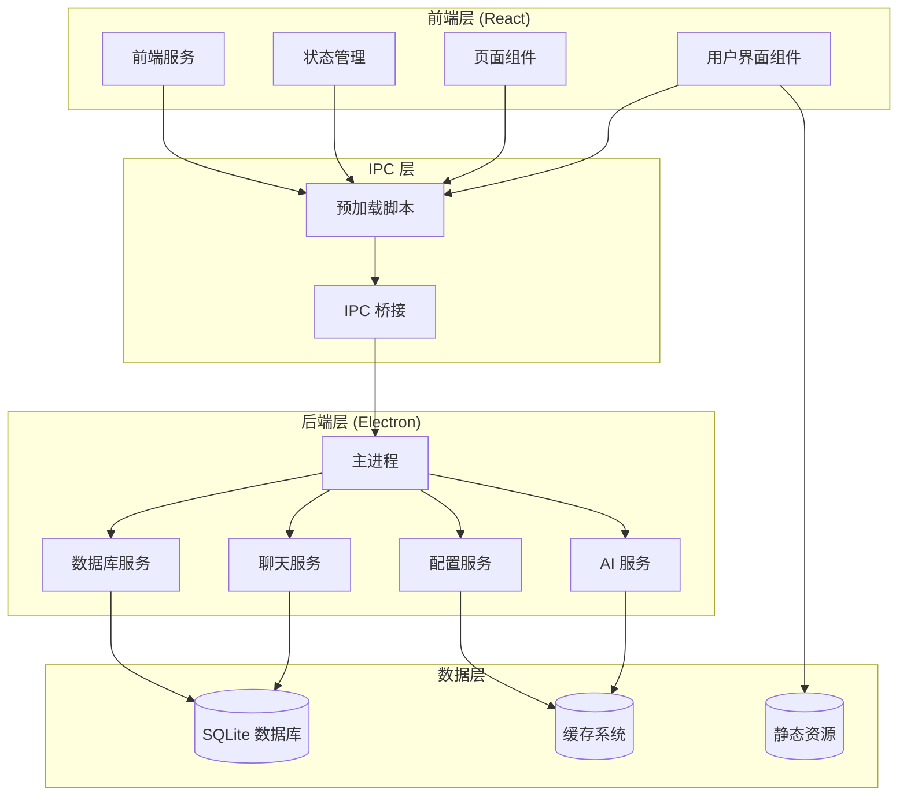

**图表来源**
- [electron/main.ts:1-100](file://electron/main.ts#L1-L100)
- [electron/preload.ts:1-100](file://electron/preload.ts#L1-L100)
- [src/App.tsx:1-50](file://src/App.tsx#L1-L50)

### 技术栈特色

项目采用了业界领先的技术组合：
- **前端框架**：React 19 + TypeScript + Zustand，提供类型安全和现代开发体验
- **桌面应用**：Electron 39，支持 Windows 平台的原生应用体验
- **构建工具**：Vite + electron-builder，实现快速开发和高效构建
- **样式方案**：SCSS + CSS Variables，支持主题切换和响应式设计
- **图表库**：ECharts，提供丰富的数据可视化能力
- **AI 集成**：OpenAI SDK 支持多家 AI 服务商

**章节来源**
- [README.md:76-90](file://README.md#L76-L90)
- [package.json:20-56](file://package.json#L20-L56)

## 核心组件

CipherTalk 的核心组件围绕四大支柱构建：聊天查看、数据分析、AI 智能摘要和数据管理。

### 聊天查看系统

聊天查看系统提供了现代化的微信聊天界面，支持多种消息类型和丰富的交互体验。

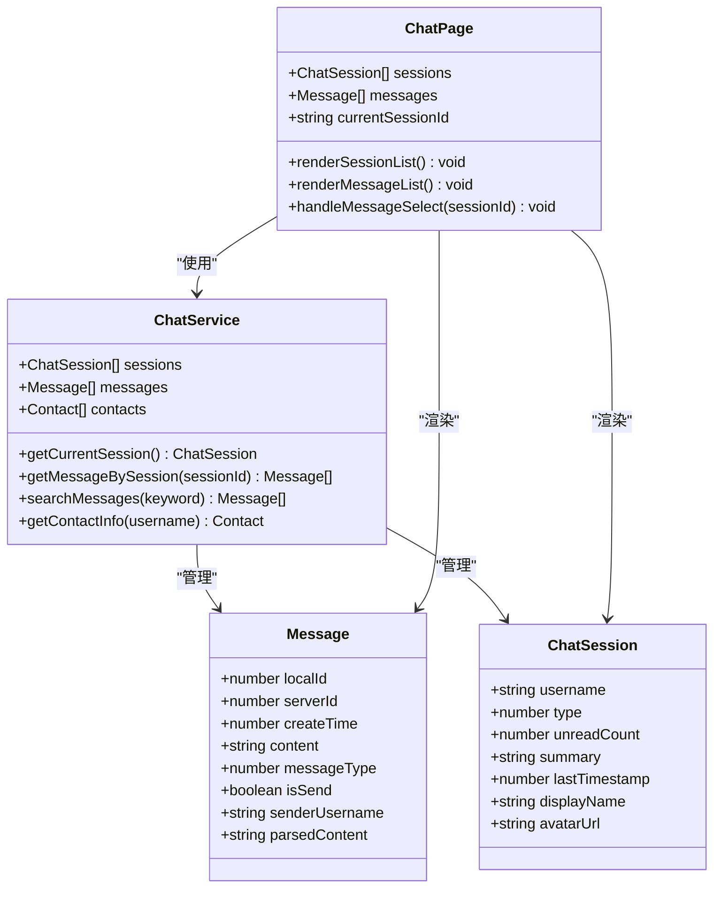

**图表来源**
- [electron/services/chatService.ts:11-101](file://electron/services/chatService.ts#L11-L101)
- [src/pages/ChatPage.tsx:1-50](file://src/pages/ChatPage.tsx#L1-L50)

### 数据分析引擎

数据分析引擎提供全面的聊天数据统计和可视化功能，帮助用户深入理解自己的社交行为模式。

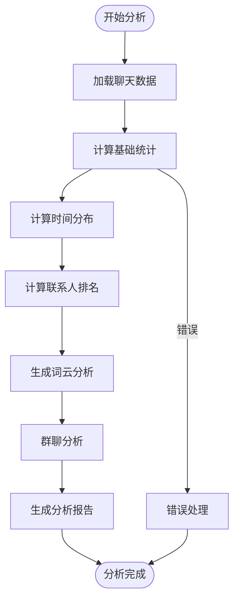

**图表来源**
- [src/pages/AnalyticsPage.tsx:15-47](file://src/pages/AnalyticsPage.tsx#L15-L47)

### AI 智能摘要系统

AI 智能摘要系统集成了多家主流 AI 服务商，为用户提供智能化的聊天内容分析和总结功能。

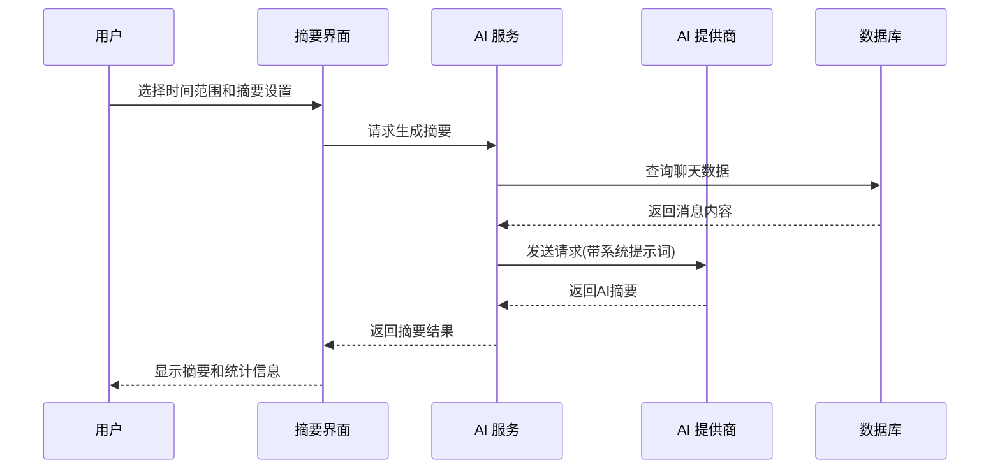

**图表来源**
- [electron/services/ai/aiService.ts:20-53](file://electron/services/ai/aiService.ts#L20-L53)
- [src/pages/AnalyticsPage.tsx:20-38](file://src/pages/AnalyticsPage.tsx#L20-L38)

**章节来源**
- [README.md:41-74](file://README.md#L41-L74)
- [README.md:163-190](file://README.md#L163-L190)

## 架构概览

CipherTalk 采用分层架构设计，确保各组件之间的职责清晰和松耦合。

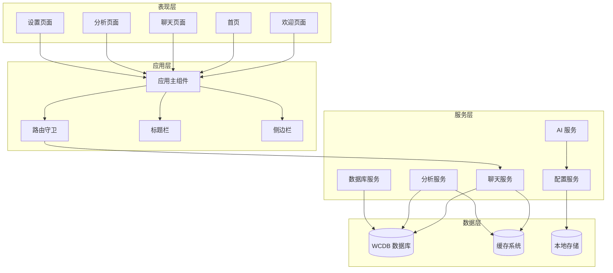

**图表来源**
- [src/App.tsx:40-100](file://src/App.tsx#L40-L100)
- [electron/main.ts:1-50](file://electron/main.ts#L1-L50)

### IPC 通信机制

项目通过 Electron 的 IPC 机制实现前后端通信，确保安全性和性能。

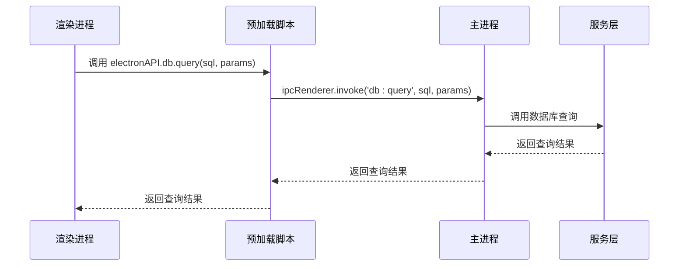

**图表来源**
- [electron/preload.ts:14-18](file://electron/preload.ts#L14-L18)
- [electron/main.ts:1-10](file://electron/main.ts#L1-L10)

**章节来源**
- [electron/preload.ts:1-200](file://electron/preload.ts#L1-L200)
- [electron/main.ts:1-100](file://electron/main.ts#L1-L100)

## 详细组件分析

### 聊天查看组件

聊天查看组件是项目的核心功能之一，提供了接近原生微信体验的聊天界面。

#### 组件架构

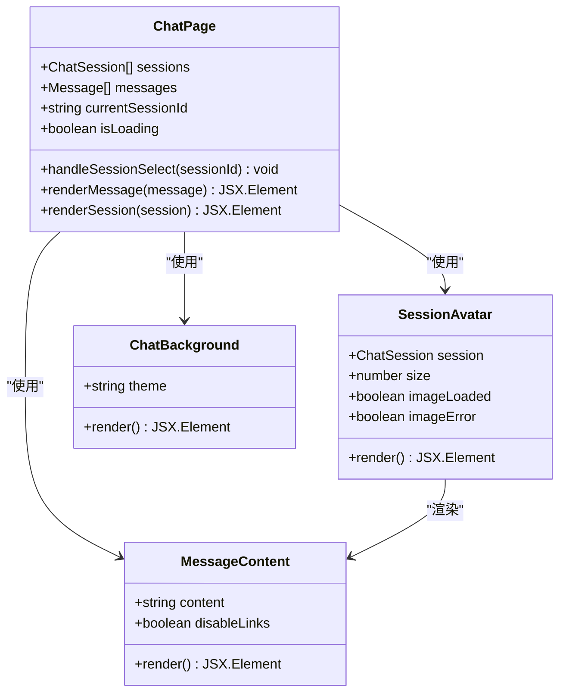

**图表来源**
- [src/pages/ChatPage.tsx:15-40](file://src/pages/ChatPage.tsx#L15-L40)

#### 性能优化策略

项目采用了多项性能优化技术来确保流畅的用户体验：

- **虚拟滚动**：使用 react-window 实现大数据集的高效渲染
- **懒加载**：头像和图片采用 IntersectionObserver 实现懒加载
- **缓存机制**：LRU 缓存系统减少重复计算和网络请求
- **骨架屏**：提升用户感知性能，改善加载体验

**章节来源**
- [src/pages/ChatPage.tsx:1-200](file://src/pages/ChatPage.tsx#L1-L200)

### 数据分析组件

数据分析组件提供了全面的聊天数据统计和可视化功能。

#### 数据分析流程

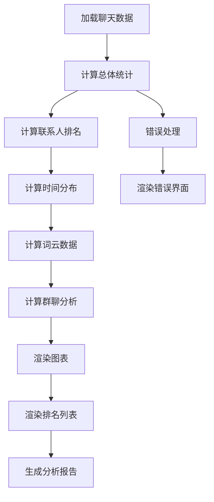

**图表来源**
- [src/pages/AnalyticsPage.tsx:15-47](file://src/pages/AnalyticsPage.tsx#L15-L47)

#### 可视化组件

项目使用 ECharts 库实现丰富的数据可视化效果：

- **消息类型分布饼图**：展示不同类型消息的比例
- **发送/接收比例柱状图**：对比用户发送和接收消息的数量
- **每小时消息分布**：分析用户的活跃时间段
- **联系人排名列表**：展示最活跃的联系人

**章节来源**
- [src/pages/AnalyticsPage.tsx:63-189](file://src/pages/AnalyticsPage.tsx#L63-L189)

### AI 智能摘要组件

AI 智能摘要组件集成了多家主流 AI 服务商，为用户提供智能化的聊天内容分析。

#### AI 服务架构

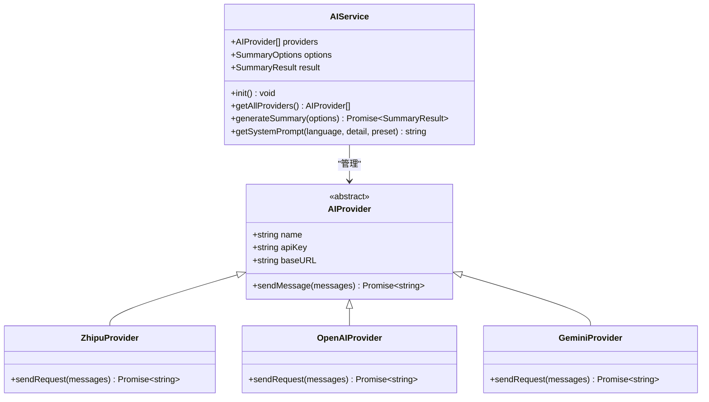

**图表来源**
- [electron/services/ai/aiService.ts:58-163](file://electron/services/ai/aiService.ts#L58-L163)

#### 支持的 AI 提供商

项目支持多家主流 AI 服务商，包括：
- **智谱 AI** (GLM-4)
- **DeepSeek**
- **通义千问** (Qwen)
- **Google Gemini**
- **豆包** (Doubao)
- **Kimi**
- **硅基流动** (SiliconCloud)
- **Ollama** (本地部署)

**章节来源**
- [README.md:165-183](file://README.md#L165-L183)
- [electron/services/ai/aiService.ts:88-104](file://electron/services/ai/aiService.ts#L88-L104)

### 数据管理组件

数据管理组件负责处理微信数据库的扫描、解密和缓存管理。

#### 数据流处理

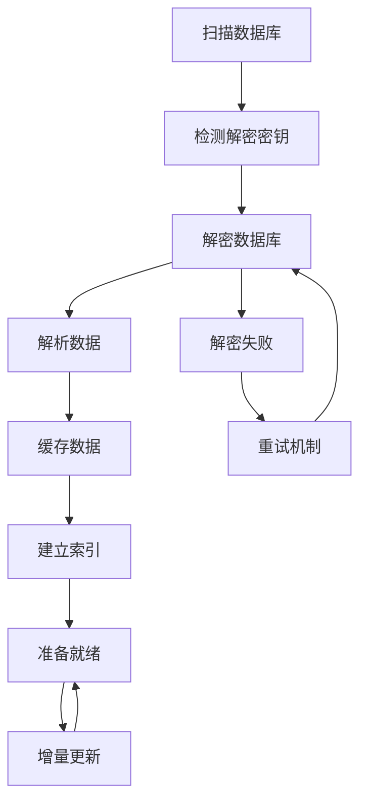

**图表来源**
- [electron/services/chatService.ts:140-160](file://electron/services/chatService.ts#L140-L160)

**章节来源**
- [electron/services/chatService.ts:110-200](file://electron/services/chatService.ts#L110-L200)
- [electron/services/database.ts:1-83](file://electron/services/database.ts#L1-L83)

## 依赖分析

CipherTalk 的依赖关系体现了现代前端开发的最佳实践，确保了项目的可维护性和扩展性。

```mermaid
graph TB
subgraph "运行时依赖"
React[react@^19.2.3]
ReactDOM[react-dom@^19.2.3]
Electron[electron@^39.2.7]
BetterSQLite[better-sqlite3@^12.5.0]
ECharts[echarts@^5.5.1]
Zustand[zustand@^5.0.2]
Material[material-ui@^7.3.9]
end
subgraph "开发时依赖"
Vite[vite@^6.0.5]
TS[typescript@^5.6.3]
ElectronBuilder[electron-builder@^25.1.8]
ReactPlugin[@vitejs/plugin-react@^4.3.4]
Sass[sass@^1.83.0]
end
subgraph "工具类依赖"
Lucide[lucide-react@^0.562.0]
Jieba[jieba-wasm@^2.2.0]
XLSX[xlsx@^0.18.5]
FFmpeg[ffmpeg-static@^5.3.0]
OpenAI[openai@^4.70.0]
end
React --> ReactDOM
Electron --> BetterSQLite
React --> Material
Material --> ECharts
React --> Zustand
Vite --> ReactPlugin
Vite --> TS
ElectronBuilder --> Vite
```

**图表来源**
- [package.json:20-56](file://package.json#L20-L56)
- [package.json:58-73](file://package.json#L58-L73)

### 核心依赖特性

**前端框架依赖**
- **React 19**：提供最新的 React 特性和性能优化
- **TypeScript 5.6**：确保类型安全和更好的开发体验
- **Material-UI 7.3**：提供现代化的 UI 组件库
- **Zustand 5.0**：轻量级状态管理解决方案

**桌面应用依赖**
- **Electron 39**：支持 Windows 平台的原生应用开发
- **electron-builder 25.1.8**：提供完整的打包和分发解决方案
- **better-sqlite3 12.5**：高性能的 SQLite 数据库驱动

**开发工具链**
- **Vite 6.0**：快速的开发服务器和构建工具
- **Sass 1.83**：强大的 CSS 预处理器
- **@vitejs/plugin-react 4.3**：优化 React 开发体验

**章节来源**
- [package.json:1-169](file://package.json#L1-L169)

## 性能考虑

CipherTalk 在多个层面进行了性能优化，确保在处理大量聊天数据时仍能保持流畅的用户体验。

### 数据库性能优化

项目采用了多项数据库性能优化策略：

- **连接池管理**：合理管理数据库连接，避免频繁的连接/断开操作
- **查询缓存**：缓存常用的查询结果，减少重复查询
- **预编译语句**：使用预编译语句提升查询性能
- **增量同步**：只同步发生变化的数据，减少不必要的处理

### 前端性能优化

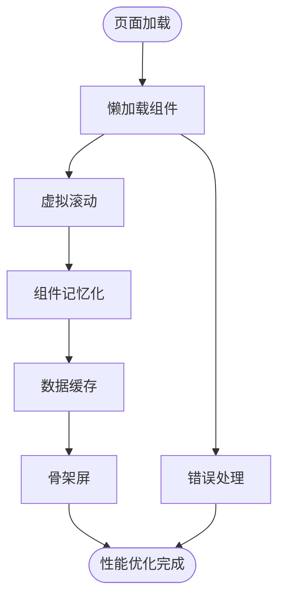

**优化策略包括**：
- **虚拟滚动**：使用 react-window 实现大数据集的高效渲染
- **组件记忆化**：React.memo 和 useMemo 减少不必要的重渲染
- **懒加载**：IntersectionObserver 实现图片和组件的懒加载
- **缓存策略**：LRU 缓存系统和本地存储优化数据访问

### 内存管理

项目实施了严格的内存管理策略：
- **垃圾回收优化**：及时清理不再使用的对象和事件监听器
- **内存泄漏防护**：在组件卸载时正确清理所有订阅和定时器
- **大对象处理**：对大型数据集采用流式处理和分块加载

## 故障排除指南

### 常见问题诊断

**数据库连接问题**
- 检查数据库文件路径是否正确
- 验证解密密钥是否有效
- 确认微信客户端未占用数据库文件

**AI 服务连接问题**
- 验证 API 密钥配置是否正确
- 检查网络连接和代理设置
- 确认 AI 服务商的可用性

**性能问题**
- 清理缓存数据
- 检查系统资源使用情况
- 考虑升级硬件配置

### 日志和调试

项目提供了完善的日志系统：
- **应用启动日志**：记录应用启动和关闭过程
- **数据库操作日志**：跟踪数据库连接和查询
- **AI 服务日志**：记录 AI 请求和响应
- **错误日志**：捕获和记录异常情况

**章节来源**
- [electron/main.ts:223-225](file://electron/main.ts#L223-L225)
- [electron/services/chatService.ts:140-160](file://electron/services/chatService.ts#L140-L160)

## 结论

CipherTalk 项目代表了微信聊天记录管理领域的技术创新和开源精神。通过精心设计的架构、丰富的功能特性和严格的开源理念，项目为用户提供了安全、可靠且功能强大的聊天记录管理解决方案。

### 项目优势

**技术创新**
- 现代化的技术栈和架构设计
- 丰富的 AI 集成和智能分析功能
- 完善的数据可视化和报告生成功能

**开源理念**
- 严格的 CC BY-NC-SA 4.0 许可证
- 完善的贡献指南和社区参与机制
- 透明的开发流程和代码审查

**用户体验**
- 接近原生的微信聊天体验
- 丰富的主题和个性化选项
- 完善的错误处理和用户指导

### 未来发展

项目将继续在以下方向发展：
- **AI 功能增强**：集成更多 AI 服务商和功能
- **性能优化**：进一步提升大数据集处理能力
- **功能扩展**：增加更多分析和导出功能
- **社区建设**：加强开源社区建设和贡献者支持

CipherTalk 不仅是一个工具，更是开源精神和技术创新的体现，为微信聊天记录管理领域树立了新的标杆。

## 附录

### 版本发展历程

项目经历了从 1.0.0 到 2.2.13 的持续演进：

**1.0.0 (2024-01-01)**
- 项目初始版本发布
- 基础聊天记录查看功能
- 简单的主题切换功能

**1.0.1 (2024-01-08)**
- 现代化聊天界面
- 多主题支持
- 数据可视化图表
- 搜索和导出功能

**2.2.13 (当前版本)**
- 完善的项目文档和贡献指南
- 标准化的开源项目结构
- 增强的 AI 智能摘要功能
- 优化的性能和用户体验

### 许可证信息

项目采用 CC BY-NC-SA 4.0 许可证，明确规定了使用权限和义务：

**允许使用**
- 复制、发行本软件
- 修改、转换或以本软件为基础进行创作
- 用于学习和个人项目

**使用限制**
- 必须给出适当的署名
- 不得用于商业目的
- 如果修改本软件，必须使用相同的许可协议

**免责声明**
- 本软件仅供学习和研究使用
- 请遵守相关法律法规
- 使用本软件产生的后果由用户自行承担

### 贡献指南

项目欢迎各种形式的贡献：

**贡献领域**
- 前端界面优化
- 样式和主题改进
- 用户体验优化
- 文档完善
- 国际化支持
- 性能优化

**贡献流程**
1. Fork 项目到个人 GitHub 账号
2. 创建特性分支
3. 提交代码更改
4. 推送到个人 fork
5. 提交 Pull Request

**代码规范**
- TypeScript 严格模式
- React 函数组件 + Hooks
- BEM 命名规范
- CSS 变量优先使用

**章节来源**
- [CHANGELOG.md:1-73](file://CHANGELOG.md#L1-L73)
- [CONTRIBUTING.md:1-248](file://CONTRIBUTING.md#L1-L248)
- [README.md:266-298](file://README.md#L266-L298)