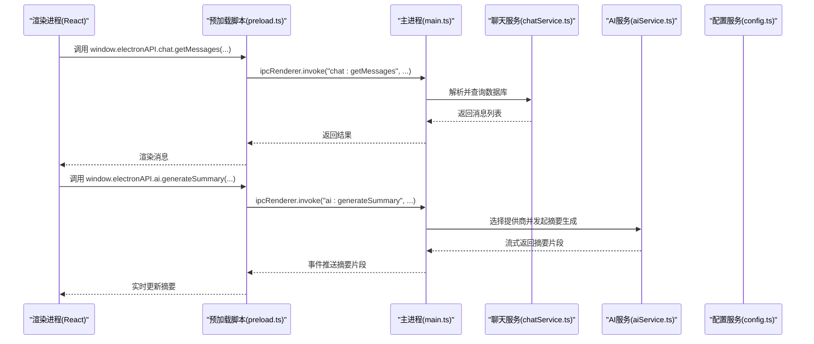
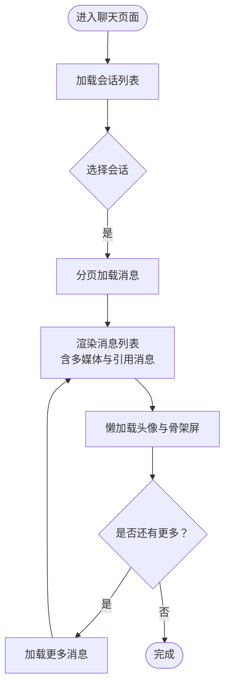
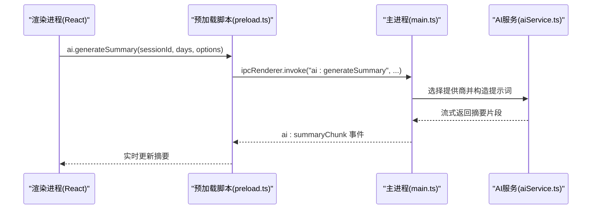
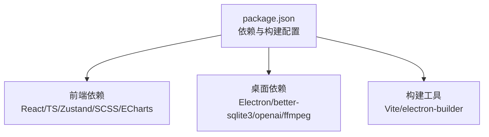

# 项目概述

<cite>
**本文档引用的文件**
- [README.md](file://README.md)
- [package.json](file://package.json)
- [CHANGELOG.md](file://CHANGELOG.md)
- [LICENSE](file://LICENSE)
- [CONTRIBUTING.md](file://CONTRIBUTING.md)
- [electron/main.ts](file://electron/main.ts)
- [electron/preload.ts](file://electron/preload.ts)
- [electron/services/chatService.ts](file://electron/services/chatService.ts)
- [electron/services/ai/aiService.ts](file://electron/services/ai/aiService.ts)
- [electron/services/config.ts](file://electron/services/config.ts)
- [electron/services/database.ts](file://electron/services/database.ts)
- [src/App.tsx](file://src/App.tsx)
- [src/pages/ChatPage.tsx](file://src/pages/ChatPage.tsx)
- [src/stores/themeStore.ts](file://src/stores/themeStore.ts)
- [src/stores/chatStore.ts](file://src/stores/chatStore.ts)
</cite>

## 目录
1. [引言](#引言)
2. [项目结构](#项目结构)
3. [核心组件](#核心组件)
4. [架构总览](#架构总览)
5. [详细组件分析](#详细组件分析)
6. [依赖关系分析](#依赖关系分析)
7. [性能考虑](#性能考虑)
8. [故障排除指南](#故障排除指南)
9. [结论](#结论)
10. [附录](#附录)

## 引言
CipherTalk 是一款现代化的微信聊天记录查看与分析工具，旨在为用户提供安全、便捷、可视化的本地数据浏览与分析体验。项目采用 Electron + React 的双进程架构，结合本地数据库解析、多媒体解密与 AI 摘要能力，覆盖“查看—分析—导出”的完整使用闭环。项目强调学习与个人使用导向，严格遵守 CC BY-NC-SA 4.0 许可协议，禁止商业用途。

- 核心价值与定位
  - 专注本地数据：所有核心功能均在本地完成，不上传任何用户数据，保障隐私安全。
  - 现代化界面：提供仿微信风格的聊天界面、多主题与深色模式支持，兼顾美观与易用。
  - 智能增强：内置 AI 摘要能力，支持多家主流大模型服务，一键生成高质量摘要。
  - 数据洞察：提供消息统计、活跃时段、词云分析、群聊成员互动等可视化分析。
  - 生态开放：支持独立窗口、HTTP API、数据导出等扩展能力，满足多样化使用场景。

- 应用场景与用户群体
  - 个人用户：回顾聊天历史、生成年度报告、导出备份。
  - 学习研究：理解微信数据结构、学习本地数据库解析与多媒体解密。
  - 开发者：基于 Electron + React 技术栈二次开发、集成 AI 服务或扩展分析维度。

- 版本与许可证
  - 当前版本：2.2.13
  - 许可证：CC BY-NC-SA 4.0（禁止商业用途）

**章节来源**
- [README.md:1-354](file://README.md#L1-L354)
- [package.json:1-169](file://package.json#L1-L169)
- [CHANGELOG.md:1-73](file://CHANGELOG.md#L1-L73)
- [LICENSE:1-77](file://LICENSE#L1-L77)

## 项目结构
项目采用前后端分离的双进程架构：
- 主进程（Electron）：负责应用生命周期、窗口管理、系统托盘、IPC 通信桥接、数据库与多媒体解密、AI 服务调度、系统集成（HTTP API、自动更新等）。
- 渲染进程（React/Vite）：负责 UI 呈现、路由导航、状态管理（Zustand）、主题系统、组件化页面与交互逻辑。

```mermaid
graph TB
subgraph "主进程(Electron)"
M_main["main.ts<br/>应用入口与窗口管理"]
M_preload["preload.ts<br/>上下文桥接与API暴露"]
M_chatSvc["chatService.ts<br/>聊天数据服务"]
M_aiSvc["aiService.ts<br/>AI摘要服务"]
M_cfgSvc["config.ts<br/>配置与持久化"]
M_dbSvc["database.ts<br/>只读数据库访问"]
end
subgraph "渲染进程(React)"
R_app["App.tsx<br/>路由与布局"]
R_chatPage["ChatPage.tsx<br/>聊天界面"]
R_themeStore["themeStore.ts<br/>主题状态"]
R_chatStore["chatStore.ts<br/>聊天状态"]
end
M_main --> M_preload
M_preload --> M_chatSvc
M_preload --> M_aiSvc
M_preload --> M_cfgSvc
M_preload --> M_dbSvc
R_app --> R_chatPage
R_app --> R_themeStore
R_app --> R_chatStore
R_app <- --> M_preload
```

**图表来源**
- [electron/main.ts:1-800](file://electron/main.ts#L1-L800)
- [electron/preload.ts:1-454](file://electron/preload.ts#L1-L454)
- [electron/services/chatService.ts:1-200](file://electron/services/chatService.ts#L1-L200)
- [electron/services/ai/aiService.ts:1-200](file://electron/services/ai/aiService.ts#L1-L200)
- [electron/services/config.ts:1-200](file://electron/services/config.ts#L1-L200)
- [electron/services/database.ts:1-83](file://electron/services/database.ts#L1-L83)
- [src/App.tsx:1-538](file://src/App.tsx#L1-L538)
- [src/pages/ChatPage.tsx:1-200](file://src/pages/ChatPage.tsx#L1-L200)
- [src/stores/themeStore.ts:1-146](file://src/stores/themeStore.ts#L1-L146)
- [src/stores/chatStore.ts:1-146](file://src/stores/chatStore.ts#L1-L146)

**章节来源**
- [README.md:132-160](file://README.md#L132-L160)
- [electron/main.ts:193-281](file://electron/main.ts#L193-L281)
- [electron/preload.ts:4-435](file://electron/preload.ts#L4-L435)
- [src/App.tsx:40-538](file://src/App.tsx#L40-L538)

## 核心组件
- 主进程核心服务
  - 窗口管理：创建主窗口、聊天窗口、群聊分析窗口、朋友圈窗口、年度报告窗口、AI 摘要窗口等，支持主题参数透传与最小化到托盘。
  - IPC 桥接：通过 contextBridge 暴露统一 API，覆盖配置、数据库、解密、对话框、Shell、WCDB、数据管理、图片/视频、聊天、朋友圈、数据分析、导出、激活、缓存、日志、语音转文字、AI 摘要等。
  - 数据服务：数据库只读访问、聊天会话与消息解析、联系人信息、表情包与媒体资源处理。
  - AI 服务：多提供商（智谱、DeepSeek、通义千问、Gemini、豆包、Kimi、硅基流动、XAI、腾讯、小米、Ollama 等）摘要生成、代理检测、成本统计与历史管理。
  - 配置服务：基于 SQLite 的配置持久化，支持主题、语言、激活、AI 参数、自动更新、HTTP API 等。
  - 数据库服务：提供只读数据库连接、SQL 查询与关闭。

- 前端核心模块
  - 应用入口：路由守卫、协议弹窗、激活流程、更新提示、锁屏、主题应用、自动连接数据库与用户信息预加载。
  - 聊天页面：会话列表、消息渲染、懒加载头像、骨架屏、消息搜索、日期跳转、图片/视频/语音/文件/转账等多媒体支持。
  - 状态管理：Zustand 管理连接状态、会话列表、消息列表、联系人缓存、搜索关键字、同步版本等。
  - 主题系统：CSS 变量驱动的主题切换，支持浅色/深色/系统模式，多主题色彩方案。

**章节来源**
- [electron/main.ts:118-123](file://electron/main.ts#L118-L123)
- [electron/preload.ts:4-435](file://electron/preload.ts#L4-L435)
- [electron/services/chatService.ts:110-152](file://electron/services/chatService.ts#L110-L152)
- [electron/services/ai/aiService.ts:58-83](file://electron/services/ai/aiService.ts#L58-L83)
- [electron/services/config.ts:126-134](file://electron/services/config.ts#L126-L134)
- [electron/services/database.ts:5-82](file://electron/services/database.ts#L5-L82)
- [src/App.tsx:40-538](file://src/App.tsx#L40-L538)
- [src/pages/ChatPage.tsx:1-200](file://src/pages/ChatPage.tsx#L1-L200)
- [src/stores/chatStore.ts:51-145](file://src/stores/chatStore.ts#L51-L145)
- [src/stores/themeStore.ts:79-140](file://src/stores/themeStore.ts#L79-L140)

## 架构总览
双进程架构通过 IPC 实现前后端协作，主进程负责敏感与高性能任务（数据库解析、解密、AI 调用），渲染进程负责 UI 与交互。系统支持独立窗口模式，便于在外部场景中复用核心能力。



**图表来源**
- [electron/preload.ts:242-287](file://electron/preload.ts#L242-L287)
- [electron/preload.ts:407-434](file://electron/preload.ts#L407-L434)
- [electron/services/chatService.ts:110-152](file://electron/services/chatService.ts#L110-L152)
- [electron/services/ai/aiService.ts:58-83](file://electron/services/ai/aiService.ts#L58-L83)

**章节来源**
- [electron/main.ts:193-281](file://electron/main.ts#L193-L281)
- [electron/preload.ts:4-435](file://electron/preload.ts#L4-L435)

## 详细组件分析

### 聊天查看与渲染
- 会话列表与消息流
  - 使用虚拟滚动与懒加载优化长列表性能，支持骨架屏与 IntersectionObserver 延迟加载头像。
  - 消息去重策略基于多维键（serverId + localId + createTime + sortSeq），避免重复渲染。
  - 支持图片、视频、语音、文件、转账等多媒体消息的解析与展示。
- 独立聊天窗口
  - 支持独立的仿微信聊天窗口，主题参数透传，适合在外部场景中嵌入聊天能力。



**图表来源**
- [src/pages/ChatPage.tsx:1-200](file://src/pages/ChatPage.tsx#L1-L200)
- [src/stores/chatStore.ts:89-110](file://src/stores/chatStore.ts#L89-L110)

**章节来源**
- [src/pages/ChatPage.tsx:1-200](file://src/pages/ChatPage.tsx#L1-L200)
- [src/stores/chatStore.ts:51-145](file://src/stores/chatStore.ts#L51-L145)

### AI 智能摘要
- 多提供商支持
  - 内置多家 AI 服务商（智谱、DeepSeek、通义千问、Gemini、豆包、Kimi、硅基流动、XAI、腾讯、小米、Ollama 等），支持系统代理检测、思考模式、成本统计与历史管理。
- 生成流程
  - 选择会话与时间范围，设置摘要详细度与系统提示词预设，发起摘要生成，实时接收流式片段并拼接结果。
- 本地化与隐私
  - 仅传输必要文本内容，不上传图片/视频等文件；支持本地 Ollama 服务，进一步降低隐私风险。



**图表来源**
- [electron/preload.ts:407-434](file://electron/preload.ts#L407-L434)
- [electron/services/ai/aiService.ts:58-83](file://electron/services/ai/aiService.ts#L58-L83)

**章节来源**
- [README.md:165-190](file://README.md#L165-L190)
- [electron/services/ai/aiService.ts:1-200](file://electron/services/ai/aiService.ts#L1-L200)

### 数据分析与可视化
- 分析维度
  - 总体统计、联系人排行、时间分布、群聊成员活跃度、媒体统计等。
- 可视化
  - 基于 ECharts 的图表展示，支持词云、趋势图、柱状图等，帮助用户洞察聊天习惯与互动模式。

**章节来源**
- [README.md:184-190](file://README.md#L184-L190)

### 多主题与界面
- 主题系统
  - 基于 CSS 变量的主题切换，支持浅色/深色/系统模式，内置多种主题色彩方案。
- 状态管理
  - Zustand 管理当前主题、主题模式与应用图标，持久化到配置服务。

**章节来源**
- [README.md:202-231](file://README.md#L202-L231)
- [src/stores/themeStore.ts:1-146](file://src/stores/themeStore.ts#L1-L146)

### 全文搜索与数据导出
- 搜索
  - 支持关键词与日期范围筛选，快速定位目标消息。
- 导出
  - 支持导出聊天记录为 TXT、HTML 等格式，便于备份与分享。

**章节来源**
- [README.md:46-74](file://README.md#L46-L74)

### 独立窗口与扩展能力
- 独立窗口
  - 支持独立的聊天窗口、群聊分析窗口、朋友圈窗口、年度报告窗口、AI 摘要窗口等，主题参数透传，适合在外部场景中复用核心能力。
- HTTP API
  - 支持启用 HTTP API，便于外部系统集成与自动化。

**章节来源**
- [electron/main.ts:286-659](file://electron/main.ts#L286-L659)
- [electron/preload.ts:64-69](file://electron/preload.ts#L64-L69)

## 依赖关系分析
- 技术栈与依赖
  - 前端：React 19、TypeScript、Zustand、SCSS、ECharts、lucide-react、marked 等。
  - 桌面：Electron 39、electron-builder、better-sqlite3、openai、ffmpeg-static、jieba-wasm、sherpa-onnx-node、silk-wasm、wechat-emojis、xlsx 等。
- 构建与打包
  - Vite + electron-builder，支持多语言安装器、图标与额外资源打包。



**图表来源**
- [package.json:20-73](file://package.json#L20-L73)
- [package.json:74-169](file://package.json#L74-L169)

**章节来源**
- [README.md:76-90](file://README.md#L76-L90)
- [package.json:1-169](file://package.json#L1-L169)

## 性能考虑
- 渲染性能
  - 使用 react-window 进行虚拟滚动，减少 DOM 节点数量。
  - 懒加载头像与骨架屏，提升首屏与滚动体验。
- 数据访问
  - better-sqlite3 提供高性能只读访问；SQL 预编译语句与列结构缓存降低查询开销。
- 增量同步
  - 会话游标与缓存时间戳控制增量更新频率，避免频繁全量扫描。
- AI 生成
  - 流式返回与片段拼接，降低一次性渲染压力；支持代理检测与成本统计，优化资源使用。

**章节来源**
- [src/pages/ChatPage.tsx:1-200](file://src/pages/ChatPage.tsx#L1-L200)
- [electron/services/chatService.ts:110-152](file://electron/services/chatService.ts#L110-L152)
- [electron/services/ai/aiService.ts:58-83](file://electron/services/ai/aiService.ts#L58-L83)

## 故障排除指南
- 协议与激活
  - 首次启动需同意协议；未激活或过期将弹出激活窗口；可通过激活服务校验状态。
- 数据库连接
  - 自动连接失败时检查数据库路径、解密密钥与 wxid；可通过 WCDB 测试连接。
- AI 服务
  - 未配置 API Key 或提供商不可用时抛出异常；支持代理检测与自定义服务地址。
- 更新与日志
  - 检查更新可用时显示提示；下载进度通过事件监听；日志级别可在配置中调整。

**章节来源**
- [src/App.tsx:90-131](file://src/App.tsx#L90-L131)
- [src/App.tsx:136-178](file://src/App.tsx#L136-L178)
- [electron/preload.ts:150-163](file://electron/preload.ts#L150-L163)
- [electron/services/ai/aiService.ts:109-163](file://electron/services/ai/aiService.ts#L109-L163)

## 结论
CipherTalk 以 Electron + React 为核心，构建了安全、现代、可扩展的微信聊天记录查看与分析平台。通过本地化处理、多主题与 AI 摘要、可视化分析与数据导出，满足个人回顾与学习研究需求。项目遵循 CC BY-NC-SA 4.0 许可，强调非商业使用与开源协作。对于初学者，项目提供了清晰的入门路径与完善的贡献指南；对于开发者，项目具备良好的扩展性与二次开发空间。

## 附录
- 版本信息
  - 当前版本：2.2.13
  - 历史版本与变更记录详见更新日志。
- 许可证
  - CC BY-NC-SA 4.0，禁止商业用途。
- 贡献指南
  - 欢迎提交 Issue、PR 与文档改进，遵循代码规范与优先级指南。

**章节来源**
- [CHANGELOG.md:1-73](file://CHANGELOG.md#L1-L73)
- [LICENSE:1-77](file://LICENSE#L1-L77)
- [CONTRIBUTING.md:1-248](file://CONTRIBUTING.md#L1-L248)