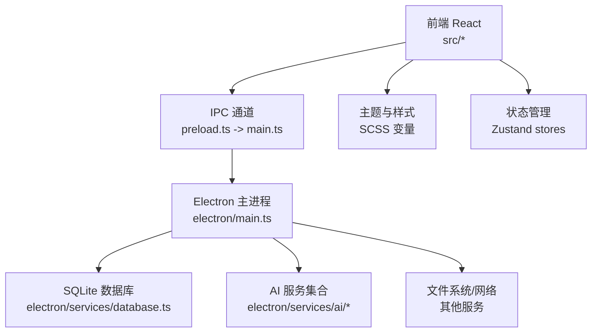
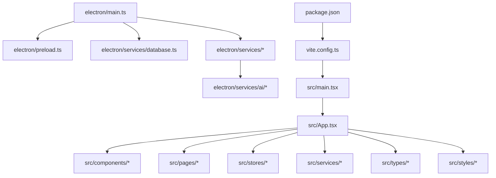
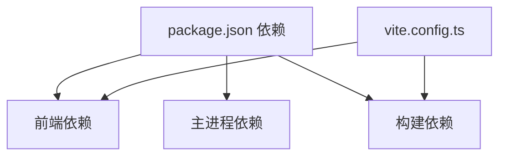

# 项目结构

<cite>
**本文引用的文件**
- [README.md](file://README.md)
- [package.json](file://package.json)
- [vite.config.ts](file://vite.config.ts)
- [src/main.tsx](file://src/main.tsx)
- [src/App.tsx](file://src/App.tsx)
- [src/App.scss](file://src/App.scss)
- [src/styles/main.scss](file://src/styles/main.scss)
- [src/services/ipc.ts](file://src/services/ipc.ts)
- [src/types/models.ts](file://src/types/models.ts)
- [src/stores/appStore.ts](file://src/stores/appStore.ts)
- [electron/main.ts](file://electron/main.ts)
- [electron/preload.ts](file://electron/preload.ts)
- [electron/services/database.ts](file://electron/services/database.ts)
- [scripts/README.md](file://scripts/README.md)
</cite>

## 目录
1. [简介](#简介)
2. [项目结构](#项目结构)
3. [核心组件](#核心组件)
4. [架构总览](#架构总览)
5. [详细组件分析](#详细组件分析)
6. [依赖分析](#依赖分析)
7. [性能考虑](#性能考虑)
8. [故障排除指南](#故障排除指南)
9. [结论](#结论)
10. [附录](#附录)

## 简介
CipherTalk 是一款基于 Electron + React 的桌面应用，专注于微信聊天记录的查看、分析与导出。项目采用前后端分离架构：前端使用 React + TypeScript + Zustand，后端（主进程）使用 Electron + better-sqlite3，通过 IPC 实现前后端通信。项目提供多主题、AI 摘要、数据分析、全文搜索、数据导出等功能，支持独立窗口模式与主窗口统一布局。

## 项目结构
项目根目录包含以下关键目录与文件：
- src/：前端源码，包含组件、页面、状态管理、服务层、类型定义、工具函数与样式
- electron/：Electron 主进程与预加载脚本，以及各类服务（数据库、AI、分析、导出等）
- public/：静态资源（图标、表情包等）
- scripts/：构建与发布脚本
- 构建与配置文件：package.json、vite.config.ts、tsconfig.json 等

```mermaid
graph TB
subgraph "前端(src)"
SRC_MAIN["src/main.tsx"]
APP["src/App.tsx"]
STYLES["src/styles/main.scss"]
TYPES["src/types/models.ts"]
STORES["src/stores/*"]
SERVICES["src/services/*"]
COMPONENTS["src/components/*"]
PAGES["src/pages/*"]
end
subgraph "主进程(electron)"
MAIN_TS["electron/main.ts"]
PRELOAD["electron/preload.ts"]
DB_SERVICE["electron/services/database.ts"]
AI_SERVICES["electron/services/ai/*"]
OTHER_SERVICES["electron/services/*"]
end
subgraph "构建与脚本"
VITE["vite.config.ts"]
PKG["package.json"]
SCRIPTS["scripts/*"]
end
SRC_MAIN --> APP
APP --> COMPONENTS
APP --> PAGES
APP --> STORES
APP --> SERVICES
APP --> TYPES
APP --> STYLES
APP < --> PRELOAD
PRELOAD --> MAIN_TS
MAIN_TS --> DB_SERVICE
MAIN_TS --> OTHER_SERVICES
OTHER_SERVICES --> AI_SERVICES
VITE --> SRC_MAIN
PKG --> VITE
SCRIPTS --> PKG
```

**图表来源**
- [src/main.tsx:1-14](file://src/main.tsx#L1-L14)
- [src/App.tsx:1-538](file://src/App.tsx#L1-L538)
- [src/styles/main.scss:1-427](file://src/styles/main.scss#L1-L427)
- [src/types/models.ts:1-109](file://src/types/models.ts#L1-L109)
- [src/stores/appStore.ts:1-97](file://src/stores/appStore.ts#L1-L97)
- [src/services/ipc.ts:1-38](file://src/services/ipc.ts#L1-L38)
- [electron/main.ts:1-3886](file://electron/main.ts#L1-L3886)
- [electron/preload.ts:1-454](file://electron/preload.ts#L1-L454)
- [electron/services/database.ts:1-83](file://electron/services/database.ts#L1-L83)
- [vite.config.ts:1-78](file://vite.config.ts#L1-L78)
- [package.json:1-169](file://package.json#L1-L169)
- [scripts/README.md:1-337](file://scripts/README.md#L1-L337)

**章节来源**
- [README.md:132-159](file://README.md#L132-L159)
- [package.json:1-169](file://package.json#L1-L169)
- [vite.config.ts:1-78](file://vite.config.ts#L1-L78)

## 核心组件
- 前端入口与路由：src/main.tsx 负责创建根节点与 HashRouter；src/App.tsx 负责全局路由、主题切换、协议与激活流程、独立窗口模式判断、状态监听与页面渲染。
- 状态管理：Zustand stores（如 appStore）集中管理数据库连接、用户信息、加载与解密进度等状态。
- IPC 通信：src/services/ipc.ts 封装 window.electronAPI 的调用，提供统一的前端服务接口。
- 样式系统：SCSS 变量与主题切换，支持多主题与深浅模式。
- 类型定义：src/types/models.ts 定义聊天会话、联系人、消息、分析数据等核心模型。
- 主进程：electron/main.ts 创建窗口、注册协议、处理自动更新、管理托盘与多窗口；electron/preload.ts 通过 contextBridge 暴露受控 API；electron/services/database.ts 提供 SQLite 只读访问。

**章节来源**
- [src/main.tsx:1-14](file://src/main.tsx#L1-L14)
- [src/App.tsx:1-538](file://src/App.tsx#L1-L538)
- [src/stores/appStore.ts:1-97](file://src/stores/appStore.ts#L1-L97)
- [src/services/ipc.ts:1-38](file://src/services/ipc.ts#L1-L38)
- [src/styles/main.scss:1-427](file://src/styles/main.scss#L1-L427)
- [src/types/models.ts:1-109](file://src/types/models.ts#L1-L109)
- [electron/main.ts:1-3886](file://electron/main.ts#L1-L3886)
- [electron/preload.ts:1-454](file://electron/preload.ts#L1-L454)
- [electron/services/database.ts:1-83](file://electron/services/database.ts#L1-L83)

## 架构总览
项目采用“前端 React + Electron 主进程”的双层架构：
- 前端层：React + Zustand + SCSS，负责 UI、路由、状态与样式。
- 主进程层：Electron + better-sqlite3 + 各类服务，负责窗口管理、IPC、数据库访问、文件系统、网络请求、AI 服务集成等。
- 通信机制：通过 preload 暴露的 window.electronAPI 与主进程 ipcMain 建立稳定的 IPC 通道。



**图表来源**
- [electron/preload.ts:1-454](file://electron/preload.ts#L1-L454)
- [electron/main.ts:1-3886](file://electron/main.ts#L1-L3886)
- [electron/services/database.ts:1-83](file://electron/services/database.ts#L1-L83)
- [src/App.tsx:1-538](file://src/App.tsx#L1-L538)
- [src/styles/main.scss:1-427](file://src/styles/main.scss#L1-L427)
- [src/stores/appStore.ts:1-97](file://src/stores/appStore.ts#L1-L97)

## 详细组件分析

### 目录组织与职责
- src/components：可复用 UI 组件（标题栏、侧边栏、AI 相关组件、对话框等），按功能分组（如 ai/）。
- src/pages：页面级组件（聊天、分析、设置、导出、年度报告、独立窗口等），支持主窗口与独立窗口两种渲染模式。
- src/stores：Zustand 状态容器（应用、主题、聊天、更新状态、激活等）。
- src/services：前端服务封装（IPC 封装、数据库、配置等），统一对外暴露。
- src/types：TypeScript 类型定义（模型、分析、DOM 扩展等）。
- src/utils：工具函数（加密、链接识别、LRU 缓存、表情包等）。
- src/styles：全局样式与主题变量（SCSS 变量、卡片、按钮、滚动条等）。
- electron/：主进程入口、预加载脚本、各类服务（数据库、AI、分析、导出、日志、语音转文字、Windows Hello 等）。
- public/：静态资源（图标、表情包等）。
- scripts/：构建与发布脚本（版本更新、打包、自动化发布等）。

**章节来源**
- [README.md:132-159](file://README.md#L132-L159)
- [src/App.tsx:1-538](file://src/App.tsx#L1-L538)

### 前后端分离与目录划分合理性
- 前端专注 UI 与交互，逻辑清晰、可维护性强；主进程负责系统级能力与数据访问，避免前端直接操作底层资源。
- 通过 preload 暴露受控 API，既满足功能需求又保障安全隔离。
- 多主题与独立窗口模式通过路由与状态管理实现，降低耦合度。
- 服务层（electron/services/*）将复杂业务拆分，便于扩展与测试。

**章节来源**
- [electron/preload.ts:1-454](file://electron/preload.ts#L1-L454)
- [electron/main.ts:1-3886](file://electron/main.ts#L1-L3886)
- [src/App.tsx:1-538](file://src/App.tsx#L1-L538)

### 项目结构图与文件关系图


**图表来源**
- [src/main.tsx:1-14](file://src/main.tsx#L1-L14)
- [src/App.tsx:1-538](file://src/App.tsx#L1-L538)
- [electron/main.ts:1-3886](file://electron/main.ts#L1-L3886)
- [electron/preload.ts:1-454](file://electron/preload.ts#L1-L454)
- [electron/services/database.ts:1-83](file://electron/services/database.ts#L1-L83)
- [vite.config.ts:1-78](file://vite.config.ts#L1-L78)
- [package.json:1-169](file://package.json#L1-L169)

### 目录命名规范与最佳实践
- 目录命名：小写 + 功能分组（components、pages、stores、services、types、utils、styles），体现单一职责。
- 文件命名：组件使用 PascalCase（如 ChatPage.tsx），服务与工具使用 camelCase（如 ipc.ts、crypto.ts）。
- 样式：SCSS 变量集中管理，遵循 BEM 或语义化命名，避免全局污染。
- 类型：将模型与枚举集中于 types 目录，便于跨模块复用。
- 构建：Vite + electron-builder，区分开发与生产环境，输出 dist 与 dist-electron。

**章节来源**
- [README.md:195-201](file://README.md#L195-L201)
- [vite.config.ts:1-78](file://vite.config.ts#L1-L78)
- [package.json:1-169](file://package.json#L1-L169)

## 依赖分析
- 前端依赖：React 19、React Router、Zustand、Material-UI、ECharts、lucide-react、marked、jieba-wasm 等。
- 主进程依赖：better-sqlite3、electron-store、electron-updater、ffmpeg-static、sherpa-onnx-node、koffi、wechat-emojis、xlsx 等。
- 构建依赖：Vite、@vitejs/plugin-react、vite-plugin-electron、electron-builder、sass 等。
- 构建配置：Vite 插件链路（react、electron、renderer），别名 @ 指向 src；Electron 打包配置包含 extraResources、asarUnpack、文件过滤等。



**图表来源**
- [package.json:20-73](file://package.json#L20-L73)
- [vite.config.ts:1-78](file://vite.config.ts#L1-L78)

**章节来源**
- [package.json:1-169](file://package.json#L1-L169)
- [vite.config.ts:1-78](file://vite.config.ts#L1-L78)

## 性能考虑
- 前端性能：使用虚拟化组件（react-window、react-virtualized-auto-sizer）提升大数据列表渲染性能；懒加载页面与组件；合理拆分包与异步导入。
- 主进程性能：数据库查询使用 prepared statements；批量操作使用事务；避免阻塞主线程，必要时使用 worker。
- 样式性能：SCSS 变量减少重复计算；深色模式下减少重绘；滚动条与阴影按需使用。
- 构建性能：Vite 开发服务器热重载；生产构建开启压缩与最小化；electron-builder 优化安装包体积与加载速度。

[本节为通用建议，无需特定文件引用]

## 故障排除指南
- 构建失败：检查 Node.js 版本与依赖安装；确认 package.json 中脚本与构建配置一致。
- IPC 调用异常：确认 preload 暴露的 API 名称与主进程 ipcMain 监听一致；检查 contextIsolation 与 preload 配置。
- 数据库连接失败：确认数据库路径与密钥正确；检查只读连接与文件权限。
- 主题切换无效：确认 SCSS 变量与 data-theme 属性同步；检查 localStorage 与主窗口同步逻辑。
- 自动更新问题：检查 electron-updater 配置与发布渠道；确认 latest.yml 与签名。

**章节来源**
- [electron/preload.ts:1-454](file://electron/preload.ts#L1-L454)
- [electron/main.ts:1-3886](file://electron/main.ts#L1-L3886)
- [src/App.tsx:1-538](file://src/App.tsx#L1-L538)
- [scripts/README.md:1-337](file://scripts/README.md#L1-L337)

## 结论
CipherTalk 项目结构清晰、职责分明，采用前后端分离与 IPC 通信机制，结合多主题与独立窗口模式，提供了良好的用户体验与可扩展性。通过合理的目录组织、类型定义与状态管理，项目在功能复杂度与可维护性之间取得了良好平衡。建议在后续迭代中进一步完善单元测试与文档，持续优化构建与发布流程。

[本节为总结，无需特定文件引用]

## 附录
- 开发与构建命令：参见 package.json scripts；开发模式使用 npm run dev；生产构建使用 npm run build。
- 发布脚本：scripts/README.md 提供自动化发布流程与 GitHub Actions 配置说明。
- 主题系统：src/styles/main.scss 定义多主题变量与深浅模式切换逻辑。

**章节来源**
- [package.json:8-18](file://package.json#L8-L18)
- [scripts/README.md:1-337](file://scripts/README.md#L1-L337)
- [src/styles/main.scss:1-427](file://src/styles/main.scss#L1-L427)